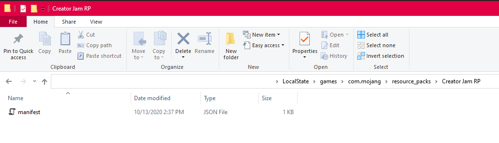

# Resource Pack

A **Resource Pack** is a folder structure that will contain all of your custom models, sounds, textures and any custom content that is made. For this tutorial, you will change the appearance of the Dirt block.

1.	Open up your game location folder **com.mojang**
1.	Double-click on the folder **resource_pack**.
1.	Right-click in the File Explorer window and select **New** and then **Folder** to create a new folder. 
1.	Name the new folder **HelloWorldRP**.
1.	Double-click on **HelloWorldRP** to open the folder. 
   	
## The Manifest File

In order to load a resource pack into Minecraft, a manifest file will need to be generated. The Manifest file is a JSON file that contains the following information; 

-	**Description** – In-game description of what the Resource Pack does.
-	**Name** – In-game name of the Resource Pack.
-	**UUID** - Universally Unique Identifier.
-	**Version** – Version of the Resource Pack.
-	**Minimal Engine Version** – Required version of Minecraft that this Pack will work in.

Since the file is written in JSON, Minecraft will be able to parse the information from the file and display it in the Add-On section. Inside the file, the information will be split into two separate sections; header and modules. The header section will contain the overall information for the pack, while modules will contain the dedicated packages 

1.	Right-click in the Explorer window and select **New**, then select **Text Document**. 
1.	Set the name to **manifest.json**. 
    1.	You will need to change the file extension from .txt to .json. If your Explorer window does not show file extensions, you can enable **File Name Extensions** under the **View** tab.
    
1.	Double-click on **manifest.json** to open it in a Text Editor. 
1.	Copy/Paste the following text into your text editor. 

```json
	{
	  "format_version": 2,
	  "header": {	    "description": "My First Add-On!",
	    "name": "Hello WorldRP",
	    "uuid":””,
	    "version": [1, 0, 0],
	    "min_engine_version": [1, 16, 0]
	  },
	  "modules": [
	    {
	      "description": "My First Add-On!",
	      "type": "resources",
	      "uuid": "",
	      "version": [1, 0, 0]
	    }
	  ]
	}
```
### UUID

Universally Unique Identifier, or UUID for short, is a unique number used to identify different software. For Minecraft, the UUID is used to define a specific pack and prevent any duplicate software from causing issues. For both Header and Modules, there will need to be 2 different UUID numbers entered between the quotes. You can use an online UUID Generator such as [UUID Generator](https://www.uuidgenerator.net/).

1.	Copy and paste a UUID into the Header section
1.	Copy and paste another UUID into the Module section. 
1.	Save. 

## Changing the Dirt block

With the Manifest file completed. You can now start adding custom content to Minecraft. Let’s get started by applying a new texture to the Vanilla dirt block. 

1.	In File Explorer, in the **HelloWorldRP** folder, right-click and select **New**, then select **Folder**.
1.	Rename the folder to **textures**.
1.	Double-click on the **textures** folder.
1.	Right-click and select **New**, then select **Folder**.
1.	Rename the folder to **blocks**.
1.	Double-click on the **blocks** folder.
	

### Creating the texture

Now that the folder structure is created, you can now place your custom textures here. A png file is also provided that you can download and place in your folder. 


1.	Open up an image editor such as Paint, GIMP or Photoshop. 
    1.	In this tutorial, Paint will be used.
1.	In the **Toolbar**, select **File**, then select **Properties**.
1.	Set the **Width** and **Height** to **64** each.

You can now design a pattern or any artwork in the editor. In this example, a simple fill color has been added. <add a dev blurb explaining some of the barebones design principles such as texture size and color pallet>
1.	When done with your texture, select **File** and then select **Save As a PNG**.
1.	Navigate to the **blocks** folder.
1.	Save the file as **dirt.png**.

### Testing the Pack

Now that the pack has both a manifest file and a texture. You can now launch Minecraft and test your new Add-on
***Pack Stacking*** 
Content is loaded with any and all vanilla content being loaded first, followed by any additional Add-ons. Since the custom texture is named dirt.png. the texture will be used on every single dirt block in game.

1.	Launch Minecraft.
1.	When Minecraft has launched and reached the main menu, select **Play**.
1.	Select **Create a new world**.
1.	Under **Settings**, scroll down to the **Add-on** section.
1.	Click on **Resource Packs** to see all available packs.
1.	Under all of the packs, select **HelloWorldRP** to add the pack to the world.
1.	**Launch** your world.

