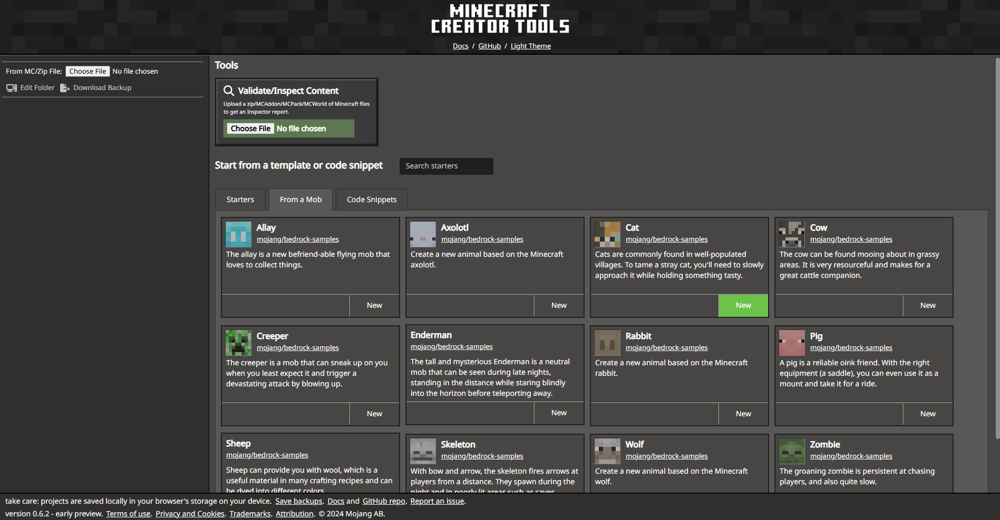
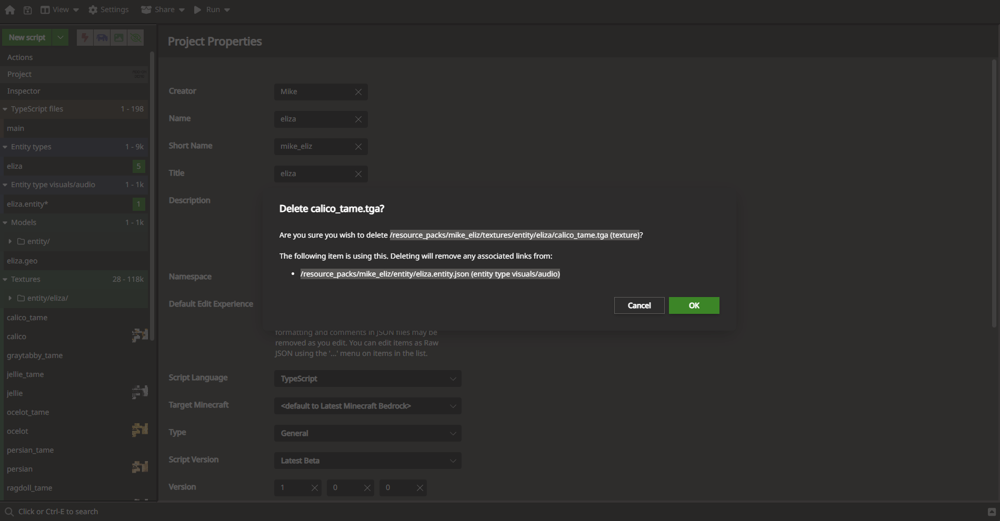
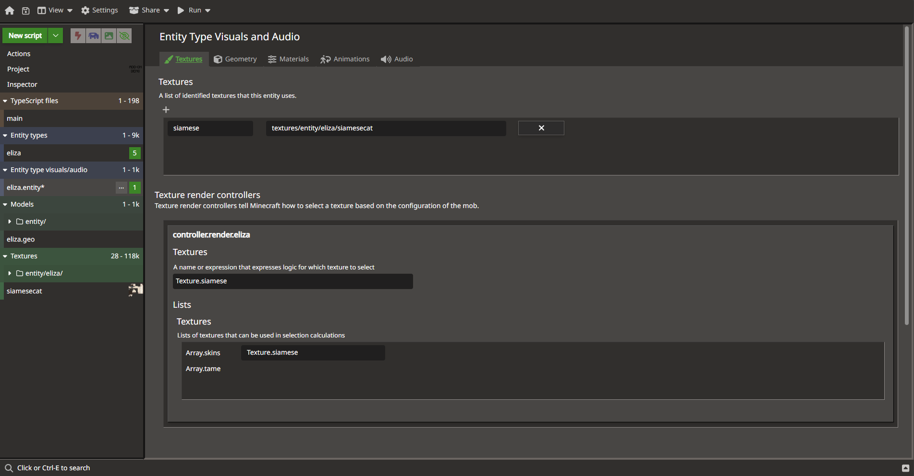
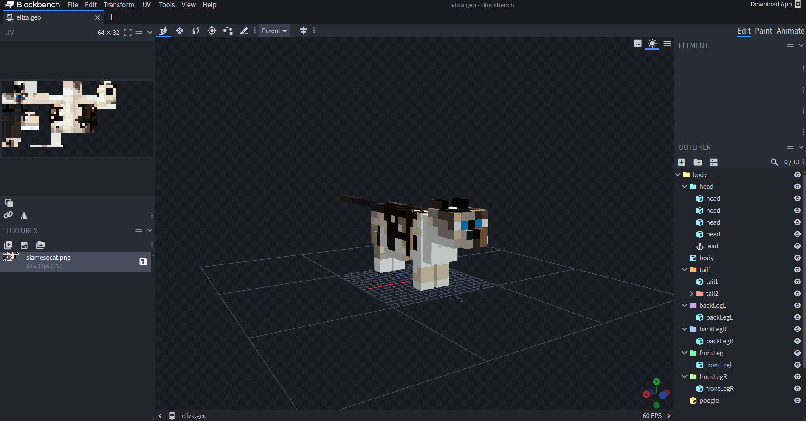
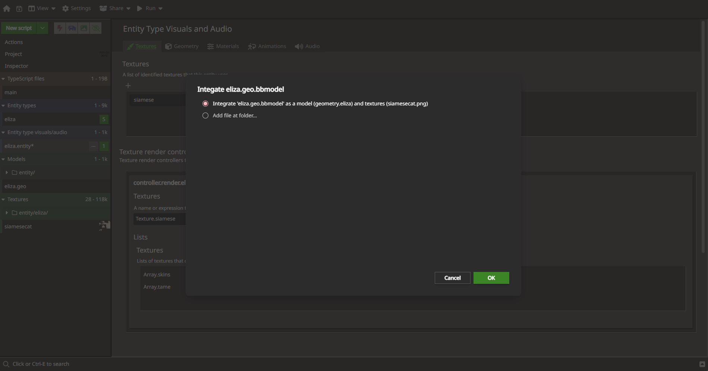
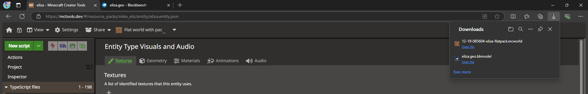
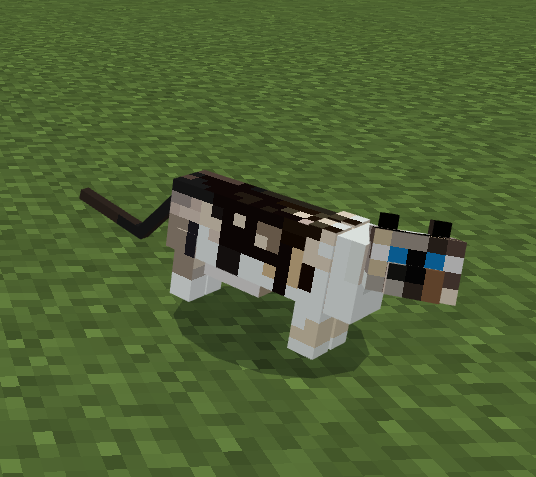
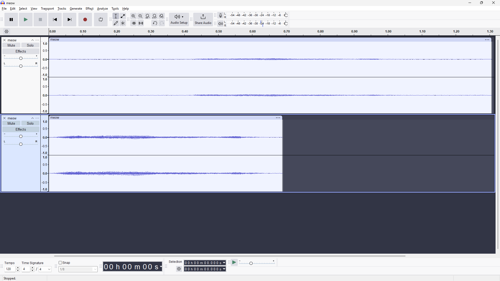
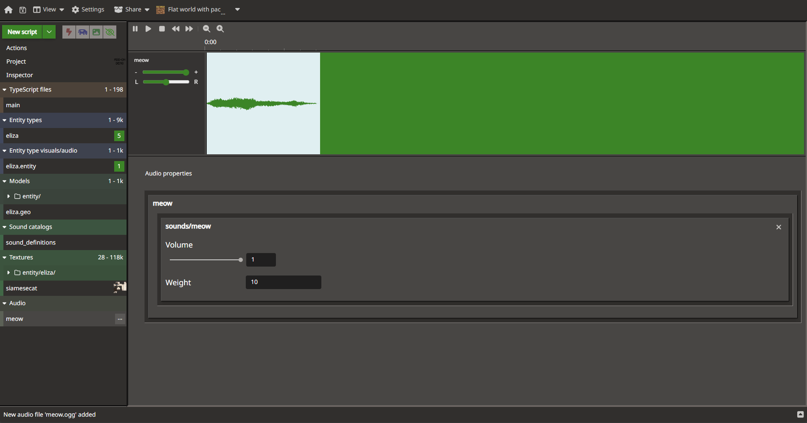
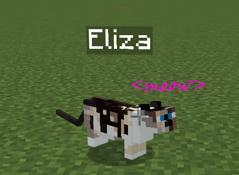

# Add your cat to Minecraft

Doesn't Minecraft already have cats? Yes, it does, but it doesn't have *your* cat (or your dog, or your parakeet, etc.). With [Blockbench](./../Documents/Blockbench.md) and [Minecraft Creator Tools on the web](./../Documents/MCToolsOverview.md), you can easily customize and add your favorite animals into Minecraft by customizing a vanilla mob and making it look, sound, and act like your furry or feathery or fishy friends.

> [!VIDEO https://www.youtube.com/embed/Z27h1O5JTA4]
*Video version of this article from the Minecraft Creator Channel*

You can check out the sample project that was created on the [Minecraft Samples GitHub](https://github.com/microsoft/minecraft-samples/tree/main/casual_creator/custom_cat_eliza).

## Starting from Vanilla

The best technique to get started is to base your custom animal on a mob that already exists inside of Minecraft. Both [mctools.dev](https://mctools.dev) and Blockbench - via the [Minecraft Entity Wizard](./../Documents/MinecraftEntityWizard.md) - have a set of "starter projects" that make it possible to create new projects from the foundation of Minecraft mobs. In our case, we'll start with [mctools.dev](https://mctools.dev) and start with a custom cat template, under the "From a Mob" tab. Give it a project namespace based on your creator name, and give the project a custom name. In my case, I choose a Creator Name of `mike` and a project name of `eliza` - to match the name of my cat I'm modelling ❤️🐈



## Prepare to edit the cat visuals

Now that the project is started, we'll want to start to customize it. One "problem" we need to deal with is that the default vanilla cat comes with a lot of variants for different types of cats. These different variants manifest as different textures, and there are subvariants for whether a cat is tame or not (when a cat is tame, it looks like it has a collar on it.) If you simply customize one variant but leave the other textures on the mob, then most of the time, when you spawn a cat it will have some other texture other than the one you designed for your custom cat. You'll want to start by picking a variant of the cat that you think serves as the best foundation for your cat and remove all unrelated textures. You'll want to, one by one, remove all the unneeded textures from your project by right-clicking on them and selecting Delete. Under the covers, MCTools should also clean up various internal references to that texture as well.  You can also remove the `_tame` variant. We all know your kitty and Eliza can't be tamed. In my case, for Eliza, I removed every texture except for `siamesecat`.



The next thing we need to do is clean up the logic that the custom pet will use to select which texture to use. Since we only have one texture, the logic is simple: always use our one texture. Select the Entity Type Visuals and Audio option, and under Textures, where currently it has a Molang formula of `query.is_tamed ? Array.tame[query.variant] : Array.skins[query.variant]` for selecting a texture, replace it with Texture.siamese (or whichever texture you are using).



## Edit your model in Blockbench

Now that we've trimmed the project to focus on one texture variant, you'll want to edit it in Blockbench. Right click on `eliza.geo` and select Download Blockbench Model. This will start a download of a .bbmodel file in your browser. BBModel files are an all-in-one-file format that Blockbench understands for editing models. If you have Blockbench installed on your device, you can double click on the BBModel in your Downloads folder and it should open in Blockbench. Alternately, you can visit [web.blockbench.net](https://web.blockbench.net) and open the bbmodel file in that web app.

From here, you'll want to customize the model to make it look exactly how you want. You can customize the texture to match the colors of your custom entity. One technique I use is to use the Reference Images option, under View | Edit Reference Images menu, to add a real-world picture of your pet. This makes modelling much easier, and while painting your entity, you can use the Alt-key shortcut to bring up the Color Picker and select colors from the real-life picture. Editing the model is probably where you will spend most of the time in your project.



Once you are done, use Save Project (Ctrl-Alt-S) to save your updated .bbmodel file.

Then, what we'll do is update our project back in MCTools to use the newly updated textures and geometry. To do that, drag and drop your updated &lt;catname&gt;.geo.bbmodel file back onto the mctools.dev web page. This will show you a pop-up that says how it will integrate the updates into your project. Click OK.



Now it's time to test it out!

## Testing out our model

Within MCTools, under the Run menu, select "Flat world with packs". This should cause your browser to download a flat world with your custom pet packs.



When you select this .mcworld file, the world should be imported into Minecraft. The world is a creative and experimental world. Once loaded, you can use the `/summon` command in the chat window to summon your cat. It should have a short name based on your creator name - in my case, I could summon Eliza with the `/summon mike_eliz:eliza` command. And with any luck, you should see your beautiful pet in Minecraft!



## Add some sounds

My Eliza is famous for her shy squeaky squeak meow. I bet your pet has a particular sound that is essential to have in Minecraft. To add some sounds, first, start with getting a recording of your pet. You can use apps on a phone, like the Voice Memo app on an iPhone, to record sounds or you could use video editing software to extract audio from a video you may have taken. Any which way you can get an audio clip, you're going to want to make it ready for Minecraft. Minecraft generally only supports .ogg files (.ogg is a type of audio format), so you'll need to convert your clips to .ogg. You can use an application like [Audacity](https://www.audacityteam.org/) to edit and convert your files.



Once you have your .ogg files, you can drag and drop them into mctools to integrate them. Once added, you can even preview them inside the browser.



## Wiring it all together with script

For the final part of this segment, we'll wire things together with a little bit of script.

Select `main` inside of mctools. Update the code to the following:

```typescript
import { world, EntitySpawnAfterEvent } from "@minecraft/server";

function handleNewMob(event: EntitySpawnAfterEvent) {
  if (event.entity.typeId === "mike_eliz:eliza") {
    world.playSound("meow", event.entity.location);

    event.entity.nameTag = "Eliza";
  }
}

world.afterEvents.entitySpawn.subscribe(handleNewMob);
```

This code intercepts the global "entity spawn" event that fires any time a new mob is spawned. In the `handleNewMob` function, we first check if the newly spawned entity is ours -- `.typeId === "mike_eliz:eliza"`. If that's true, then we play the newly added `meow` sound. We also set the name tag of the entity to match our cat.

You can use the "Download Flat Pack" option to try another world inside of Minecraft. After using the `/summon` command, you should see your pet, with a custom sound and a custom name tag:



## Wrapping up

So that's the start of customizing your pets for Minecraft. There are dozens of different ways you could further customize your pet, including further model changes, new animations, sounds for different events, and new behaviors. You'd probably want to give your pet eleventy billion health. You can add spawn rules to have your pet get randomly spawned inside of the world. The possibilities are endless.. and there is just *something* about seeing your pet inside of Minecraft that is just wonderful. Happy creating!

### More Links

* [Add your Cat to Minecraft Video](https://youtu.be/Z27h1O5JTA4)
* [Custom Cat on Minecraft Samples GitHub](https://github.com/microsoft/minecraft-samples/tree/main/casual_creator/custom_cat_eliza)
* [Use the Minecraft Entity Wizard in Blockbench](./../Documents/MinecraftEntityWizard.md)
* [Overview of Minecraft Creator Tools](./../Documents/MCToolsOverview.md)
