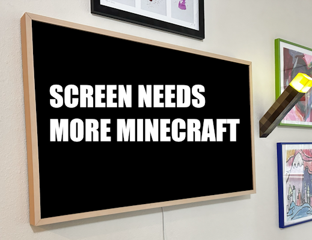
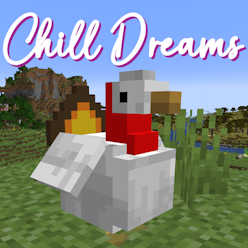
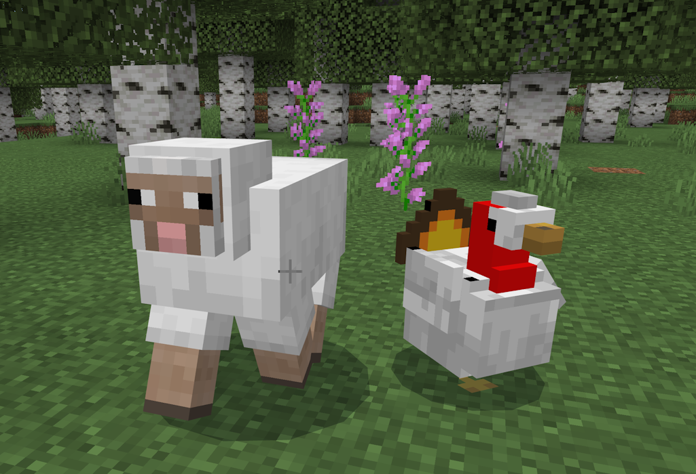
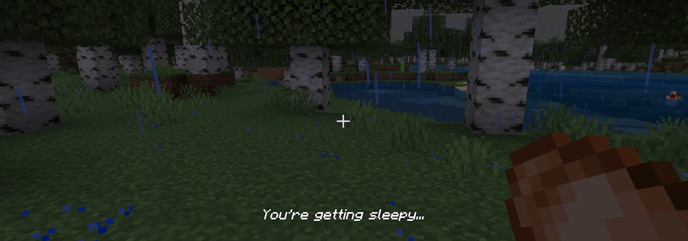
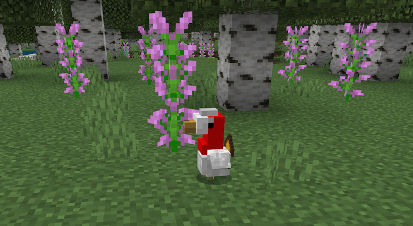

# Chill Dreams Add-On for Minecraft: Part 1 - The Dream Turkey

_This article is part of a casual new series of articles focusing on building cool things in Minecraft for the fun of it. We hope you like them!_


Have you ever been in the middle of an adventure in Minecraft and you just had to stop and stare at a gorgeous vista? Walking over a hill and seeing the way the sunlight shines on your latest creation? There is so much beauty to see in Minecraft... It's enough that you may want to put your favorite Minecraft meme on a screen and create your own serene scenes. Somewhat like the [Minecraft Serene Scene YouTube Series](https://www.youtube.com/watch?v=JBoUwElRFVM&t=1s).

For me, personally, I happened to have a spare mini PC and an empty screen. What better to display on it than some beautiful dynamic Minecraft-y scenes? I could sure use a "Minecraft screensaver."

I also wanted to accomplish this goal in the Minecraftiest way possible: through Add-Ons. Add-Ons let you add extensions to your existing Minecraft experiences, like survival worlds. While Add-Ons are a [cool new addition to the Minecraft Marketplace](https://www.minecraft.net/en-us/article/introducing-Add-Ons) and there is a diverse set of new experiences, Add-Ons and mods have been available and delivered in the community for a long time, whether it's Add-Ons for Bedrock or Mods for Java. You can build your own nifty Add-Ons! There is also an [amazing community focused on building Add-Ons for Bedrock - (bedrock.dev)](https://wiki.bedrock.dev/discord.html).

This is the first in a three-part set of articles.

1. The Dream Turkey - _you are here_
1. [Making Dreams Come True](./ChillDreamsPart2MakingDreamsComeTrue.md)
1. [Smells Like Memories](./ChillDreamsPart3SmellsLikeMemories.md)

You can get the sample from this project from [https://github.com/microsoft/minecraft-samples/tree/main/casual_creator/chill_dreams/](https://github.com/microsoft/minecraft-samples/tree/main/casual_creator/chill_dreams/). Note that there are subfolders for each part of this series, along with the "complete" sample.

You can also download the Chill Dreams MCAddon file from the [Minecraft Samples release page](https://github.com/microsoft/minecraft-samples/releases).

Summing up our goal for this Add-On series: we'll discuss building a scene-generating screensaver Add-On within Minecraft.



## Make it a Minecraft-y screensaver: Add-On game design

A key design goal of this Add-On – and many Add-Ons – is to make this thematically tied-in with Minecraft - not "just" a utility in your inventory.

What this means is that you could learn and play with this Minecraft experience within your survival world without needing to go into Creative mode. It is also somewhat thematic to the world of Minecraft – there is no mention of "SCREENSAVER MODE" or anything like that; we don't want to break the immersion of being in the Minecraft world if we can help it. So, for this Add-On I want to add a little bit of gameplay design and background for our Add-On (though this is not official Minecraft lore in any sense, friends 😊 – just something random I made up).

### Dream Turkeys – a Thanksgiving Detour

The core concept here is that playing the screensaver is a "dream" for the player – thus the name: the "Chill Dreams" Add-On.

While a Dream (screensaver mode) is playing, their corresponding Player in Minecraft is in Spectator mode. The screensaver moves them across many different points within the Minecraft world.

But that poses a game design question: _How do you get into this new dream mode_?

Well, here is one idea: during the Thanksgiving holiday, there is a common story that eating a big Thanksgiving dinner puts everyone to sleep. Specifically, the turkey has a chemical called tryptophan that could make your brain emit more serotonin and thus make you a bit more sleepy. While this [theory seems to have been disproven](https://www.scientificamerican.com/article/fact-or-fiction-does-turkey-make-you-sleepy/), we'll go with that here – that eating a turkey will put you to sleep and trigger Dream Mode. We'll call this the Dream Turkey.

### Building our Dream... Turkey

For our project, we're going to get started by using an existing sample. Over in the [minecraft-samples](https://github.com/microsoft/minecraft-samples) GitHub repository, there is a folder called "addon_starter" which shows a progression of how an Add-On is built over time. 

I copied the ["1_hello_world" folder](https://github.com/microsoft/minecraft-samples/tree/main/addon_starter/1_hello_world) from the download into a separate folder called "chill_dreams" to create the foundational behavior pack and resource pack.

This is what we'll add various assets and things into, over time. Be prepared: creating and extending content in Minecraft will involve copying and extending files from a number of different sources. See this article for an [intro to behavior packs](../Documents/BehaviorPack.md) and an [intro to resource packs](../Documents/ResourcePack.md) to better understand how packs work.

Within my behavior pack, I updated the identifiers and titles to make it the **Chill Dreams Add-on**.

When starting with your first BP/RP (that is, behavior pack/resource pack), you'll want to run it frequently to see how your updates are functioning, and that things are working as expected. To see the Add-On run, you'll want to run `npm i` to install dependencies for this project, and run `gulp` to deploy it. If `npm` and `gulp` doesn't sound familiar to you, check out the [Build a gameplay experience with TypeScript](../Documents/ScriptingGettingStarted.md) article to familiarize yourself with those tools. When you run the gulp script, these tools will do the work to automatically push updates into Minecraft as you work. 

Now that we have our starter, we can work to add and extend it. First up: we're going to want to create our Dream Turkey entity. I started with [BlockBench](https://www.blockbench.net/) which has an optional Add-On called the Minecraft Entity Wizard. Within the entity wizard, you can choose a "starter mob", and of course, I chose the chicken as my turkey starter. See more about [the Entity Wizard here](../Documents/MinecraftEntityWizard.md).

Now, I'm not really a great artist so I need inspiration to help with my turkey design. Having never really thought too hard about it before, what makes a turkey different versus, say, a chonky, chicken?

To get inspiration, I looked at some pictures of turkeys, of course. Clearly turkeys have much more magnificent plumage and a red neck wattle. Yes, I also used CoPilot in Bing to generate some samples of what a Turkey in Minecraft would look like, as another source of inputs. It... was more useful than I expected! And it worked well! Inspiration in hand, I modeled out my turkey in BlockBench as a set of cubes (bones), and then updated and painted the turkey to match. I updated the set of animations from the chicken. I liked this result.

When I was done, I copied these files that BlockBench emitted into my Add-On starter project, into the appropriate places in my behavior and resource packs. I used the Screenshot mode in BlockBench to take some glamour shots of my turkey to use as the pack icons (pack_icon.png). To my mind, that's the most fun part - dressing up my logo with an odd choice for a font to make my Add-On look a bit more "packaged":



### Spawning, Recipes, and Loot: The Turkey Circle of Life

From there, I made a few tweaks to de-chicken the turkey:

Because turkeys are a little bigger and chonkier than chickens, I changed their movement component within the behavior entity JSON from 0.25 to 0.1– to make them slower and easier to catch.

I also created equivalents for the loot of a turkey – a raw dream turkey, cooked dream turkey, and "dream essence."

To do this, I looked to [github.com/mojang/bedrock-samples](https://github.com/mojang/bedrock-samples), where there is a set of samples based on the vanilla samples.

Specifically, I copied 'behavior_packs\items\cooked_chicken.json' and 'chicken.json' into my project as "raw_dream_turkey" and "cooked_dream_turkey" and updated as expected. 

I also had to create textures within the resource pack, so I copied in images from the raw/cooked chicken (**chicken_raw** and **chicken_cooked**) as foundational images - and updated **item_textures.json**. 

Then, I created a third new ingredient, which is "dream essence." We'll see how dream essence gets used in part 3 – but for now, it's a pretty simple ingredient that looks like seeds. (I used **pumpkin_seeds** from bedrock-samples as an inspiration.)

Finally, I updated the loot table of the Dream Turkey in to generate dream_essence and dream_turkey in place of feathers and chicken.

OK, now we have our dream turkey all set up! Time to test it. Run `gulp` in your folder, exit and reload your test world, and then `/summon mamm_cds:dream_turkey`.



_Dream Turkey and Friends_

### This Part will Put You to Sleep

The final component of our dream turkey is our sleep behavior. To implement that, we'll use a little bit of script.

First, in **main.ts**, we'll hook the `itemStartUse` and `itemStopUse` events, so that we can time how long a player is using items:

```typescript
world.afterEvents.itemStartUse.subscribe(startAfterItemUse);
world.afterEvents.itemStopUse.subscribe(stopAfterItemUse);
```

In the `itemStartUse` event, we'll track the starting tick of when a player started eating dream turkey:

```typescript
function startAfterItemUse(event: ItemStartUseAfterEvent) {
  if (!event.source || event.source.typeId !== "minecraft:player") {
    return;
  }

  if (event.itemStack.typeId === "mamm_cds:cooked_dream_turkey") {
    tickTurkeyStartEating = tickCount;
  }
}
```

In the `itemStopUse` event, we'll implement the function to start the dream sequence:

```typescript
function stopAfterItemUse(event: ItemStopUseAfterEvent) {
  if (!event.source || event.source.typeId !== "minecraft:player") {
    return;
  }

  if (event.itemStack && event.itemStack.typeId === "mamm_cds:cooked_dream_turkey") {
    // UH OH GETTING SLEEPY
    if (tickCount - tickTurkeyStartEating > 60 && event.source && event.source.typeId === "minecraft:player") {
      startDreamSleep(event.source as Player);
    }
  }
}

function startDreamSleep(player: Player) {
  player.onScreenDisplay.setActionBar("§oYou're getting sleepy...§r");
  player.onScreenDisplay.setTitle(" ", {
    fadeInDuration: 20,
    fadeOutDuration: 20,
    stayDuration: 100,
  });
}
```

What this code does is detect if the player eats a turkey for at least 60 ticks (3 seconds) by measuring the time in between the start and stop events. When the dream sequence starts, I’ll basically set the action bar with some text that will fade in and fade out. Because title/subtitle/and action bar are generally all controlled by the same fade in/fade out logic, we set the title too, here, even if we’re not really using that text.

If you try it out with `gulp` again, gulp should compile the TypeScript into JavaScript and push it into the Minecraft folder.



_Outside in a rainstorm is not the best place for sleeping_

So, that's it for this first part of building the Chill Dreams Add-On. I got a start to the Add-On by building a turkey as the "entry point" mob into our experience and implemented a simple dream effect. We've got a turkey that will put you to sleep.

You can see the final output at [the end of start 1 on GitHub](https://github.com/microsoft/minecraft-samples/tree/main/casual_creator/chill_dreams/1_dream_turkey).

In the next part, we’ll implement the Dream effect more broadly – and in the third and final section, we'll add a new concept of "Memories" to make Dreams more interesting. Stay tuned for the next two parts!

--



_The Dream Turkey has an unintended effect where, when it's a baby, it has a really large head. Love it._