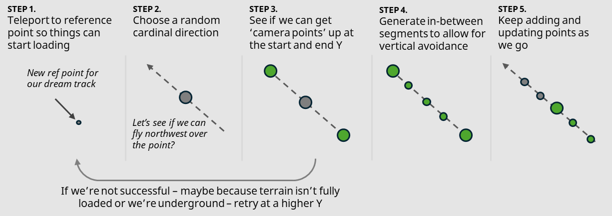

# Chill Dreams Add-On for Minecraft: Part 2 - Making Dreams Come True

_This article is part of a casual new series of articles focusing on building cool things in Minecraft for the fun of it. We hope you like them!_


In [part 1 of our Chill Dreams Add-on series](./ChillDreamsPart1TheDreamTurkey.md), I covered the Chill-Dreams  Add-On as a "Minecraft Screen Saver.", how the screensaver mode is synonymous with "dreaming," and how dreams get started by eating the Dream Turkey. Now I need to make the dreams _happen_!

In this section I'll discuss how dreams are implemented, primarily via script. This section of the series will be fairly script-heavy - if you haven't written some script yet, check out this [JavaScript Introduction](../Documents/ScriptingIntroduction.md) and the more advanced [TypeScript tutorial](../Documents/ScriptingGettingStarted.md) to get started with scripting.

You can get the sample from this project from [https://github.com/microsoft/minecraft-samples/tree/main/casual_creator/chill_dreams/](https://github.com/microsoft/minecraft-samples/tree/main/casual_creator/chill_dreams/). Note that there are subfolders for each part of this series - this is the `2_dreams_come_true` part.

The first general concept is that dream modes should run like a "screensaver" - always showing something a little different. Dream mode shouldn't end until it's interrupted by the player – it can "run forever." A dream is implemented as an infinite set of "tracks," where each part runs for a couple of minutes before moving onto a new track. It works like Shuffle in a music player – playing amongst a set of "tracks" in a random manner.

Each "track" then, is basically a small 1-3 minute flyover around part of the Minecraft terrain. You could imagine other ideas for different types of tracks – maybe just parking the camera statically outside of a village while villagers do their thing, or maybe even creating dream scene "set pieces" with spawned entities and mobs. But for now, let's just talk about the one kind of "track" that we implemented for this Add-On: 1-3 minute flyovers and how they were built.

To start with, the dream mode will just generate random points within 800 blocks of the players' spawn point. Then, we'll see if we can generate a shuffle playlist of tracks around those random 'reference points'.

## Challenge #1: Managing World Loading

The biggest obstacle in making fly-overs across random parts of the world work effectively is to understand that Minecraft tries very hard to only load terrain and mobs around active players, for the sake of efficiency. This is why, for example, with Minecraft Scripting APIs you can't really access blocks 1000 blocks away from any loaded player and expect it to return results (`dimension.getBlock` will return `undefined` to signify _unloaded_.) Similarly, something like Minecraft's new [Camera Command feature](../Documents/CameraCommandIntroduction.md) – which seems like a natural choice for the screensaver – suffers from the same problem: when it's far-flung from any active player, it won't work quite right because the terrain around the camera won't get loaded.

There is a feature called [Ticking Areas](../Documents/TickingAreaCommand.md) which can help by asynchronously force-loading areas, but these come with some limitations: there is a max total of 10 ticking areas active for the entire world, and they can be a little hard to work with in their current command-only form. While it's common in many Minecraft worlds and Add-Ons to carefully and judiciously manage ticking areas to ensure that experiences load as expected, I'm not going to rely on them here – mostly for the sake of simplicity, and it would be a little 'rude' for an Add-On to "take up" the precious set of ticking areas. I don't want my Add-Ons to be rude.

So how then do we move the player around? One idea that has been a part of Minecraft since the dawn of Add-Ons is "simply" to teleport the player every single tick, along the course of a track. 

```typescript
      const thisSegment = this.segments[activeSegmentIndex];
      const nextSegment = this.segments[activeSegmentIndex + 1];

      player.teleport(
        {
          x: thisSegment.x + (nextSegment.x - thisSegment.x) * ticksInSegmentPercent,
          y: thisSegment.y + (nextSegment.y - thisSegment.y) * ticksInSegmentPercent,
          z: thisSegment.z + (nextSegment.z - thisSegment.z) * ticksInSegmentPercent,
        },
        {
          rotation: {
            x: 0,
            y: this.getRotationFromXZ(),
          },
          dimension: world.getDimension(this.referencePoint.dimensionId),
        }
      );
```
_The centerpiece of this operation is teleporting the player every tick_

I'll use that technique here along with the relatively new Spectator mode and Input Permissions features. It's important to know that it's still a bit asynchronous to work with – for example, after teleporting the spectator player to a completely different section of the map, it can take 10+ ticks before enough blocks have loaded to start reading their state and starting the player movement. It takes even longer if you teleport the player across dimensions. (side note: I call navigating the player in a track through the nether a "nightmare")

Another important note: the teleporting spectator may traverse 100+ blocks during a dream part, but we can maybe only read 20 blocks away from the player, I need to nearly-continually calculate the path of a track for the player as they go; you can't really pre-compute it in its entirety.

## Challenge #2: Terrain Math

The next biggest obstacle is doing what I call "terrain math" – that's finding an optimal path to move a camera. This is unexpectedly tricky – what if the target location is in a narrow cave? What if they are underwater? What if they are at the edge of a cliff?

Here, I use the admittedly too-simple algorithm of:

* Find where the nearest "ground" (non-air) block by choosing a somewhat arbitrary high point at a (x, z) coordinate and then scanning downwards (y = y - 1) to find a non-air block.
* Then pop back up around 10-20 blocks to set the camera above the ground.
* Get this "camera point" for a particular (x,z) coordinate, and for every coordinate in your path.

Many times, this algorithm fails: maybe the area isn't loaded yet, or maybe because you're at a point so far underground that it can't find anything nearby. For this, there is a retry algorithm that will keep trying to find different combinations of increasingly-higher starting Y points.

The broader algorithm is this: For a given point of interest, choose a point at a random cardinal direction (e.g., north, southeast, east) 20 blocks away. Then find the point in this opposite cardinal direction, 20 blocks away. If you can build camera points at both ends, then you've got a viable path for your track. Next, turn around and build interpolated points in between the start and end points to create _segments_. As it approaches the next point, it generates another point continued in the cardinal direction.



With our simple algorithm that produces a set of segments, we can then for every tick interpolate a point within a segment, and teleport the player to that point per the code noted above.

Every single tick. It seems odd to teleport the player 20 times a second, but it works. Better than it has any right to.

The broader algorithm we're using here has all kinds of problems, even with lots of retry logic:

* Trees are problematic because they have a narrow base and bushy leaves, which can confuse things. The camera point can end up either really high above trees, or high above the forest floor but buried in treetops. Or maybe the camera bounces up and down as it tries to hover in between treetops and the forest floor.
* Features like steep cliffsides can make the transitions very sharp.
* The view frustum (that is, the cone-shaped perspective/view of all the stuff that is visible from your first-person view) – is generally "wider" than one block. Even if you've computed a great path from point to point, you'll still appear to collide with trees if they are one block off your chosen path.

A future project might be to take the "terrain math" and spin it into a separate re-usable library, make it more nuanced against common Minecraft terrain types, and more advanced as well. It would be nice if the algorithm was flexible enough to do something beautiful when working underwater, as well as work in tight caves. Making all this work in a way that deals with unpredictable load semantics adds a challenge.

In summary: we have an animation scheme that is serviceable, but still could be greatly improved.

Allow me to detour for a second. This algorithm is a great metaphor for creative projects like building Minecraft Add-ons. Have a big dream of an amazing experience, even if it's so far off in the distance that you don't know what it will look like or how you'll get there (the world may not even be loaded yet!). Plot your journey to that dream end point by subdividing your path into smaller in-between points. Validate and work toward those in-between points as they come into view. And then just start moving. And trust that if you update your path along the way, you'll get there.

## Dreamy dreams

_Back to our screensaver implementation_ - a few more finishing touches for the dream mode are covered here:

### Dream configuration experience

When the Dream starts, we want to let the player configure how their dream will run. Should we consider points in the nether? (e.g., a nightmare?) To support this in a somewhat elegant manner, we use the camera at the start of the dream to "fade to black." Then, we use a scripting element called "server UI" to pop up some menu options to collect some basic dream configuration elements. This is nice and only a few lines of JavaScript.

```typescript
  player.camera.fade({
    fadeColor: { red: 0, green: 0, blue: 0 },
    fadeTime: {
      fadeInTime: 3,
      fadeOutTime: 3,
      holdTime: 10,
    },
  });

  ...

  const modalForm = new ModalFormData()
    .title("Dream Preferences")
    .title("Dream")
    .toggle("...around your memories")
    .toggle("...about random places")
    .toggle("...nightmares");

  let response: ModalFormResponse | undefined = undefined;
  try {
    response = await modalForm.show(player);
  } catch (e) {}

```

_Fade to black, wait a bit, then pop up a configuration UI_

### Spectator mode is the perfect match for dreams

When the dream is running, we set the individual [`gamemode`](../ScriptAPI/minecraft/server/GameMode.md) of the player to `Spectator`. Spectator mode is nice for many reasons: first, the player is basically invisible to other players in the world, their view automatically hides "HUD elements," and when the player collides with a block they can at least see the interior of the world. It's an out-of-body experience. Kind of like real dreams, am I right?

```typescript
    this.preserveSettings();

    player.runCommand("gamemode spectator @s");

    player.runCommand("inputpermission set @s camera disabled");
```

_Three operations that kick off when a dream starts_

### Input permissions keep the player under control

We use a command called [`inputpermission`](../Commands/commands/inputpermission.md) to remove the ability of a player to adjust their view.

The reason for this is: if a player could use the camera to change their view, it'd just get reset during the next tick. This would cause a lot of view "judder" as the view snaps between the players' mouse movements and the next teleport update. So for as long as the dream is playing, the ability to move the camera is taken away.

### All dreams come to an end

It's important to make sure the player never gets stuck in dream mode. For example, what if the player leaves the game in the middle of a dream or what if the device Minecraft is running on is turned off? We don't want to leave the player in spectator mode. At the start of the dream, we use a world-scoped dynamic property to store the player's location and dimension. On load of the world and as players join the server, if we detect this property, we'll reset the player and then clear the property. This way, as long as this script runs in the world, the player should be reset back into where they were before the dream started.

```typescript
// restore player back to where they were before the dream started
  const predreamState = world.getDynamicProperty(player.id + "predream");

  if (predreamState && typeof predreamState === "string") {
    try {
      const predreamObj = JSON.parse(predreamState) as IPlayerSettings;

      if (predreamObj) {
        player.teleport(predreamObj.location, {
          dimension: world.getDimension(predreamObj.dimensionId),
        });

        player.runCommand("gamemode default @s");
        player.runCommand("inputpermission set @s camera enabled");
      }
    } catch (e) {}

    world.setDynamicProperty(player.id + "predream", undefined);
```

_Player state restoration code. Check to see if they were in a dream, and if so, reset their state_

To get out of the dream, we simply check if the player is trying to sprint. This is implemented with an every-tick check for if `player.isSprinting` == `true`. If so, we exit out of the dream mode and restore their last position and game state using the above code.

## Summary

In this section, I've got a basic dream mode now established. I've built our "playlist" of "random dream tracks". Some finishing touches were added to complete the experience. _But it's not really personal_.. what if you had an amazing build like a castle, or discovered a really nice cave and wanted to revisit it in your dreams? You'd want to swoop over those in dream mode, right? Well, to support that, we'll need a new way to remember them. Enter: the Memory System. In [part 3](./ChillDreamsPart3SmellsLikeMemories.md), I cover how to implement a Memory System.
