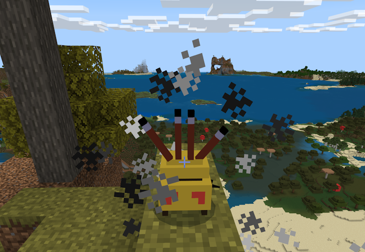
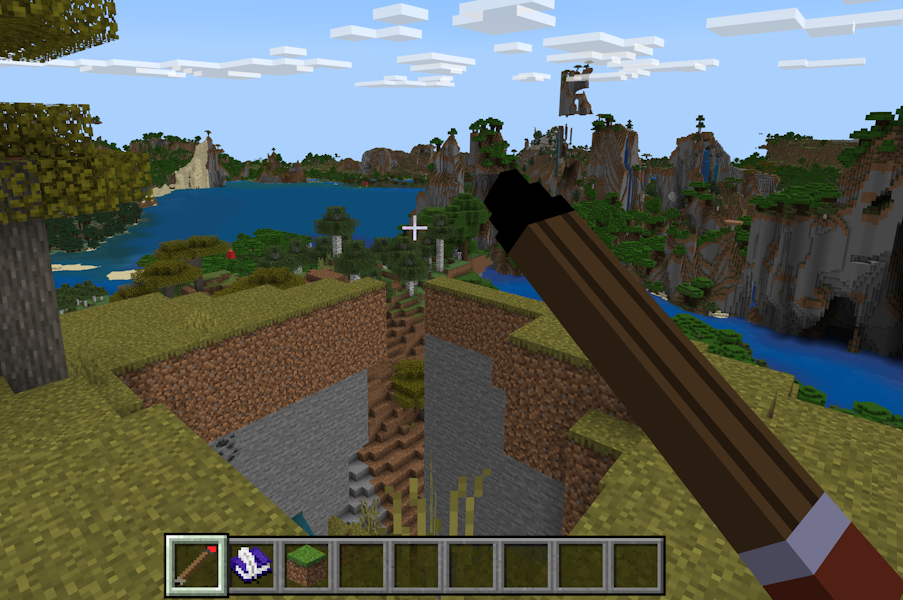

# Building the Chill Dreams Add-On for Minecraft: Part 3: Smell the Memories

_This article is part of a casual new series of articles focusing on building cool things in Minecraft for the fun of it. We hope you like them!_

As discussed in [part 2](./ChillDreamsPart2MakingDreamsComeTrue.md), we've now got our basic Dream mode set up. But dreams aren't the same if they don't involve some of your memories. Don't you want your latest builds and cool spots that you've tracked to be in your dreams? Of course you do! In this third and final part of the Chill Dreams Add-On series, I'm going to add a new system: Memories, which are used to track locales you've been to and that will serve as waypoints for dreams.

You can get the sample from this project from [https://github.com/microsoft/minecraft-samples/tree/main/casual_creator/chill_dreams/](https://github.com/microsoft/minecraft-samples/tree/main/casual_creator/chill_dreams/). Note that there are subfolders for each part of this series - this is the final `complete` part.

As you saw in [part 1](./ChillDreamsPart1TheDreamTurkey.md), I wanted to try to create lore in Minecraft to invoke these specific capabilities. So rather than just clinically let a player input a set of well-known points to use as a Dream starter, we want to make it lore-y. So for this, we'll introduce a few new concepts:

* A dream journal is a place where all of your memories are written down. You can re-visit your memories.
* A dream journal pencil is a place where you can edit memories that you place in the world.
* When you use the pencil, it places a memory incense jar as the placeholder in the Minecraft world for your memory.

Why a memory incense jar? I don't know. Your sense of smell can conjure up some powerful memories. When I say "I love the smell of the ocean" – it probably immediately conjures up experiences you may have had at the beach, or at an ocean pier, right? Analogizing memories to something with a strong smell seems like a workable metaphor. What has a strong smell? Incense. I'll go with that here.

## Jarful of Memories

We'll start with the design of the memory incense jar. The memory incense jar is implemented as a static (non-moving) entity type, like an Armor Stand or a Shulker. Using entities (vs. blocks) for non-moving things is a common pattern to add things that are static in the world, but that also might have special features like animations or ongoing different behaviors and events.

Using entities for static things also makes them easy to query for – with methods like `dimension.getEntities` to query for entities using a specified criteria. It's much, much harder to actually search for (or -re-find) blocks of a particular type – with existing APIs, you would need to manually search across three dimensions over a set of blocks if you want to re-find a particular block of a type. And in Minecraft or in any program, three-deep for-loops could always lead to performance issues.

There are a couple of downsides to using entities for static things:

1. They take up more performance headroom than their block equivalents. You would not want to use more than a small handful of static entities in any one location.
1. Entities might sometimes collide awkwardly with blocks or other items nearby
1. [A dozen other small expectations players will have when they work with your things, expecting them to work like blocks]

But we'll continue with memory jars as entities. To model the memory incense jar, I again used my trusty friend [BlockBench](../Documents/MinecraftEntityWizard.md) to design the visuals of the memory jar.

In my case, I wanted to add something a little extra to my memory incense jar. I would love it if it had a little smokey effect. To support this, I added a behavior animation that simply runs a /particle command on a loop, every five seconds. 

Despite its name, a "behavior animation" doesn't really have to do with _visual animations_ per se; it provides a system for managing different events and actions that happen over the lifecycle of an entity. It gets its name because it re-uses a lot of the same semantics as [resource pack animations](../Documents/EntityModelingAndAnimation.md).

Behavior pack animations give us a simple way to add simple actions to your entity, like firing a command, on a broader timeline in response to conditions. Here, within our `memory_jar` entity JSON, we have:

```json
      "scripts": {
        "animate": [
          {
            "ambient": "1.0"
          }
        ]
      },
      "animations": {
        "ambient": "animation.mamm_cds.memory_jar.ambient"
      }
```

_Note that we have an animation named ambient that is set to "1.0" - for always run_

Within our animation file, we simply define a 5 second timeline that runs a command:

```json
{
  "format_version": "1.10.0",
  "animations": {
    "animation.mamm_cds.memory_jar.ambient": {
      "animation_length": 5,
      "loop": true,
      "timeline": {
        "0.0": ["/particle mamm_cds:incense ~ ~ ~"]
      }
    }
  }
}
```

I then re-used a custom smoke particle effect from the [particle samples](https://github.com/microsoft/minecraft-samples/tree/main/particles_examples_1.19) to design the smoke effect.

With particles, it's worth thinking about them as actually two things: a _particle emitter_ where you configure the parameters of how small particles are generated, and the _particles_ themselves: the actual look and feel and motion (this case, swirling smoke puffs). I tweaked some of the emitter variables and particle effect articles. You can read more about how to build particle effects - in part using a tool called Snowstorm - [from this article](../Documents/ParticleEffects.md).

Be careful not to get too carried away with many entities with many animations that run commands... they could slow down the players' experience.



_Ooof, in my first experience, it puts out a lot of smoke! But I kind-of like how odd that is, so I think I'll keep it._

## Dream Journal & Pencil

Next, I wanted to create a dream journal and a dream journal pencil. These are _custom items_. You can see more about how to build different types of custom items via [a three part series that starts here](../Documents/AddCustomDieBlock.md). 

I used some samples from [github.com/microsoft/minecraft-samples/custom_items](https://github.com/microsoft/minecraft-samples/tree/main/custom_items) as starters – in particular the items that have models associated with them (crown and wrench) as our inspiration. 

Ultimately, our goal here is that when these items are used, it will fire some script events. Then, with the script, we can implement custom experiences for our dream.

The Dream Journal and Dream Journal Pencil both have 3D models, to make using them more visual. Again, I modeled these using BlockBench.


_TODO: work on pencil holding visual to make it look less sword-y and less gigantic_

We use a simple event in script to trap when the Dream Journal and Dream Journal Pencil are used:

```typescript
function afterItemUse(event: ItemUseAfterEvent) {
  if (!event.source || event.source.typeId !== "minecraft:player") {
    return;
  }

  if (event.itemStack.typeId === "mamm_cds:journal") {
    useJournalBook(event.source as Player);
  } else if (event.itemStack.typeId === "mamm_cds:journal_pen") {
    useJournalPen(event.source as Player);
  }
}

world.afterEvents.itemUse.subscribe(afterItemUse);
```

When the Dream Journal Pencil is used, we "ensure" that there is a nearby memory jar. When I say ensure, I mean the pattern of: **get the nearby memory jar if it's there, or create one and return it if not**.

To find the nearby memory pot, I first check to see if a player is looking at a memory jar:

```typescript
  const entitiesFromView = player.getEntitiesFromViewDirection();

  for (const entityHit of entitiesFromView) {
    if (entityHit.entity.typeId === "mamm_cds:memory_jar") {
      memoryEntity = entityHit.entity;
    }
  }
```

If the memory jar entity is still empty, I use `dimension.getEntities` to find a nearby entity (maybe it's behind the player?)

```typescript
  if (memoryEntity === undefined) {
    const entities = player.dimension.getEntities({
      location: player.location,
      type: "mamm_cds:memory_jar",
      maxDistance: 10,
    });

    if (entities && entities.length > 0) {
      memoryEntity = entities[0];
    }
  }
```

And if, after all that, I still haven't found a memory, I create a new one based on what the player was looking at:

```typescript
  if (memoryEntity === undefined) {
    const viewDirection = player.getViewDirection();
    const targetLoc = {
      x: player.location.x + viewDirection.x,
      y: player.location.y,
      z: player.location.z + viewDirection.z,
    };

    memoryEntity = player.dimension.spawnEntity("mamm_cds:memory_jar", targetLoc);
  }
```

Here it's also important to note that we're going to build out a data structure in script to keep a record of all the memory entities in the world. I use the `MemorySet` and `Memory` objects to do this. Behind the scenes, they track Memories as JavaScript structures (interfaces in TypeScript), and this is all saved in a world-scoped dynamic property:

```typescript
    const dataStr = JSON.stringify(this.#data);

    world.setDynamicProperty("mamm_cds:memories", dataStr);
```

This makes it easy to always discover where the memories are when a dream sequence starts; I don't need to be bound to whether the memory entities are actually loaded by Minecraft or not.

For the Dream Journal implementation, I essentially pop up a server-ui dialog listing all of the Memory locations. I added button(s) that can immediately transport the player back to their memory. This is... an interesting and controversial design because it hugely changes the dynamic of Minecraft if you can easily transport amongst locations. Maybe I should take it out? Probably.

To delete a memory, you would simply destroy the memory jar (and remember: memory jars are _entities_, so you have to destroy it.) You can track when the memory jar is destroyed with the `entityDie` after event:

```typescript
function entityDie(event: EntityDieAfterEvent) {
  // exit out quickly if this isn't a memory jar.
  if (!event.deadEntity || event.deadEntity.typeId !== "mamm_cds:memory_jar") {
    return;
  }

  // we should have the memory, stored by the identifier of the entity
  let memory = memorySet.getMemory(event.deadEntity.id);

  // as backup, remove all memories near the location of the destroyed memory jar
  if (!memory) {
    memory = memorySet.getMemoryNear(event.deadEntity.location, event.deadEntity.dimension.id);
  }

  // remove the memory data structure from our memory set 'database'
  if (memory) {
    memorySet.removeMemoryOnly(memory);
  }
}
```

The finishing touch: when a dream sequence starts, I add the list of Memories into the dream track generation:

```typescript
  setupDreamFromMemories(memorySet: MemorySet) {
    if (memorySet) {
      const memories = memorySet.getMemories();

      for (const memory of memories) {
        if (memory.location && memory.dimensionId)
          this.addPoint(memory.location, memory.dimensionId, memory.getEffectiveTitle());
      }
    }
  }
```

I then made it optional to navigate amongst the completely random parts in the world.

## Summary and Conclusions

In this three-part series, I've talked about how I built an  Add-On that adds a number of interesting new dynamics to Minecraft, primarily featuring dream sequences that can also act as a screensaver for all of the beauty of Minecraft. There are still many many bugs to fix and features to add (foreshadowing?), but it works well enough to get a Minecraft screensaver going.


Hopefully in reading this series you've picked up some design pointers or code snippets you can look at that might make for useful ideas in the elements you create. Add-Ons in the marketplace complement the set of Add-Ons that creators like you have been sharing in the community for many years now; I hope you feel inspired to try or even implement your own dream  Add-Ons!
