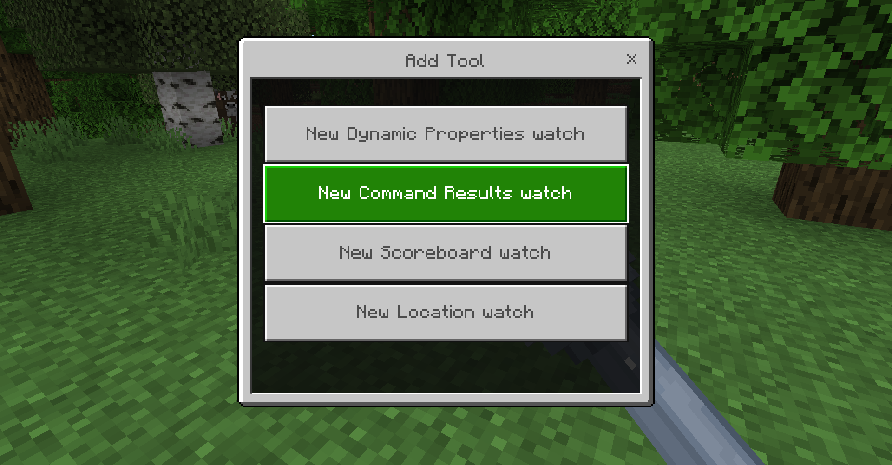
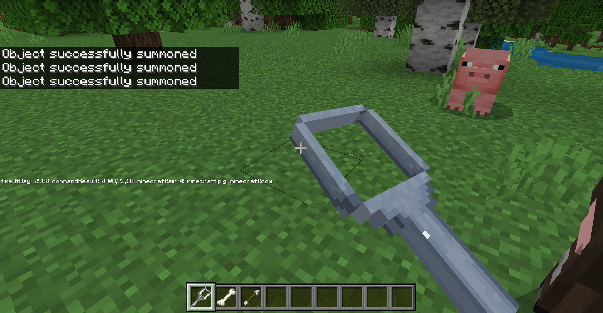

# Building Debug Tools

If you've ever spent a lot of time playing with creations in Minecraft, you've probably seen some unexpected things crop up, commonly known as "bugs". I'm not talking about the silverfish. As you go out and build wonderful and complicated things, unexpected surprise bugs can emerge given the complexity of things and it can take you out of your flow. But dealing with bugs doesn't always need to be a hardship - in this article, we're going to build some tools to make debugging easier.

## Take the "ugg" out of debugging

When you see an "unexpected new behavior" in the middle of your game, sometimes the problem is obvious. A message that pops up that says "Tou wib!" is probably just a typo. But much of the time, bugs start off as a mystery – "why'd it do that?". The bigger your game gets, with more and more interlinked mobs and rules and environmental effects, the bigger the mystery. Unravelling mysterious bugs can be a fun strategy game by itself - as long as you've got good tools that take away the tedious and frustrating parts of debugging.

Imagine, if you will, that you're building a Gift Eagle bird that delivers treats to all animals, but never seems to give treats to cats. That's an unacceptable bug! To figure out why this is happening, you'll want to:

* _Build one or more theories about how that bug can happen._ You'll need to harness your understanding of everything you know about your code and about Minecraft to form full theories more quickly. Maybe it only avoids giving treats to kittens, vs. adult cats? That can't possibly be. But test to see if it matters whether the cat is a kitten or adult.
* _Break down a buggy situation into smaller parts._ If you can't build a theory as to why a bug was happening, or want to test and confirm your theory, rule out different factors so you can see what the problem is. You may need to take some time to set up smaller, different environments to see what's going on. Maybe the problem is actually that they just don't deliver treats in biomes where cats hang around, and it's a "biome bug", not a "cat bug"?
* _Is it a Minecraft thing?_ Sometimes bugs can happen because the underlying Minecraft infrastructure has unexpected "complexity" or maybe you're not quite using an API or command or block or JSON element in just the right way. For this, search your favorite documentation source like the official docs, community sites and wikis, Discord or other corners of the internet to see if others have had similar issues. Maybe your Gift Eagle isn't delivering treats to cats because of some quirk of cats built into Minecraft?

_[It turns out Phantoms have a behavior where they avoid cats. Maybe the bug stems from copying  the Phantom JSON file as your Gift Eagle "starter", and you inadvertently inherited that behavior? Tou wib! You've found the bug!]_

## Put the "gg" in debugging

A great set of tools keeps bug hunting fun by eliminating the tedious parts, so you can focus on inspecting/asking questions/building theories/building smaller test cases. Your metaphorical debugging toolbox should include a number of existing tools built into and around Minecraft. You can see more about some built-in tools like [the content log](https://learn.microsoft.com/minecraft/creator/documents/contenterrorlog?view=minecraft-bedrock-stable) and [GameTest Framework](https://learn.microsoft.com/minecraft/creator/documents/gametestgettingstarted?view=minecraft-bedrock-stable). Minecraft also has a [powerful Script Debugger plug-in for Visual Studio Code](https://learn.microsoft.com/minecraft/creator/documents/scriptdevelopertools?view=minecraft-bedrock-stable) that now features displays of metrics about gameplay that go beyond script debugging.

## Building debug tools

But now we're here at the core of this article: from here, we're going to talk about building a custom debug tool set you can use and extend in Minecraft.

The central concept for our debug tool set is to focus on the idea of "watches". A watch is another word for a probe: it allows you to watch the value of something over time so that as you play your Minecraft game or experience, you can see how that value changes or doesn't change. Our debug tool set will print messages in various places in Minecraft with various updates on the state of blocks, scoreboards, and more. Sometimes developers call this "printf debugging" - think of this add-on as "printf Professional Edition". The add-on can help you answer questions and prove/disprove your hypotheses about what's going wrong. In our Gift Eagle bug scenario, maybe this watch can show the status and location of eagles or cats, so you can track when eagles get close to cats.

You can see these tools in the [`minecraft-samples` GitHub repository](https://github.com/microsoft/minecraft-samples/tree/main/debug_tools). The code is a behavior pack and resource pack that is intended to be added to your worlds as you debug them; if you want to share your world with a broader community, you'd want to remove those "debug only" packs from your world. As a special bonus, you'll see that the packs are factored into two versions: one for the game (suffixed with `_ingame`) and one that serves as an editor plugin (`_editor`) – so whether you want to debug as you play the game or want to debug in the context of an editor session, you can use the same core concepts and code. These packs are still a work in progress, and will grow and expand into other helpful debug tools.

For the rest of this article, though, we're going to focus on the "in-game" debug tools packs.

To get started, select Download from the [samples repository](https://github.com/microsoft/minecraft-samples). Ensure you have Node Package Manager (npm) installed and run `npm install` to ensure all the tools and dependencies are deployed. Assuming you want to deploy these packs to a Minecraft Preview instance, run `npm run local-deploy`. (If you want to use these packs with the "main", non-preview version of Minecraft, edit the .env-ingame file and change MINECRAFT_PRODUCT="PreviewUWP" to MINECRAFT_PRODUCT="BedrockUWP". Then run `npm run local-deploy`.)

After adding the Debug Tools packs to your worlds, you can get started with them by `/give`-ing yourself two debug tools: `/give @s debug_tools:magnifying_glass` and `/give @s debug_tools:wrench`.

### Using our watch debug tool

The magnifying glass, when used, will bring up a series of dialogs that let you edit the configuration of those watches. This uses a series of menus implemented with `@minecraft/server-ui` dialogs.

There are also a couple of display modes: you can either display debug text via the "minecraft" subtitle, via the Minecraft scoreboard, or as an occasional update text or console warning that will show every 5 seconds.

There are several types of watches:

* A time of day tool shows you the current time of day
* A tick tool shows you the current world tick
* A scoreboard tool allows you to select a particular scoreboard value and display it
* A gamemode tool that shows you the active gamemode across players
* A command result tool that will repeatedly run a command (e.g., a `/testfor` command) and display the result

### How it's coded

The main implementation of the logic is in `debug_tools/scripts/DebugTools.ts`. This maintains a list of active "tools" and stores any data related to those tools as well as other configuration state inside of a dynamic property. It also has logic to instantiate types that implement `ITool` to provide for watch-specific implementations – for example, `ScoreboardWatchTool` has the logic to print out the value of a scoreboard across players. `debug_tools/scripts/ingame/main.ts` features the "in game" specific implementation of debug tools experiences, including the logic to host the `@minecraft/server-ui` dialogs and display the text as requested.

In general, the goal therefore is to keep as much generaly debug tool logic inside of `DebugTools.ts` and in-game/editor specific implementations inside of `main.ts`. Ideally, you don't really need to delve too far into the boring work of loading and storing new debug tools over time.

The idea is to make it as easy as possible to add future tools – in the future, you can add your own WatchTool that can print out a specific bit of information specific to your implementation. You can check out `debug_tools/scripts/tools/CustomWatchTool.ts` and `debug_tools/scripts/DebugToolRegistry.ts` for an example simple implementation to extend your own information.

The Debug Tool sample provides a starter implementation and some basic watches that can make your debugging detective work simpler. While investing in creating or extending your own debugging tools can at times feel like a bit of a detour, it'll pay off in the long run when it helps you overcome mysterious bugs – and make the process of bug theory-hunting more like a game than a chore. Happy bug hunting!
