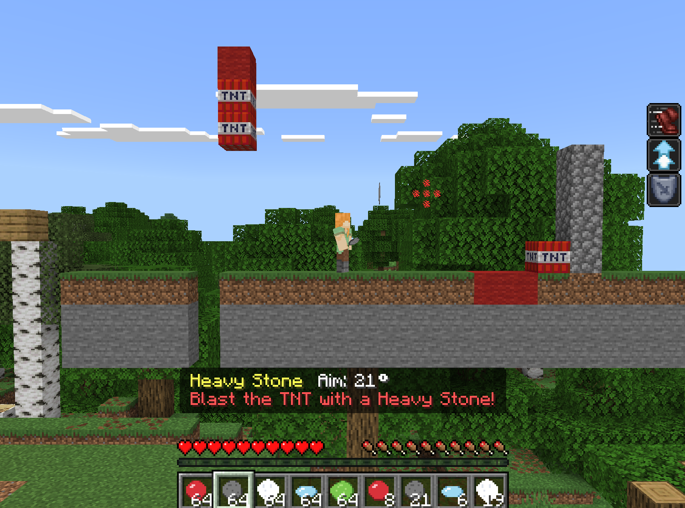
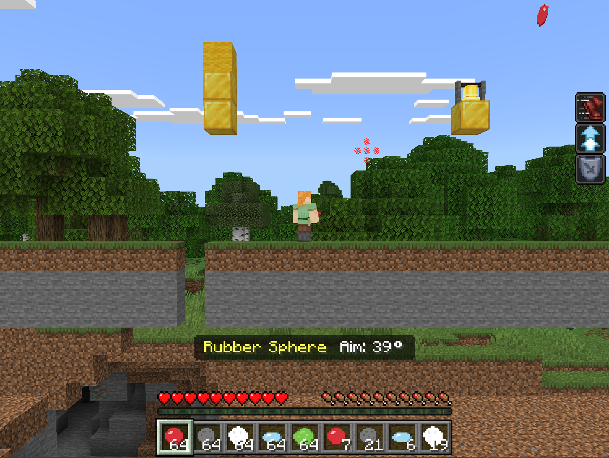
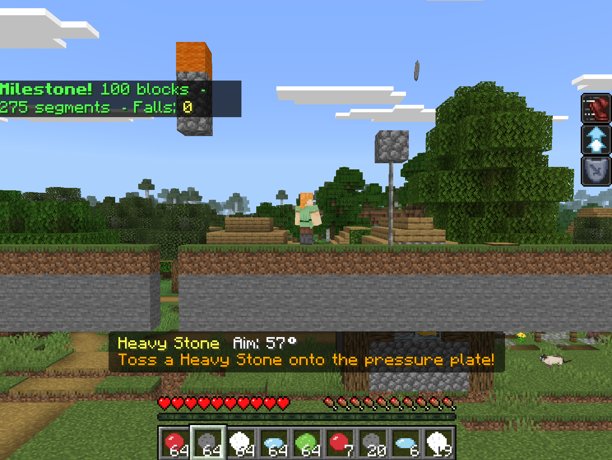

# Toss Lab: Build a Physics Puzzle Game with Lobbable Objects

With new physics-related components for entities introduced in Minecraft as part of the [Chaos Cubed game drop](https://www.minecraft.net/article/play-chaos-cubed-today), adding physics-based effects to your mobs becomes much easier.  In this tour of the "artillery"/side scroller game "Toss Lab", we'll explore all of those new components and tools in a game.

Our job here is to walk you through the interesting parts - the physics components - and explain what makes each lobbable object behave the way it does. Once you understand the components, you can mix them yourself to make whatever physics personalities your game needs.



By the end of this tour through the Toss Lab code, you'll know how to use:

- minecraft:bounciness -- (new in 1.26.30) how much an entity bounces off surfaces
- minecraft:air_drag_modifier -- (new in 1.26.30) how much an entity slows down in the air
- minecraft:uses_uniform_air_drag -- (new in 1.26.30) apply air drag uniformly on both vertical and horizontal axes
- minecraft:friction_modifier -- (improved in 1.26.20) how much an entity slows down on the ground
- minecraft:uses_legacy_friction -- (new in 1.26.20) opt in to the legacy (incorrect) friction calculation for backward compatibility
- minecraft:pushable_by_entity -- (improved in 1.26.30) fine-grained control of how an entity is pushed when something runs into it
- minecraft:apply_knockback_rules -- (updated in 1.26.30, but some elements require a "beta" entity type) fine-grained control of how an entity is nudged when struck

## Prerequisites

To get the most out of this tour, you should be familiar with:

- Getting Started with Add-On Development
- Introduction to Behavior Packs
- Introduction to Resource Packs
- Adding Custom Items

> [!NOTE]
> The new physics components require Minecraft Bedrock Edition 1.26.20 or later. The bounciness, air drag, knockback rules, and improved push components, on the other hand, require 1.26.30 or later.

## Get that sample!

You can find the Toss Lab sample we're walking through in the [Minecraft Samples](https://github.com/microsoft/minecraft-samples) repository, in the toss_lab/ folder. Open it however you prefer:

- Download the zip and, in your favorite editor, examine the code as a plain folder of behavior- and resource-pack files.
- Download the repository and use the Node.js/NPM tools to 'npm run local-deploy' the file from your device

Throughout this tutorial, the sample's identifiers all live under the toss_lab: namespace  — `toss_lab:rubber_sphere`, `toss_lab:heavy_stone`, and so on. When you're building your own variants, don't forget to swap that for your own namespace.

Toss Lab has a puzzle game mechanic, and each object is chosen to play a role in different side-scroller puzzles that are generated into the player's infinite side scroller level.
The objects at a glance

## How the objects work

The sample includes five lobbable objects, each one designed around a different physics component:

| Object	  |  Physics personality	| Components used	| Puzzle role|
|-------------|-------------------------|-------------------|------------|
| Rubber Sphere | Bounces several times in light, predictable arcs |	bounciness, air_drag_modifier |	Reach things behind corners or trigger out-of-sight switches|
|Heavy Stone | Drops fast, doesn't bounce, almost no air drag | bounciness (= 0), apply_knockback_rules | Punch a target block clean off a ledge|
| Cotton Puff | Drifts and floats; takes a long, slow arc |	air_drag_modifier (high), uses_uniform_air_drag	| Land softly on top of a precarious target |
| Ice Disc | Lands on flat ground and slides | friction_modifier (very low), bounciness (low)| Glide across a room to a far pressure plate |
| Sticky Glob | Lands and stops dead, hard to push off friction_modifier (very high), pushable_by_entity (resistant) |    bounciness, air_drag_modifier, uses_uniform_air_drag, friction_modifier | Plug a hole, build stairs, or block a path that mobs can't push aside | 

Each object is an item that, when thrown, spawns a corresponding entity. The entity is where the physics live.

### What the objects have in common

Open any of the five entity files in `behavior_pack/entities/` and you'll notice they have a common base: a small, summonable, throwable entity, a small collision box, no self-damage, and minimal impact damage.

> [!IMPORTANT]
> The new physics components currently don't interact with Projectile Entities (that is, entities with a minecraft:projectile component) in consistent ways, which is why for this sample we are going to focus on "throwable entities" – a non-projectile entity that is "spawned" when a player uses an item. On spawn, that entity has a force applied. When the throwable entity is done moving, we convert it to an item by removing the entity and spawning an item in its place.

The damage value in the projectile's on_hit block is intentionally small (1, or 0 for the Cotton Puff). Toss Lab is about nudging targets and triggering things, not about combat.

The differences between objects live in just a handful of physics components. Let's walk through each object and see what makes it tick.

### Object 1: The Rubber Sphere

The Rubber Sphere is the reference object for bounciness. It bounces a few times before settling, drifts gently through the air, and feels light. It's the tool the player reaches for when a target is around a corner or behind an obstacle.



In `toss_lab:rubber_sphere` within `behavior_packs\toss_lab\entities\rubber_sphere.json`, the physics-defining components are:

```json
"minecraft:bounciness": {
  "value": 0.98
},
  "minecraft:air_drag_modifier": {
  "value": 0.6
},
"minecraft:uses_uniform_air_drag": {}
```

#### So what's going on here?

- `minecraft:bounciness` with a value of 0.98 means the entity retains 98% of its speed each bounce. A value of 1.0 would be a perfectly elastic, never-ending bounce; 0.0 would be a complete stop.
- `minecraft:air_drag_modifier` with a value of 0.6. 0 is the new default-style drag. Higher values slow the object faster.
- `minecraft:uses_uniform_air_drag` causes the drag to apply on both the vertical and horizontal axes equally—so the sphere doesn't fall through the air weirdly while only horizontal drag slows it.

> [!NOTE]
> The combination of `minecraft:air_drag_modifier` + `minecraft:uses_uniform_air_drag` is the modern default for any new flying object. Without `uses_uniform_air_drag`, the engine applies the legacy split where vertical drag is calculated separately. For a brand-new entity, keep them together unless you have a specific reason not to.

### Object 2: The Heavy Stone

The Heavy Stone is the opposite of the Rubber Sphere: a dense object that flies straight, drops fast, and lands without bouncing. Its puzzle role is to deliver a hard, decisive nudge - for example, knocking a target entity off a ledge so it falls onto a pressure plate below. It also triggers TNT that it hits to explode.



The interesting physics on `toss_lab:heavy_stone` in `behavior_packs\toss_lab\entities\heavy_stone.json`:

```json
"minecraft:bounciness": {
  "value": 0.0
},
"minecraft:air_drag_modifier": {
  "value": 1.0
},
"minecraft:uses_uniform_air_drag": {},
"minecraft:apply_knockback_rules": {
  "presets": [
    {
      "horizontal_power": 1.6,
      "vertical_power": 0.5,
      "vertical_velocity_cap": 1.0
    }
  ]
}
```

Here's what to take in this example:

- `minecraft:bounciness` set to 0.0 - the stone lands and stops cold.
- A low air_drag_modifier of 0.2 means almost no air resistance. The stone keeps its speed.
- `minecraft:apply_knockback_rules` does most of the work. This new component lets you describe exactly how things on the receiving end of an impact get pushed. horizontal_power and vertical_power together give the stone the ability to deliver a strong, decisive shove—perfect for bumping a target block clean off a platform! `scale_with_damage` makes the push proportional to the damage delivered, so glancing hits feel different from direct ones.

> [!TIP]
> `apply_knockback_rules` accepts an array of presets, each with an optional filter. That means you can say "shove this kind of target hard, but only nudge that other kind a little" by giving each preset a different filter and doing some fine-tuning. See the Player entity sample for an example with multiple filtered presets—very useful when you want a single object to behave differently when it's up against different puzzle elements.

### Object 3: The Cotton Puff

Out of all these objects, the Cotton Puff is the slowest and gentlest. It drifts on a long, leisurely arc and barely makes contact with anything. Its puzzle role is to land softly on top of a precarious target — say, a column of fragile blocks or a thin platform you don't want to knock over. If it lands in between blocks, it will convert to wool.

`toss_lab:cotton_puff` (in `behavior_packs\toss_lab\entities\cotton_puff.json`) lowers its projectile gravity to 0.01 and its impact damage to 0, then adds:

```json
"minecraft:bounciness": {
  "value": 0.1
},
"minecraft:air_drag_modifier": {
  "value": 6.0
},
"minecraft:uses_uniform_air_drag": {}
```

The high air_drag_modifier of 6.0 is doing the work here. The puff loses speed fast, both horizontally and vertically (thanks to `uses_uniform_air_drag`), so it coasts. Mix that with the puff's low gravity values, and you get a satisfyingly floaty descent to the ground.

### Object 4: The Ice Disc

The Ice Disc is the trick-shot option. It doesn't bounce much, but when it lands on flat ground it slides - potentially much farther than where it touched down! It will also create ice blocks underneath it as it skips. Its puzzle role is to glide across a room to a pressure plate or trigger you can't reach in a straight line, or crossing gaps.

`toss_lab:ice_disc` (--behavior_packs\toss_lab\entities\ice_disc.json--) brings in a new component, `minecraft:friction_modifier`:

```json
"minecraft:bounciness": {
  "value": 0.15
},
"minecraft:air_drag_modifier": {
  "value": 0.85
},
"minecraft:uses_uniform_air_drag": {},
"minecraft:friction_modifier": {
  "value": 0.05
}
```

The base minecraft:friction_modifier value of 1.0 is normal friction; 2.0 is twice as much, 0.0 is theoretically frictionless. The sample uses 0.05 -- a tiny but non-zero value, so the disc eventually stops, but only after a long, smooth glide.

> [!IMPORTANT]
> Because friction_modifier was improved in 1.26.20, new entities now use the corrected friction math by default. Old entities continue to use legacy math via the new minecraft:uses_legacy_friction component, which is automatically added to existing content during migration. Where possible, don't add minecraft:uses_legacy_friction to new entities. It exists to preserve old behavior, not to be used in new content.

### Object 5: The Sticky Glob

The Sticky Glob is the stick-and-stay option. When you toss the glob, it adheres to wherever it lands, making it difficult for mobs to move out of the way. When thrown at a wall, it will convert to a slime block. Its puzzle role is to plug a gap, build stairs, or block a path - drop one in the right spot and even a charging mob can't shove it aside easily.

The interesting bits on toss_lab:sticky_glob:

```json
"minecraft:bounciness": {
  "value": 0.0
},
"minecraft:air_drag_modifier": {
  "value": 1.5
},
"minecraft:uses_uniform_air_drag": {},
"minecraft:friction_modifier": {
  "value": 6.0
},
"minecraft:pushable_by_entity": {
  "presets": [
    {
      "push_mode": "default",
      "strength_multiplier": 0.05,
      "min_distance": 0.1,
      "push_scale_self": 0.1,
      "push_scale_other": 0.9
    }
  ]
}
```

Two things to note here:

- The very high friction_modifier of 6.0 means the glob barely moves once it touches the ground.
- The new `minecraft:pushable_by_entity` presets give us fine control over what happens when something bumps into the glob. The low `strength_multiplier` and `push_scale_self` values mean the glob mostly ignores anything trying to shove it. Meanwhile, a high `push_scale_other` value means whatever bumps into it gets pushed away&mdash;like running into a wall of slime. Stack a few of these in a doorway and you've got yourself a sticky barricade!

> [!NOTE]
> minecraft:pushable_by_entity was improved in 1.26.30 to support presets (with optional filters), opening up cases like "I am pushable by zombies but not by players" or "I shove other things harder than they shove me". The classic `minecraft:pushable_by_entity: {}` form still works for "yes, things can push me, default behavior."

### Try them out

In a Creative test world with the sample applied, /give yourself one of each object and throw them at things. You should immediately feel the difference: bouncy ones bounce, drag-y ones drift, slippery ones slide, sticky ones plant themselves... you get the idea.

The toss_lab sample is intentionally minimal, beacuse it's just a starting point for your creativity. There are a few directions to take the sample once you've sampled the objects:

- Tweak the existing five. Open `toss_lab:rubber_sphere` and dial bounciness down to 0.65. Open `toss_lab:cotton_puff` and double the `air_drag_modifier`. Each component has a small enough surface area that you can iterate fast.

- Add a sixth object. Maybe it's a magnet shell with a high `pushable_by_entity` value to attract things. Or perhaps a featherweight glider with very low gravity value and modest amounts of drag. Or maybe a tumbler with directional `apply_knockback_rules` filtered by entity type? Use the existing files as templates.

- Puzzle rooms. Use structure blocks to design and stamp out rooms with pressure plates, switches, target blocks, and gaps that each need a different object to solve.

- Object cooldowns and limited inventories. Add minecraft:cooldown to each item, or hand-pick which objects are available in each room, so each puzzle has a clear "best" answer.

## Quick reference: the new physics components

| Component | Added | Purpose |
| ------------ | ------- | --------- |
| minecraft:bounciness | 1.26.30 (new) | Specifies if and how much an entity bounces on impact |
| minecraft:air_drag_modifier | 1.26.30 (new) | Specifies if and how much an entity slows down in the air |
| minecraft:uses_uniform_air_drag | 1.26.30 (new) | Applies air drag uniformly on vertical and horizontal axes |
| minecraft:friction_modifier | 1.26.20 (improved) | Specifies if and how much an entity slows down on the ground |
| minecraft:uses_legacy_friction | 1.26.20 (new) | Opts into legacy (incorrect) friction math for backward compatibility |
| minecraft:pushable_by_entity | 1.26.30 (improved) | Fine-grained control over how an entity is pushed when something runs into it |
| minecraft:apply_knockback_rules | 1.26.30 (new and ongoing) | Fine-grained control over how an entity is nudged when struck |
