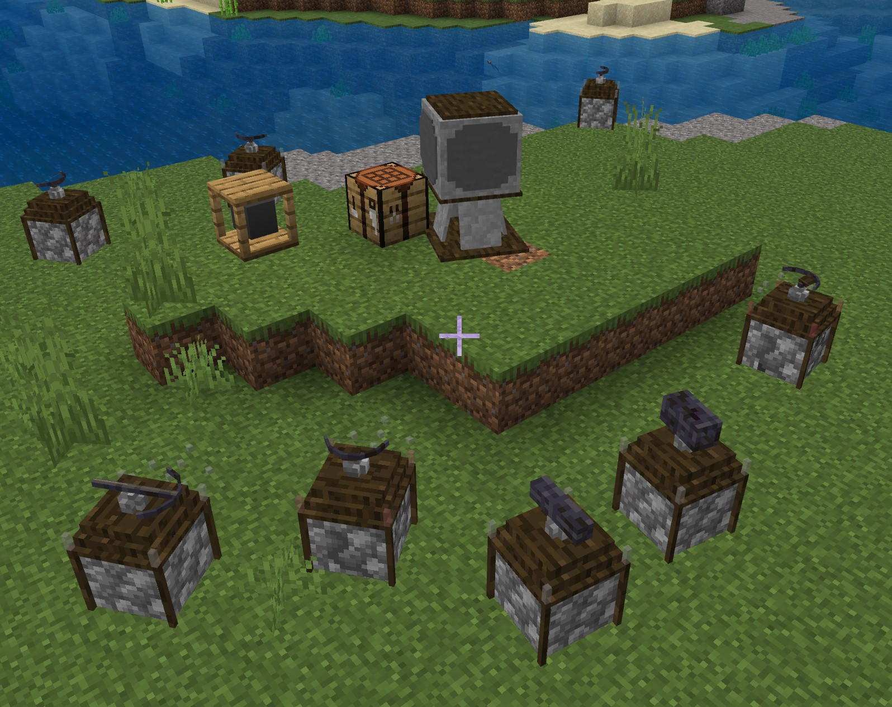
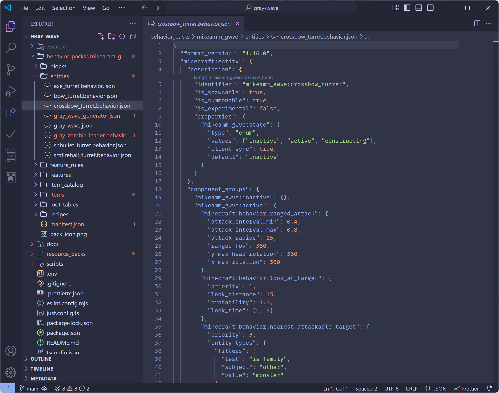
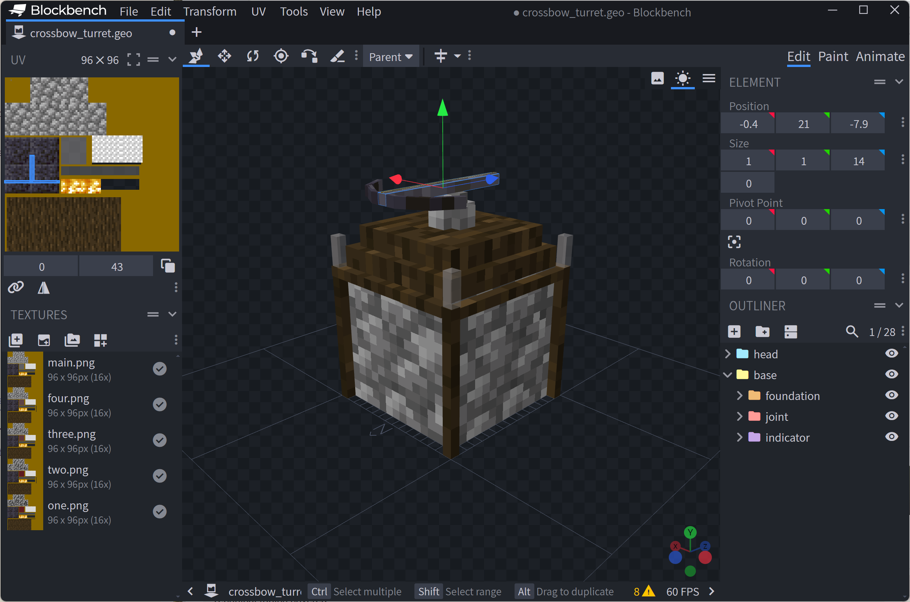

# Build a Tower Defense Add-On

The [Gray Wave Add-On](https://github.com/microsoft/minecraft-samples/tree/main/casual_creator/gray_wave) not only adds cool new game mechanics to Minecraft: Bedrock Edition, it demonstrates several topics and techniques you can use in your own Add-Ons, including entity properties and states, render controllers, custom features, scripting with JSON and Molang, and quick editing of models in Blockbench.

> [!VIDEO https://www.youtube.com/embed/5a5pYrRF87s]

The Gray Wave Add-On was created as part of an Add-On Jam in the [Bedrock Add-Ons Community Discord](https://wiki.bedrock.dev/discord). The video demonstrates the Add-On and walks through its features; we'll go over some of them in more detail below.

## What is Gray Wave?

The Gray Wave Add-On introduces the concept of the _Gray Wave,_ an energy force used to power _turrets,_ blocks with attached weapons&mdash;bows, crossbows, fireballs, even axes&mdash;that fire (or swing) toward approaching enemies. Gray wave energy is generated, naturally enough, by _Gray Wave Generators,_ which require the use of a new mineral you can mine: _Gray Ore._ With gray ore and other ingredients, you can craft a _Fabricator_ to build the generators and turrets. Then, when turrets are within a certain range and have line of sight to the generator, they'll power on and start shooting at enemies.

However, using gray wave generators will start attracting enemies, too. You'll need to position your turrets in a way that helps defend your generator. Turrets also take damage. And, there's a new enemy type, the _Gray Wave Leader,_ who'll specifically target generators. If you can take out a leader, though, you might be rewarded with their loot&mdash;depleted gray shards, which your fabricator can turn into emeralds.

One of the neat aspects of the Gray Wave Add-On is that it's completely optional as a gameplay element. If you don't use turrets, you'll never get any gray waves, new mobs, or gray wave leaders attacking. If you want the extra strategic challenge of designing a fortification and seeing how it holds up, though, you can "opt in" by mining gray ore and starting to place your turrets!



## Get the code

Let's dig into the Gray Wave Add-On! We're going to cover entity properties and type families, events, scripting, modeling and more. First, though, you'll have to download the Add-On's source code and install the required Node packages.

> [!IMPORTANT]
> To get going, you'll need to have [Visual Studio Code](https://code.visualstudio.com/) and the [Node.js](https://nodejs.org) tools installed already. If you're installing Node for the first time, choose the most recent "LTS" version to install.

### Downloading

You can download the Minecraft Samples project from GitHub at <https://github.com/microsoft/minecraft-samples/>. Under **Code**, select **Download ZIP**. Unzip the folder somewhere on your hard drive.

Create a new folder to store your copy of the Add-On, such as **C:\projects\gray-wave**. Copy the contents of **casual_creator/gray_wave** folder to it.

### Installing Node packages

Open Windows Terminal or PowerShell and change the working directory to your project folder.

```shell
cd c:\projects\gray-wave
```

Then, install the tools with the Node Package Manager (NPM).

```shell
npm install
```

Finally, open your new project in Visual Studio Code.

```shell
code .
```

> [!TIP]
> Code might prompt you to install the Minecraft Debugger and Blockception's Visual Studio Code plugin. If it does, go ahead and install them&mdash;they'll help you with Minecraft development.

## Exploring the code



In Visual Studio Code, you'll see a lot of subfolders that might be familiar to you as a Minecraft creator: [behavior\_packs](../Documents/BehaviorPack.md) with [entities](../Documents/IntroductionToAddEntity.md), for instance, and [resource\_packs](../Documents/ResourcePack.md) with models and textures. Turrets are the heart of the Gray Wave pack, so let's see how they're made.

### Behavior pack

Open the **behavior\_packs/mikeamm\_gwve/entities** folder and select the **crossbow_turret.behavior.json** file.

One of the first things you'll notice is the `description` block, which tells us the turret is spawnable and summonable (but not experimental). The more interesting section in that block contains the `properties`:

```json
"properties": {
  "mikeamm_gwve:state": {
    "type": "enum",
    "values": ["inactive", "active", "constructing"],
    "client_sync": true,
    "default": "inactive"
  }
}
```

This defines a new [property](../Documents/IntroductionToEntityProperties.md), `state`, which can be `active` or `inactive`, with a default of `inactive`. This property lets the game know whether the turret is active, that is, powered up and able to fire at enemies.

> [!NOTE]
> Wait, what happened to the `constructing` state? The original idea was to have a third state with different behavior while the turrets were "under construction" and not fully operational, but that was never implemented. You could always try and add it in yourself!

Let's look at the `components` block. This gives the turret its basic characteristics such as how much damage it can take, what damage it takes from conditions like being dropped in lava, how hard it is to knock back (`minecraft:knockback_resistance`), and so on. It also does something that might be unexpected:

```json
"minecraft:type_family" {
  "family": ["gray_wave", "player", "gray_wave_consumer"]
}
```

The `gray_wave` type family associates it with this Add-On, and `gray_wave_consumer` indicates that it "consumes" gray wave energy rather than producing it. But the `player` type family gives the turrets many properties of players. Why? Because it's one of the easiest ways to attract hostile mobs: the attack behavior of zombies, skeletons, and so on, involves looking for `player` objects and going after them.

There are _other_ behaviors that are driven by this family type, so this shortcut isn't without side effects. Those should be mostly harmless, such as entities like frogs and sheep frequently admiring the turrets even when they're not attacking them, but it's something to be aware of.

There's some other things in `components` worth noting. We've given the turret a `health` value here, and we've also given it a `movement` value of `0` just to ensure that it's not going to move on its own somehow. Likewise, the `body_rotation_blocked` property is set (even though it's an empty list) to make sure the turret _body_ doesn't rotate to face the enemy, only the head. (See [Models](#models), below, for more about that.) Also, to reinforce the idea that this is a heavy, immovable stone object, it has a very high knockback resistance.

We'll come back to the `component_groups` section after talking about...

#### Events and states

The `events` block contains directives for the `active` and `inactive` states we defined above. Here's the activation event:

```json
"mikeamm_gwve:activate": {
  "add": {
    "component_groups": ["mikeamm_gwve:active"]
  },
  "remove": {
    "component_groups": ["mikeamm_gwve:inactive"]
  },
  "set_property": {
    "mikeamm_gwve:state": "active"
  }
}
```

The `deactivate` event is similar, but swaps each of the values above: the `inactive` component group is added, the `active` group is removed, and the `state` property is set to `inactive`.

Now, go back up to the `component_groups` section, and you can see the effects of these events:

```json
"component_groups": {
  "mikeamm_gwve:inactive": {},
  "mikeamm_gwve:active": {
    "minecraft:behavior.ranged_attack": {
      "attack_interval_min": 0.4,
      "attack_interval_max": 0.8,
      "attack_radius": 15,
      "ranged_fov": 360,
      "y_max_head_rotation": 360,
      "x_max_rotation": 360
    },
    // continues...
  }
}
```

The `active` group contains new settings for the turret that control `behavior.ranged_attack`, `behavior.look_at_target`, `behavior.nearest_attackable.target`, `behavior.hurt_by_target`, and `behavior.random_look_around`. The `inactive` group, by contrast, is the empty list: `{}`. So, when the turret becomes `active`, it gets directions for finding attackable targets (the `filters` block), and for how fast and far it can shoot its crossbow (the `behavior.ranged_attack` block).

#### Feature: placing gray ore

In **features/gray\_ore\_feature.json**, there are [ore features](../Reference/Content/FeaturesReference/Examples/Features/minecraft_ore_feature.md) that allow gray ore blocks to replace stone, granite, and andesite. There's more complex logic for placement in **features/gray\_ore\_feature\_rules.json**, which sets up the [conditions](../Reference/Content/FeaturesReference/Examples/Features/feature_rule_definition.md) under which Minecraft is allowed to place gray ore and how it's distributed.

#### Items

These are all defined as JSON files in the **items** subfolder. The JSON schema is described in [Item Definition Properties](../Reference/Content/ItemReference/Examples/ItemDefinition.md).

* Turret kits (`*_turret_kit.item.json`)
* Gray Wave generator (`gray_wave_generator_kit.item.json`)
* Depleted gray shard (`depleted_gray_shared.item.json`)

#### Recipes

The **recipes** subfolder contains recipes for all the turret kits, the gray wave generator, and adds `emeralds.recipe.json` and `fabricator.recipe.json`. Learn more about creating recipes starting with the [Introduction to Recipes](../Documents/RecipeIntroduction.md).

### Scripting

So we've seen the definitions for what happens when the `active` and `inactive` events fire off, but what actually kicks off those events? Open the **scripts** folder and select **main.ts**. Here's the entire file&mdash;it's short:

```typescript
import { world, system } from "@minecraft/server";
import GrayWaveManager from "./GrayWaveManager";

const g_gwmn = new GrayWaveManager();
let tickIndex = 0;

function mainTick() {
  tickIndex++;

  if (tickIndex === 100) {
    g_gwmn.init();
  } else if (tickIndex > 100) {
    try {
      g_gwmn.tick(tickIndex);
    } catch (e) {
      console.warn(e);
    }
  }

  system.run(mainTick);
}

system.run(mainTick);
```

The `system.run()` method is very simple: it runs the specified function, in this case `mainTick()`, at the end of a "tick"&mdash;a regular unit of time the game uses to schedule processes. There are usually 20 ticks per second. You can see `mainTick()` itself is also simple: it loads another class called `GrayWaveManager` (we'll get to it in a moment); at 100 ticks, it calls the `init()` method in that class, and every tick after that, it calls the `tick()` method.

Open `GrayWaveManager.ts`. The (first) interesting part to look at is the `tick()` method, a dispatcher that makes two calls on a schedule. Let's look at both of them.

#### Activating and deactivating turrets

The `processGrayWaveItemsAroundPlayer(player)` method is called for every player once every 60 ticks. It finds every object in the `gray_wave` family within 50 blocks of the player, then loops through them to find gray wave consumers (e.g., turrets). For each of those, it goes through the following steps:

* Find whether the turret is connected to a generator or not by calling `getConnectedGenerator()`:
  * Find all the generators within 30 blocks of the turret;
  * Calculate whether there is a `lineOfSightBetween` any given generator and the turret (e.g., no blocks are between the two entities);
  * When any generator has line of sight to the turret, return it, and if no generators do, return `undefined`;
* If the turret is `inactive` and connected, set it to `active`, play the power up sound, and trigger the `activate` event;
* If the turret is `active` and _not_ connected, set it to `inactive`, play the power down sound, and trigger the `deactivate` event.

#### Spawning hordes

Every 20 ticks, `considerWhetherToSpawnHorde()` is called. This checks to see whether the current tick is greater than the `nextHordeInterval`. If it is, and if there are any "active Gray Wave consumers"&mdash;that is, operational turrets&mdash;then `spawnHorde()` is called with a randomly chosen turret,  its connected generator, and an intensity. (If you read the code, you'll see the hordes get more intense the more turrets you have!) A horde of a random type (skeletons, zombies, witches, and so on) is generated at a randomly chosen location some distance away from the target turret.

There's a trick here, though: it's difficult to get a mob you've generated in the distance to consistently march toward its target. So in addition to generating a mob, we also generate actual Gray Wave particles. These are deliberately hard-to-see entities that are placed to form a line between the newly-generated horde of enemies and the target turret&mdash;effectively a trail of breadcrumbs. This isn't a foolproof solution to the problem, but it works well enough for a first pass.

Note that after the horde is generated, the last thing `spawnHorde()` does is generate a new value for `nextHordeInterval`. (If this interval isn't set on the very first call to `considerWhetherToSpawnHorde()`, it gets set then: if it didn't, no hordes would ever be spawned!)

### Rendering

#### Models

If you open **resource_packs/mikeamm\_gwve/models/entity/crossbow\_turret.geo.json** in [Blockbench](../Documents/Blockbench.md), you can see how the turret model is constructed: just like a real player, it has a "head" that can turn to look at (and attack) its target.



> [!TIP]
> The stock textures used in the Gray Wave models are available in the [Bedrock Samples pack](https://github.com/mojang/bedrock-samples), licensed under the [Minecraft End-User License Agreement](https://www.minecraft.net/eula).

Notice the turrets have "health indicators": the corners have translucent glass pillars that slowly turn red as the turrets lose health. You'll also notice cracks that appear on top of the turret as it gets damaged. How's that done? In the Blockbench editing screen, you can see there are five different textures, named `main`, `four`, `three`, `two`, and `one`. Each one adds a few more cracks and changes the color of the glass pillars.

#### Render controllers

These JSON files drive Gray Wave item rendering, including the turrets in **turret.rc.json**. This is another short file, so we can look at it in its entirety:

```json
{
  "format_version": "1.8.0",
  "render_controllers": {
    "controller.render.mikeamm_gwve_turret": {
      "arrays": {
        "textures": {
          "Array.damageLevels": ["Texture.one", "Texture.two", "Texture.three", "Texture.four", "Texture.main"]
        }
      },
      "geometry": "Geometry.default",
      "materials": [{ "*": "Material.default" }],
      "textures": ["Array.damageLevels[math.clamp(query.health / 50, 0, 4)]"]
    }
  }
}
```

You can see how the texture-changing trick is accomplished here: in the render controller for the turret, we put the various damage level textures in `Array.damageLevels`, then use a bit of [Molang](../Documents/MolangBeginnersGuide.md) to choose which texture to map to the model by dividing the turret's health by `50`, arriving at a number from `0` (most damaged) to`4` (least damaged), and choosing the corresponding texture.

## Wrapping up

The Gray Wave Add-On uses a range of techniques and elements to add a whole new gameplay mechanic to Minecraft: Bedrock Edition. Try customizing the models, tweaking the behaviors, and using it as an inspiration for building your own Add-Ons!
