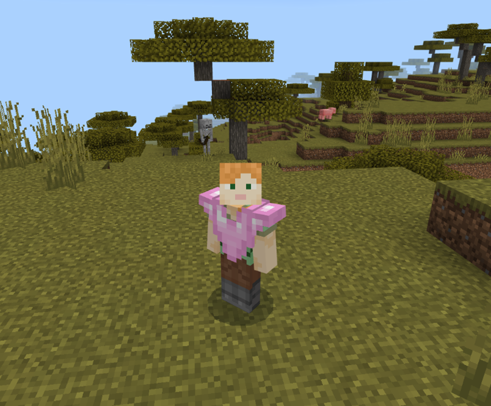
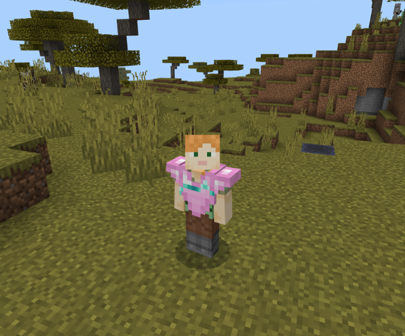
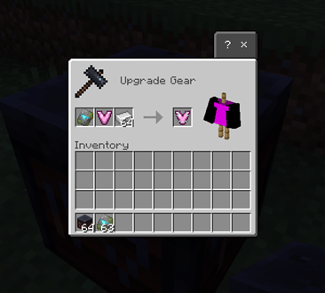
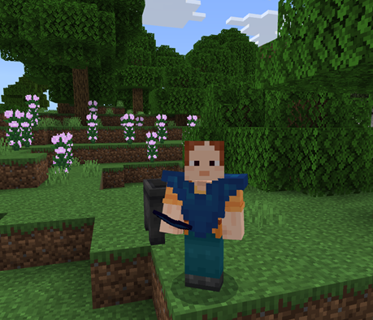

# Custom Items

Just like you can create custom blocks and entities, you can create custom items in Minecraft, too! This tutorial shows you how&mdash;what types of files different kinds of items need, where they go in resource and behavior packs, and what JSON files to edit or create.

> [!CAUTION]
> Just like entities and blocks, files for items have specific names (or extensions), and they need to be placed in the correct folders or sub-folders. If your add-on pack for a new or customized item doesn't work, doublecheck that everything is in the right place!

You should be familiar with these other tutorials before tackling custom items:

- [Getting Started with Add-On Development](GettingStarted.md)
- [Introduction to Resource Packs](ResourcePack.md)
- [Introduction to Behavior Packs](BehaviorPack.md)
- [How to Add a Simple Custom Block](AddCustomDieBlock.md)
- [Minecraft Item Wizard](MinecraftItemWizard.md)

You might also want to take a look at the files and folder structure of the [Vanilla Minecraft Add-On Packs](https://aka.ms/resourcepacktemplate).

## Make some items

We're going to make four items that don't exist in vanilla Minecraft. In order of complexity:

- Goo
- Wrench
- Crown
- Custom Chestplate with Vanilla Armor Trim

And, at the end, we'll talk about dyeable custom items.

You can create an add-on pack for each item, or do sets of packs for two or more items.

This is the general process for creating items we'll follow:

1. Create Behavior Pack and Resource Pack folders.
1. Create the folder and file structure for the item you want to create, being sure to include the **manifest.json** files.
1. Copy and paste the contents for the custom item files from the content in each section.
1. Download and save the graphic files into the correct location.
1. Copy or move the packs into the **development_behavior_pack** and **development_resource_pack** folders in your com.mojang folder.
1. Launch Minecraft: Bedrock Edition.
1. Create a world with the behavior pack and resource packs activated.
1. Choose either Creative Mode or Survival Mode with cheats toggled on.
1. Go into your world and use the `/give @s demo:<item>` command to get your custom item.

> [!TIP]
> While we're providing you with graphics and model files, you can edit them or create entirely new ones in [Blockbench](./Blockbench.md) or a similar editor.

Each **manifest.json** file follows a similar template&mdash;the same one in the [Resource Pack](ResourcePack.md) and [Behavior Pack](BehaviorPack.md) tutorials. As with those, be sure you create new [UUIDs](https://uuidgenerator.net) for your items!

The Behavior Pack **manifest.json** file looks like this:

```json
{
  "format_version": 2,
  "header": {
    "description": "Custom Item Behavior Pack",
    "name": "Custom Item Behavior Pack",
    "uuid": "<ADD YOUR OWN UUID>",
    "version": [1, 0, 1],
    "min_engine_version": [1, 20, 30]
  },
  "modules": [
    {
      "description": "Custom Item Behavior Pack",
      "type": "data",
      "uuid": "<ADD YOUR OWN UUID>",
      "version": [1, 0, 1]
    }
  ]
}
```

The Resource Pack **manifest.json** file looks like this:

```json
{
  "format_version": 2,
  "header": {
    "description": "Custom Item Resource Pack",
    "name": "Custom Item Resource Pack",
    "uuid": "<ADD YOUR OWN UUID>",
    "version": [1, 0, 1],
    "min_engine_version": [1, 20, 30]
  },
  "modules": [
    {
      "description": "Custom Item Resource Pack",
      "type": "resources",
      "uuid": "<ADD YOUR OWN UUID>",
      "version": [1, 0, 1]
    }
  ]
}
```

## Goo

Goo is the simplest custom item: you don't wear it or eat it, it's just a handful of weird goo. It's useful for making sure your add-on packs work and for experimenting with stack size and the display name.

### Goo Behavior Pack


Copy and paste this JSON into **development_behavior_pack/items/goo.json**:

```json
{
  "format_version": "1.20.30",
  "minecraft:item": {
    "description": {
      "identifier": "demo:goo",
      "category": "Items"
    },
    "components": {
      "minecraft:max_stack_size": 16,
      "minecraft:icon": {
        "texture": "demo:goo"
      },
      "minecraft:display_name": {
        "value": "Weird Goo"
      }
    }
  }
}
```

### Goo Resource Pack


Copy and paste this JSON into **development_resource_pack/textures/item_texture.json**:

```json
{
  "resource_pack_name": "Goo Resource Pack",
  "texture_data": {
    "demo:goo": {
      "textures": "textures/items/goo"
    }
  }
}
```

Here is a PNG file to use as the goo texture:


Copy that file into **development_resource_pack/textures/items/**.

### Custom Goo Result

After you create the packs, go into Minecraft, and give yourself goo, it should look like this:


## Wrench

An awesome giant wrench! This item has separate texture files for the version in your hotbar and the version you hold in your hand.

### Wrench Behavior Pack

Copy and past this JSON into **development_behavior_pack/items/wrench.json**:

```json
{
  "format_version": "1.20.30",
  "minecraft:item": {
    "description": {
      "identifier": "demo:wrench",
      "category": "Items"
    },

    "components": {
      "minecraft:max_stack_size": 16,
      "minecraft:icon": {
        "texture": "demo:wrench"
      },
      "minecraft:wearable": {
        "dispensable": true,
        "slot": "slot.weapon.offhand"
      }
    }
  }
}
```

### Wrench Resource Pack


Copy and past this JSON into **development_resource_pack/attachables/wrench.player.json**:

```json
{
  "format_version": "1.20.30",
  "minecraft:attachable": {
    "description": {
      "identifier": "demo:wrench",
      "item": { "demo:wrench": "query.is_owner_identifier_any('minecraft:player')" },
      "materials": {
        "default": "entity",
        "enchanted": "entity_alphatest_glint"
      },
      "textures": {
        "default": "textures/items/wrench",
        "enchanted": "textures/misc/enchanted_item_glint"
      },
      "geometry": {
        "default": "geometry.wrench"
      },
      "animations": {
        "hold_first_person": "animation.steve_head.hold_first_person",
        "hold_third_person": "animation.steve_head.hold_third_person"
      },
      "scripts": {
        "animate": [
          {
            "hold_first_person": "context.is_first_person == 1.0"
          },
          {
            "hold_third_person": "context.is_first_person == 0.0"
          }
        ]
      },
      "render_controllers": ["controller.render.item_default"]
    }
  }
}
```

And copy and paste this JSON into **development_resource_pack/models/entity/wrench.geo.json**:

```json
{
  "format_version": "1.16.0",
  "minecraft:geometry": [
    {
      "description": {
        "identifier": "geometry.wrench",
        "texture_width": 32,
        "texture_height": 32,
        "visible_bounds_width": 3,
        "visible_bounds_height": 4,
        "visible_bounds_offset": [0, 1, 0]
      },
      "bones": [
        {
          "name": "bb_main",
          "pivot": [0.1, 19, -6],
          "rotation": [125, 0, 0],
          "binding": "q.item_slot_to_bone_name(context.item_slot)",
          "cubes": [
            {"origin": [-0.9, 9, -8], "size": [2, 16, 3], "uv": [0, 13]},
            {"origin": [-0.9, 25, -11], "size": [2, 4, 9], "uv": [0, 0]},
            {"origin": [-0.9, 29, -5], "size": [2, 2, 3], "uv": [13, 0]},
            {"origin": [-0.9, 29, -11], "size": [2, 1, 3], "uv": [10, 13]},
            {"origin": [-0.9, 30, -10], "size": [2, 1, 2], "uv": [10, 17]},
            {"origin": [-0.9, 31, -5], "size": [2, 1, 3], "uv": [13, 5]},
            {"origin": [-0.9, 32, -5], "size": [2, 1, 2], "uv": [0, 6]},
            {"origin": [-0.9, 31, -9], "size": [2, 1, 1], "uv": [17, 19]},
            {"origin": [-0.9, 33, -5], "size": [2, 1, 1], "uv": [16, 17]},
            {"origin": [-0.9, 24, -5], "size": [2, 1, 2], "uv": [0, 3]},
            {"origin": [-0.9, 24, -10], "size": [2, 1, 2], "uv": [0, 0]},
            {"origin": [-0.9, 23, -5], "size": [2, 1, 1], "uv": [17, 13]},
            {"origin": [-0.9, 23, -9], "size": [2, 1, 1], "uv": [7, 13]}
          ]
        }
      ]
    }
  ]
}
```

Now, you'll need to download these two graphics files and put them into **development_resource_pack/textures/items**:

This is the wrench icon...


...and this is the wrench's texture:


To complete the Resource Pack, you'll need to copy and paste this JSON into **development_resource_pack/textures/item_texture.json**:

```json
{
  "resource_pack_name": "Wrench Resource Pack",
  "texture_data": {
    "demo:wrench": {
      "textures": "textures/items/wrench_ico"
    }
  }
}
```

After you create the packs, go into Minecraft, and give yourself a wrench, it should look like this:


## Crown

We'll create a crown item by customizing a helmet.

### Crown Behavior Pack


Copy and paste this JSON into **development_behavior_pack/items/crown.json**:

```json
{
  "format_version": "1.20.30",
  "minecraft:item": {
    "description": {
      "identifier": "demo:crown",
      "category": "Items"
    },
    "components": {
      "minecraft:max_stack_size": 1,
      "minecraft:icon": {
        "texture": "demo:crown"
      },
      "minecraft:wearable": {
        "dispensable": true,
        "slot": "slot.armor.head"
      }
    }
  }
}
```

### Crown Resource Pack


Copy and paste this JSON into **development_resource_pack/attachables/crown.player.json**:

```json
{
  "format_version": "1.19.80",
  "minecraft:attachable": {
    "description": {
      "identifier": "demo:crown_hat.player",
      "item": { "demo:crown": "query.is_owner_identifier_any('minecraft:player')" },
      "materials": {
        "default": "armor",
        "enchanted": "armor_enchanted"
      },
      "textures": {
        "default": "textures/items/crown_minecraft",
        "enchanted": "textures/misc/enchanted_item_glint"
      },
      "geometry": {
        "default": "geometry.crown"
      },
      "scripts": {
        "parent_setup": "variable.helmet_layer_visible = 0.0;"
      },
      "render_controllers": ["controller.render.armor"]
    }
  }
}
```

Copy and paste this JSON into **development_resource_pack/models/entity/crown.geo.json**:

```json
{
  "format_version": "1.16.0",
  "minecraft:geometry": [
    {
      "description": {
        "identifier": "geometry.crown",
        "texture_width": 32,
        "texture_height": 32,
        "visible_bounds_width": 2,
        "visible_bounds_height": 3.5,
        "visible_bounds_offset": [0, 1.25, 0]
      },
      "bones": [
        {
          "name": "Crownbase",
          "pivot": [0, 0, 0],
          "binding": "q.item_slot_to_bone_name(context.item_slot)",
          "cubes": [
            {"origin": [-3, 31, -6.4], "size": [6, 3, 2], "uv": [1, 0]},
            {"origin": [-5, 31, -6.4], "size": [6, 3, 2], "pivot": [-1, 31, -1.4], "rotation": [0, 90, 0], "uv": [0, 0]},
            {"origin": [-3, 31, 1.6], "size": [6, 3, 2], "pivot": [1, 31, -1.4], "rotation": [0, 90, 0], "uv": [0, 0]},
            {"origin": [-3, 31, 4.6], "size": [6, 3, 2], "uv": [1, 0]},
            {"origin": [3, 31, -5.4], "size": [2, 3, 2], "uv": [24, 0]},
            {"origin": [3, 31, 2.6], "size": [2, 3, 2], "uv": [22, 23]},
            {
              "origin": [-5, 31, -5.4],
              "size": [2, 3, 2],
              "uv": {
                "north": {"uv": [18, 22], "uv_size": [2, 3]},
                "east": {"uv": [16, 22], "uv_size": [2, 3]},
                "south": {"uv": [22, 22], "uv_size": [2, 3]},
                "west": {"uv": [20, 22], "uv_size": [2, 3]},
                "up": {"uv": [18, 20], "uv_size": [2, 2]},
                "down": {"uv": [20, 22], "uv_size": [2, -2]}
              }
            },
            {"origin": [-5, 31, 2.6], "size": [2, 3, 2], "uv": [20, 10]}
          ]
        },
        {
          "name": "crownprongs",
          "pivot": [0, 0, 0],
          "binding": "q.item_slot_to_bone_name(context.item_slot)",
          "cubes": [
            {"origin": [-5, 34, -5.4], "size": [2, 3, 2], "uv": [8, 20]},
            {"origin": [3, 34, 2.6], "size": [2, 3, 2], "uv": [20, 5]},
            {"origin": [3, 34, -5.4], "size": [2, 3, 2], "uv": [0, 20]},
            {"origin": [-5, 34, 2.6], "size": [2, 3, 2], "uv": [16, 15]}
          ]
        },
        {
          "name": "crownextraprongs",
          "pivot": [0, 0, 0],
          "binding": "q.item_slot_to_bone_name(context.item_slot)",
          "cubes": [
            {"origin": [-1, 34, -6.4], "size": [2, 3, 2], "uv": [8, 15]},
            {"origin": [-6, 34, -1.4], "size": [2, 3, 2], "uv": [0, 15]},
            {"origin": [-1, 34, 4.6], "size": [2, 3, 2], "uv": [12, 10]},
            {"origin": [4, 34, -1.4], "size": [2, 3, 2], "uv": [12, 5]}
          ]
        },
        {
          "name": "crownjewels",
          "pivot": [0, 0, 0],
          "binding": "q.item_slot_to_bone_name(context.item_slot)",
          "cubes": [
            {"origin": [-7, 32, -1.4], "size": [1, 1, 2], "uv": [6, 25]},
            {"origin": [5, 32, -2.4], "size": [1, 1, 2], "pivot": [0, 31, -1.4], "rotation": [0, 90, 0], "uv": [0, 25]},
            {"origin": [-6, 32, 0.6], "size": [1, 1, 2], "pivot": [0, 31, 1.6], "rotation": [0, 90, 0], "uv": [22, 18]},
            {"origin": [6, 32, -1.4], "size": [1, 1, 2], "uv": [24, 15]}
          ]
        }
      ]
    }
  ]
}
```

That file creates the custom shape of the crown that the texture will be mapped on to.

Now, here are the image files to download and use for the crown icon and the crown texture itself. Copy these images into **development_resource_pack/textures/items**.

Here is the crown icon:


Here is the crown texture:


Last but not least, copy and paste this JSON into **development_resource_pack/textures/item_texture.json**:

```json
{
  "resource_pack_name": "crown_resource_pack",
  "texture_data": {
    "demo:crown": {
      "textures": "textures/items/crown"
    }
  }
}
```

### Custom crown result

After you create the packs, go into Minecraft, give yourself a crown, and put it on, you should look like this:


## Custom chestplate with vanilla armor trim

If you create a custom chestplate, either by hand or through using the [Minecraft Item Wizard](MinecraftItemWizard.md), you can have it support all the Armor Trims available as of release 1.20.70. You can modify the trim patterns to better fit your custom armor too!

> [!NOTE]
> To use armor trim on your custom armor, you need to set your `format_version` on the item and attachable to a minimum of `1.20.60`.

### Chestplate Behavior Pack

Copy and paste this JSON into **development_behavior_pack/items/custom_chestplate.item.json**:

```json
{ 
"format_version": "1.20.60", 
  "minecraft:item": { 
    "description": { 
      "identifier": "demo:custom_chestplate", 
      "menu_category": { 
        "category": "equipment", 
        "group": "itemGroup.name.chestplate" 
      }
    },
    "components": { 
      "minecraft:max_stack_size": 1, 
      "minecraft:icon": { 
        "textures": { 
          "default": "custom_chestplate" } 
      }, 
      "minecraft:wearable": { 
        "protection": 10, 
        "slot": "slot.armor.chest" 
      }, 
      "minecraft:durability": { 
        "damage_chance": { 
          "min": 10, 
          "max": 50 
      }, 
        "max_durability": 1560 
      }, 
      "minecraft:repairable": { 
        "repair_items": [ 
          { 
            "items": ["pink_dye"], 
            "repair_amount": 390 
          } 
        ] 
      }, 
      "minecraft:tags": { 
        "tags": [ 
          "minecraft:is_armor", 
          "minecraft:trimmable_armors" 
        ] 
      } 
    } 
  } 
}
```

### Chestplate Resource Pack

Copy and paste this JSON into **development_resource_pack/attachables/custom_chestplate.attachable.json**:

```json
{
  "format_version": "1.20.60", 
  "minecraft:attachable": { 
    "description": { 
      "identifier": "demo:custom_chestplate", 
      "render_controllers": ["controller.render.armor"], 
      "materials": { 
        "default": "entity_alphatest", 
        "enchanted": "entity_alphatest_glint" 
      }, 
      "textures": { 
        "default": "textures/entity/attachable/custom_chestplate",
        "enchanted": "textures/misc/enchanted_item_glint", 
        "wild_trim": "textures/models/armor/custom_wild", 
        "iron_palette": "textures/trims/color_palettes/diamond_darker"
      }, 
      "geometry": { 
        "default": "geometry.custom_chestplate"
      }
    }
  }
}
```

This file defines which geometry will appear for the chestplate, as well as the armor trim palette that will be used and any adjusted trim patterns. You can add any of the existing vanilla armor trim patterns to the textures section to supply adjusted trim textures to your new armor.

Copy and paste this JSON into **development_resource_pack/models/entity/custom_chestplate.geo.json**:

```json
{
  "format_version": "1.16.0", 
  "minecraft:geometry": [ 
    { 
      "description": { 
        "identifier": "geometry.custom_chestplate", 
        "texture_width": 32, 
        "texture_height": 32, 
        "visible_bounds_width": 3, 
        "visible_bounds_height": 2.5, 
        "visible_bounds_offset": [0, 0.75, 0] 
      }, 
      "bones": [ 
        { 
          "name": "body", 
          "pivot": [0, 14, 0] 
        }, 
        { 
          "name": "chestplate", 
          "parent": "body", 
          "pivot": [0, 0, 0], 
          "binding": "'body'", 
          "cubes": [ 
            {"origin": [-4, 2, -2], "size": [8, 12, 4], "inflate": 1.01, "uv": [0, 0]} 
          ] 
        }, 
        { 
          "name": "arm_right", 
          "pivot": [-5, 12, 0] 
        },
        { 
          "name": "arm_plate_right", 
          "parent": "arm_right", 
          "pivot": [-5, 12, 0], 
          "binding": "'rightarm'", 
          "cubes": [ 
            {"origin": [-8, 2, -2], "size": [4, 12, 4], "inflate": 1, "uv": [0, 16]} 
          ] 
        }, 
        { 
          "name": "arm_left", 
          "pivot": [5, 12, 0] 
        }, 
        { 
          "name": "arm_plate_left", 
          "parent": "arm_left", 
          "pivot": [5, 12, 0], 
          "binding": "'leftarm'", 
          "cubes": [ 
            {"origin": [4, 2, -2], "size": [4, 12, 4], "inflate": 1, "uv": [0, 16], "mirror": true} 
          ] 
        } 
      ] 
    } 
  ] 
}
```

This file creates the custom shape of the chestplate that the texture and armor trim will be mapped on to.

Here are the image files to download and use for the custom chestplate icon and the geometry's texture itself.

Here is the chestplate icon:


Here is the chestplate texture:


Here is the modified "wild" trim pattern:


Copy and paste this JSON into **development_resource_pack/textures/item_texture.json**:

```json
{
    "texture_data": {
        "custom_chestplate": {
            "textures": "textures/items/custom_chestplate.png"
        }
    }
}
```

### Custom Chestplate Result

After you create the packs, go into Minecraft, give yourself the custom chestplate, and put it on. You should look like this:



Give yourself the wild armor trim template and combine your chestplate with the wild template at a smithing table, and put it back on, you should now look like this:



If your chestplate instead looks like this...



... then check the paths to your textures in the `item_texture.json` and `custom_chestplate.attachable.json` files. If there are any spelling errors or textures in incorrect folders, the geometry will display the "missing texture pattern" on your armor.

## Dyeable custom items

Custom items can now be dyed in cauldrons. To use the dyeable component, `format_version` on the item and the attachable needs to be `1.21.30` or higher.

This section of the tutorial assumes that you have successfully completed the previous section, and made your custom chestplate with vanilla armor trim. Make a copy of its add-on pack.

## Dyeable custom chestplate Behavior Pack

Inside the behavior pack, open **textures/item_texture.json** and do this:

1. Edit the format version to be **1.21.30**.

2. Edit `minecraft:icon`:

    ```json
    "minecraft:icon": {
      "textures": {
        "default": "custom_chestplate_icon",
        "dyed": "custom_chestplate_icon_gray"
        }
    },
    ```

3. Add `minecraft:dyeable`.

    ```json
    "minecraft:dyeable": {
      "default_color":  "#175882"
    }
    ```

The final version of **item_texture.json** should look like this:

```json
{ 
"format_version": "1.21.30", 
  "minecraft:item": { 
    "description": { 
      "identifier": "demo:custom_chestplate", 
      "menu_category": { 
        "category": "equipment", 
        "group": "itemGroup.name.chestplate" 
      }
    },
    "components": { 
      "minecraft:max_stack_size": 1, 
      "minecraft:icon": {
        "textures": {
          "default": "custom_chestplate_icon",
          "dyed": "custom_chestplate_icon_gray"
        }
      },
      "minecraft:wearable": {
        "protection": 10, 
        "slot": "slot.armor.chest" 
      }, 
      "minecraft:durability": { 
        "damage_chance": { 
          "min": 10, 
          "max": 50 
      }, 
        "max_durability": 1560 
      }, 
      "minecraft:repairable": { 
        "repair_items": [ 
          { 
            "items": ["pink_dye"], 
            "repair_amount": 390 
          } 
        ] 
      }, 
      "minecraft:tags": { 
        "tags": [ 
          "minecraft:is_armor", 
          "minecraft:trimmable_armors" 
        ] 
      },
      "minecraft:dyeable": {
        "default_color":  "#175882"
      }
    } 
  } 
}
```

If you do not want a default color you can leave the `default_color` off, and the texture will be the same as if you did not have the component until it is dyed.

For the icon to be dyed correctly, you need to provide a grayscale TGA version of your icon image. To do this, make a copy of the PNG file, change the extension to TGA, and then change the configuration to grayscale.

*Hint: You can use the icon graphics from the previous section.*

## Dyeable custom chestplate Resource Pack

Edit **development_resource_pack/attachables/custom_chestplate.attachable.json** like this...

1. Edit the format version to be **1.21.30**.

2. Edit `render_controllers` like this...

    ```json
    "render_controllers": [ "controller.render.custom_chestplate" ],
    ```

3. Edit `materials` to be:

    ```json
    "materials": {
      "default": "armor",
      "dyed": "entity_alphatest_change_color"
    },
    ```

4. Edit `textures` to be:

    ```json
    "textures": {
      "default": "textures/items/custom_chestplate.png",
      "dyed": "textures/items/custom_chestplate_grayscale.tga"
    },
    ```

5. Add scripts:

    ```json
    "scripts": {
      "pre_animation": [
        "variable.is_dyed = query.armor_color_slot(1, 0) != 1.0 || query.armor_color_slot(1, 1) != 1.0 || query.armor_color_slot(1, 2) != 1.0"
      ]
    }
    ```

The final version of **custom_chestplate.attachable.json** should look like this:

```json
{
  "format_version": "1.20.60", 
  "minecraft:attachable": { 
    "description": { 
      "identifier": "demo:custom_chestplate", 
      "render_controllers": ["controller.render.armor"], 
      "materials": { 
        "default": "armor",
        "dyed": "entity_alphatest_change_color"
      }, 
      "textures": { 
        "default": "textures/items/custom_chestplate.png",
        "dyed": "textures/items/custom_chestplate_grayscale.tga"
      }, 
      "geometry": { 
        "default": "geometry.custom_chestplate"
      },
      "scripts": {
        "pre_animation": [
          "variable.is_dyed = query.armor_color_slot(1, 0) != 1.0 || query.armor_color_slot(1, 1) != 1.0 || query.armor_color_slot(1, 2) != 1.0"
        ]
      }
    }
  }
}
```

### Render controller

1. In the resource pack, add a **render_controllers** directory and put a new file in there named **custom_chestplate.render_controllers.json**.

2. Copy and paste this content in there:

```json
{
  "format_version": "1.8.0",
  "render_controllers": {
    "controller.render.custom_chestplate": {
      "geometry": "Geometry.default",
      "materials": [ { "*": "variable.is_dyed ? Material.dyed : Material.default" }
],
      "textures": [
        "variable.is_dyed ? Texture.dyed : Texture.default"
      ]
    }
  }
}
```

Copy and paste this JSON into **development_resource_pack/items/item_texture.json**:

```json
{
  "texture_data": {
    "custom_chestplate": {
      "textures": "textures/items/custom_chestplate.png"
    },
    "custom_chestplate_icon_gray": {
      "textures": "textures/items/custom_chestplate_icon_grayscale.tga"
    }
  }
}
```

After you have edited and saved all of the files, you should be able to dye your custom chestplate in a cauldron full of dye and it will look like this:



To learn more about the dyeable item component, take a look at the [`minecraft:dyeable` reference page](../Reference/Content/ItemReference/Examples/ItemComponents/minecraft_dyeable.md).

## Next Steps

After you create the custom item packs and get them to work, take a look at the [item components](../Reference/Content/ItemReference/Examples/ItemComponentList.md) and try adding some of these to your own custom items! Or, go through the [Custom Item Wizard](MinecraftItemWizard.md) and compare the add-on packs created by the Wizard to the ones you created on your own.
