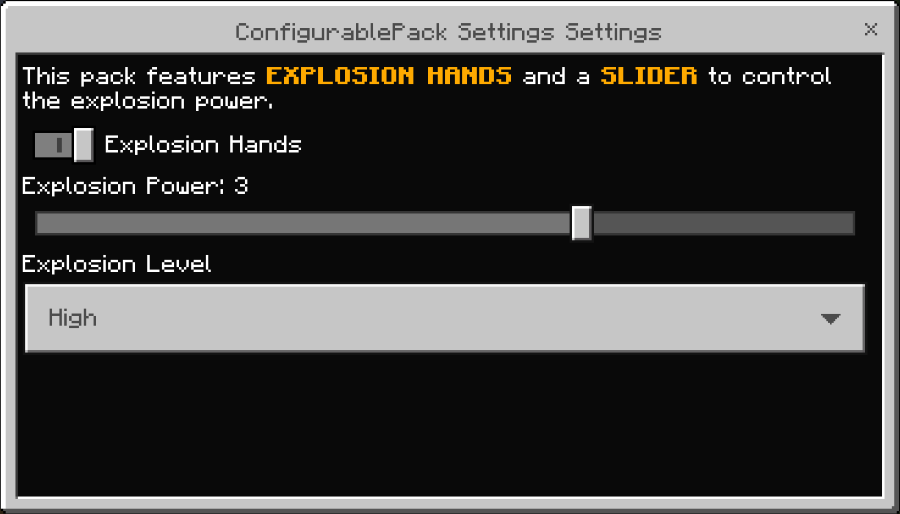
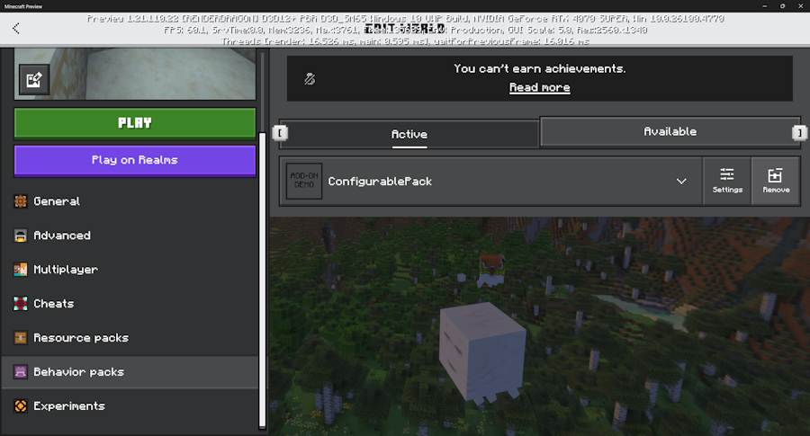
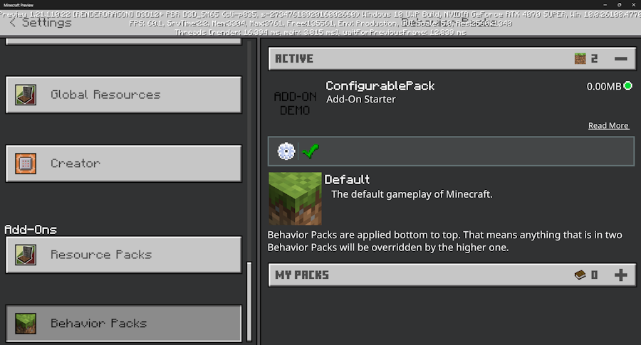

# Creating a Pack with Custom Settings

Many packs in Minecraft present broad gameplay experiences, and it's natural that you might want to let players tailor how that experience functions out in their world. For example, you can imagine a pack that has specific settings for how much treasure is dropped, or the mix of mobs that are spawned, or specific types of assists that might be given. Pack settings provides a consistent "meta-experience" across packs that can help players get just the gameplay experience they are looking for.

> [!NOTE]
> The pack settings capability is still experimental and subject to change, as of Minecraft preview versions 1.21.110. It may be significantly altered or even removed in future updates.

### Elements of Custom Pack Settings

In this overview, we will be working with a sample that is available from the Minecraft sample repo at [https://github.com/microsoft/minecraft-samples/tree/main/configurable_packs](https://github.com/microsoft/minecraft-samples/tree/main/configurable_packs). This simple example show the concept of adding player-configurable "explosion hands" - or that is, having it happen that any time a player interacts with a block, it would create an explosion. And the player can configure the pack to change how or if those explosion hands work.

Custom pack settings can be added in a new and updated `format_version` of the pack manifest - pack manifest version 3. See the [reference documents](../../Reference/Content/AddonsReference/PackManifest.md) for more information on the changes relative to the longstanding `format_version` of 2 of manifest.json. In a nutshell, all version references should be updated to use SemVer strings. Also, there is a temporary issue where pack manifest version 3 requires a metadata/author value to be set. Once you have updated your pack to manifest version 3, you can add then add a new settings section.

The custom pack settings can be applied to both behavior packs and resource packs via their manifest.json. They cannot be used within skin packs. Behavior pack settings can be changed by the world or server owner, and are configured per-world. Resource pack settings can be individually configured on a per-player basis.

An example settings section looks as follows:

```json
[
    {
      "type": "label",
      "text": "This pack features §l§6EXPLOSION HANDS§r and a §l§6SLIDER§r to control the explosion power."
    },
    {
      "type": "toggle",
      "text": "Explosion Hands",
      "name": "mypack:explosion_hands",
      "default": true
    },
    {
      "type": "slider",
      "text": "Explosion Power",
      "name": "mypack:explosion_power",
      "min": 1,
      "max": 4,
      "step": 1,
      "default": 3
    }
  ],
```

This creates a dialog that looks like:



When you configure the world outside of an game session, this can be accessed via the Settings button that is visible on the Packs listing:



Settings can also be configured within game, by selecting Settings, then selecting the pack in particular from either the Resource Packs or Behavior Packs list, and then selecting the behavior pack itself, and finally clicking on the Gear icon:



Pack settings is an ordered list of different controls that you can add that show up in the user interface. Three control types are initially served:

* The `label` setting type lets you add read-only pieces of display text.
* The `toggle` adds a true/false boolean "switch". In the sample above, we use that to toggle whether explosion hands should be applied or not.
* The `slider` setting type lets you pick a number within a range. 

In future iterations, more controls, like a dropdown, may be added.

### Accessing pack settings in game: Behavior Packs

Within behavior packs, custom pack settings can be accessed via new [`world.getPackSettings()` APIs](../../ScriptAPI/minecraft/server/World.md), currently in Beta. The following code snippet from the Configurable Pack samples shows how to use this:

```typescript
  const explosionSize = packSettings["mypack:explosion_power"];

    if (packSettings["mypack:explosion_hands"] === true && explosionSize && typeof explosionSize === "number") {
      const player = event.player;
      const block = event.block;

      if (block && player && !block.isAir) {
        world.sendMessage("Explosion hands go boom! " + explosionSize);
        block.dimension.createExplosion(block.location, explosionSize, {
          source: player,
          causesFire: false,
          breaksBlocks: true,
        });
      }
    }
```

### Accessing pack settings in game: Resource Packs

Although you can mark up a resource pack manifest.json in the same way as a behavior pack manifest.json, there currently isn't a way to *use* the results of those settings in a resource pack. We envision there being a Molang query function to access those settings so you can condition how your models, animations, particle behavior, and render controller behavior can be dynamic with respect to different resource pack settings.

Keep in mind that [Subpacks](./../UtilizingSubpacks.md) also can come with a singular slider setting that can configure which sets of files load for a resource pack. Configuring a resource pack via a subpack slider remains a great choice for certain types of customizations (e.g., scaling the resources that get loaded based on performance tier of the device).


 ### Summary

 That's a brief overview of how you can get started with custom settings. Custom settings is still in preview and could change over time. We welcome any bugs or feedback you may have - you can open bugs or feedback at at [bugs.mojang.com](https://bugs.mojang.com/projects/MCPE/summary).