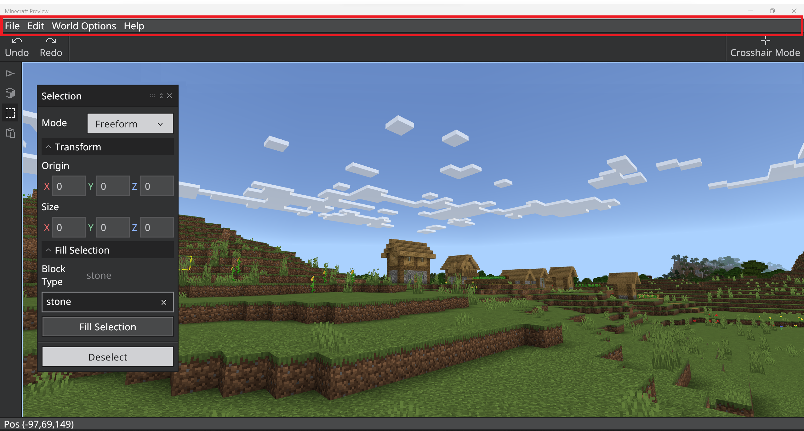
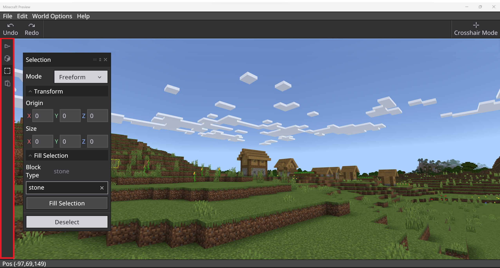
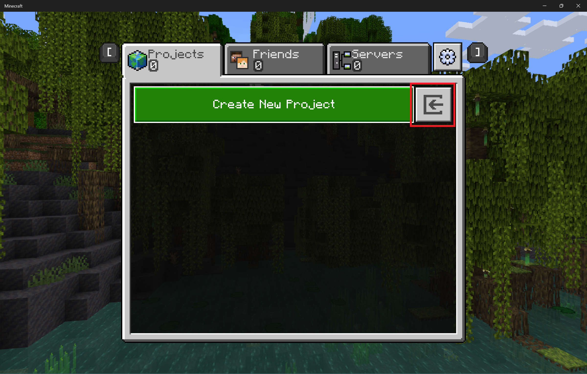

# Editor Tool Mode

Think of the Tool Mode UI as a collection of containers. The menu bar contains menus. The action bar contains buttons that do simple functions like Undo and Redo. The toolrail contains more complicated tools that have their own configuration windows where you can change the settings.

The contents of these containers will change as Editor is developed.

**Menu bar**: At the top of the screen. Currently has File, Edit, World Options, and Help.

**Action bar**: Below the menu bar. Currently has undo and redo buttons that affect the things you do to the world, including some of the actions you do in Crosshair Mode.

**Toolrail**: Left side of the screen. Currently holds Test World, Brush, Selection, and Paste Preview. You can also select these tools using keyboard shortcuts, if they have one.

## Menu bar

### File menu

- **Export as** - When you're ready to share your project (or just see it in non-Editor Minecraft) selecting **File > Export as > Playable world** to start the process to create a .mcworld file in the **projectbackups** folder inside the **com.mojang** folder in your computer.

If you don't know how to find your com.mojang folder, there are instructions in the Bedrock [Getting Started](/creator/Documents/GettingStarted.md) tutorial.

Editor has its own filetype: .mcproject. These files will always open in Editor, if you have it installed.

To **import** projects, go to the Create New Project screen and click the import button to the right of the Create New Project button.

Navigate to a .mcworld, .mctemplate, or .mcproject files.
After the file is imported, it is converted to an .mcproject file.

If you want to learn more about Minecraft file types like .mcproject and .mcworld, there is more information on the [Minecraft File Types](MinecraftFileExtensions.md) page.

- **UI settings** - This is where you can adjust the UI Scale, Font, and Theme color settings of the Editor UI.

- **Pause screen** - This option brings up the Minecraft pause screen where you can edit game settings (like music volume) or Save & Quit.

### Edit menu

As you work in Tool Mode, these familiar functions (along with their keyboard shortcuts) are available to help you.

|Command  |Shortcut  |
|:-------|:---------|
| Undo | `Ctrl Z` |
| Redo | `Ctrl Y` |
| Quick Fill | Select an area and either `Ctrl F` while in Selection mode or use Fill in the Selection panel |
| Deselect | `Ctrl D` or use the Deselect button in the Selection panel |
| Cut | `Ctrl X` |
| Copy | `Ctrl C` |
| Quick Paste | `Ctrl V` |
| Delete | `Delete` |

This menu is also a good place to go for a reminder about these keyboard shortcuts.

## Help

- **Quick start** - If you want the welcome screen back, select this.

- **Documentation** - This is a handy link to the document you are reading right now (among others).

- **Feedback** - This is the link to the GitHub site where you can share feedback.

