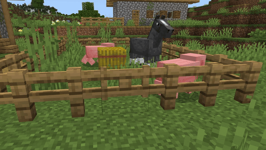

# Editor Block Inspector

The Block Inspector lets you view and modify block properties to fine tune block details. You’ll see position, block type, dimension, tags, components, and editable block state properties (where allowed).

>[!NOTE]
> Not all properties are customizable for all blocks. Some low-level or internal states are intentionally hidden.

## Use Block Inspector

1. From the tool rail (left side of toolbar), click to open the Block Inspector.
2. Aim at a block and left-click to inspect it.
3. Review the block's details and components, expanding the sections as needed.
4. Adjust the block's properties via the drop-downs to set valid values.

## Inspector Pane

| Name | Description |
|:----|:----|
|Actions|Refresh, Reset to initial type, Clear selection.|
|Components|Lists any present Block Components with generated UI, when available.|
|Header|Shows the block’s localized name.|
|Hidden properties|Some states that are filtered out by default (ex. upper_block_bit, door_hinge_bit, wall_connection_type_*, head_piece_bit).|
|Main info|Position (X, Y, Z), Block Type ID, and Dimension (read-only).|
|Properties|Lists editable block state properties with drop-downs of valid values. Changing a value applies a new permutation to the block immediately.|
|Session changes|Switching dimensions clears the current selection and shows Help again.|
|Tags|Shows permutation tags (read-only) if any exist.|
|Targeting|Block-only targeting with a yellow cursor outline; visible cursor; keyboard-and-mouse control mode.|

## Keyboard shortcuts

For the full list, see [Editor Hotkeys](../BedrockEditor/EditorKeyboardInputs.md).