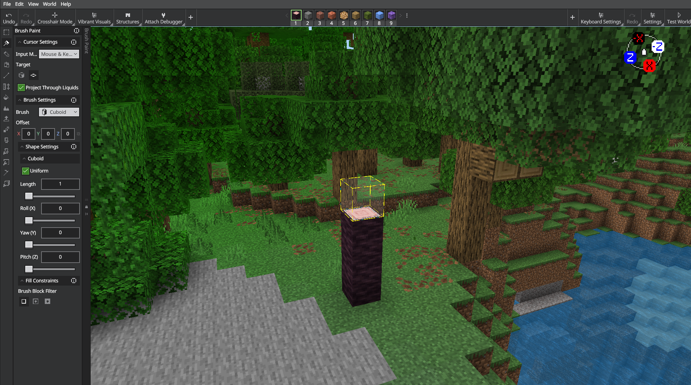
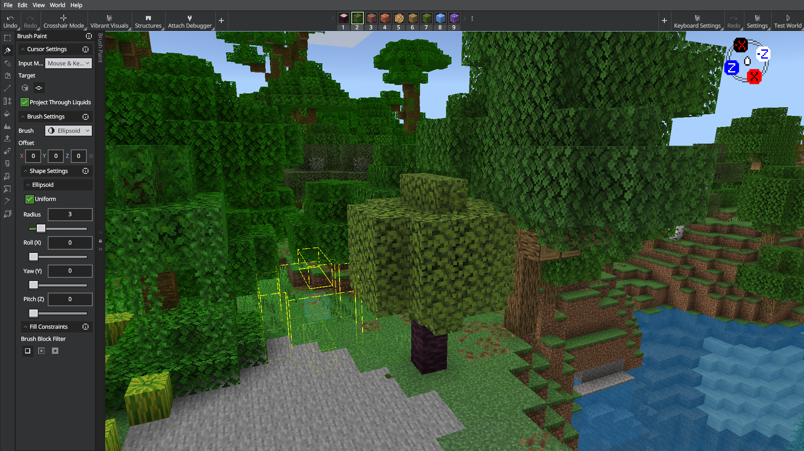
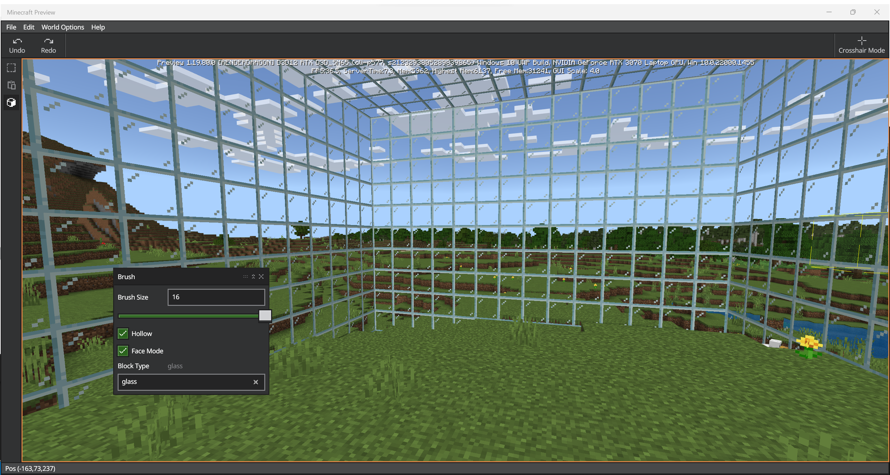

# Editor Brush Tool

The brush tool is used to draw shapes with a selected Block Type.

`Ctrl B` opens the brush tool window.

You can change the brush size, ranging from 1 to 16. Brush sizes are rendered as squares of the selected brush size. This means a brush size of 1 draws a 1x1 block shape. If you select a brush size of 3, you get a 3x3 block shape, or 9 total blocks arranged as a cube.

You can click once once to place one block shape, or click and drag to paint blocks everywhere you touch.

If you choose a brush size larger than 3, you can select the Hollow checkbox to make the brush strokes hollow.

If the Face Mode checkbox is selected, the brush cursor acts like the Adjacent selection cursor - meaning you can select the air above a solid block to draw your blocks. This should make it easier to build up shapes from the ground - like mountains!

Practice 1: A humble tree...

1. Move to a clear area.
1. Set the Brush Size to 1, check the box for Face Mode, and choose 'log' for the Block Type.
1. Find a clear place on the ground and place one log block.
1. Draw another log on top of that one.
1. Draw two more log blocks on top of each other to create a tree trunk.

1. Change the Block Size to 3 and the Block Type to 'leaves' and click the top of your log blocks to put leaves around the top of your tree.

Practice 2: Is it really Hollow?

1. Move to a clear area.
1. Change the Brush Size to 16.
1. Check the box for Hollow.
1. The box for Face Mode should be checked, too.  
1. Set the Block Type to 'glass'.
1. Click the ground once to draw a 16x16, hollow glass shape. You should find yourself inside a huge, glass house.

