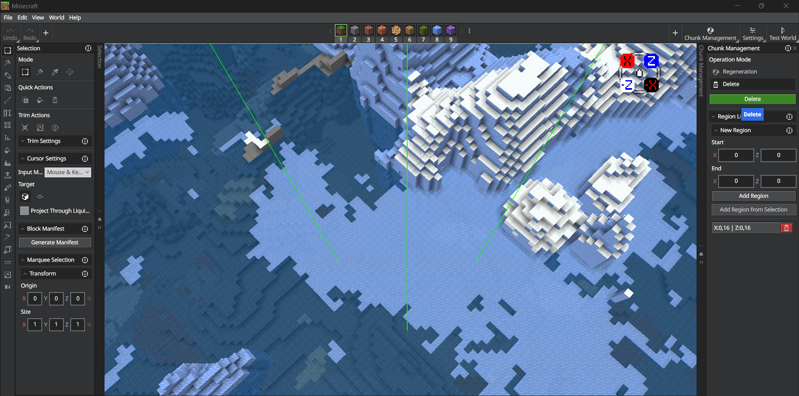
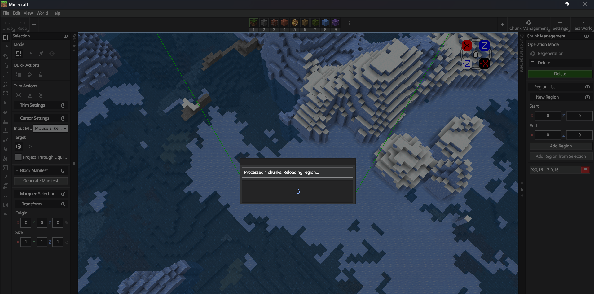
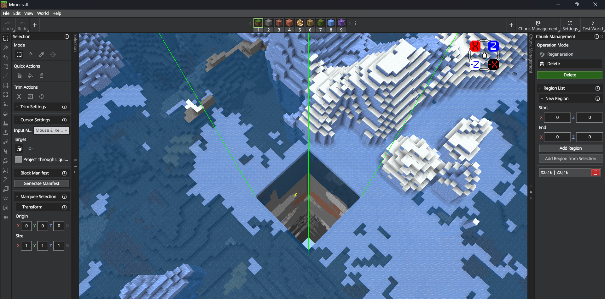

# Chunk Management

Chunk Management lets you generate or delete chunks in your world to reset terrain to its original seed-generated state, clear out unwanted areas, or selectively rebuild specific regions.

## Operation modes

Chunk Management supports two operation modes which you can toggle between at the top of the panel.

### Regeneration mode

This mode regenerates chunks back to the original world seed terrain using one of two target modes:

- **List**: Only regenerates the chunks that overlap with regions you define in the region list. You can also enable **Exclude Bounds** to regenerate everything *except* the listed regions.

- **World**: Regenerates all chunks in the current dimension. When combined with a region list and **Exclude Bounds** enabled, the listed regions are protected from regeneration.

### Delete mode

Completely removes chunk data for the regions you define.
> [!NOTE]
> Deleted chunks will be regenerated when a player next visits the area.

## Using the chunk manager

1. Open Chunk Management from the action bar.

2. Select an **Operation Mode**.

3. Define one or more regions using the region list:
    - Enter **Min** and **Max** coordinates (X and Z) manually, then click **Add Region**.
    - Click **Add from Selection** to use the current Editor selection bounds.

    > [!NOTE]
    > Regions are snapped to chunk boundaries (multiples of 16 blocks). A bounding box visualization appears in the viewport for each defined region.

4. Click the region list entry to teleport to that area for verification.
    

5. Click **Regenerate** or **Delete** to begin the operation. A confirmation dialog will appear before processing starts.

6. A progress modal displays while chunks are being processed and reloaded.
    

    > [!IMPORTANT]
    > Chunk regeneration and deletion are irreversible operations that cannot be undone. Always verify your region bounds before confirming.

## Keyboard shortcuts

For the full list of Editor shortcuts, see [Editor Hotkeys](../BedrockEditor/EditorKeyboardInputs.md).
