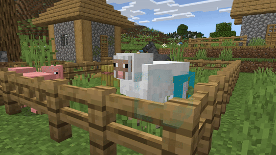

# Editor Entity Inspector

Inspect entities in the world and view or edit their key details. You can read identity and location fields, change a name tag, browse components, and see current tags and effects. 

>[!NOTE]
> Not all properties are customizable for all entities.

## Pane layout

- Cursor options: 
    - Visible
    - Keyboard-and-mouse control
    - Fixed distance (face target mode)

- General options: 
    - Type ID (read‑only)
    - Entity ID (read‑only)
    - Name Tag (editable)
    - Location (read‑only)
    - Rotation Y (read‑only)
    - Dimension (read‑only)

- Tags: Lists the selected entity's tags (read‑only)

- Effects: Lists selected entity's active effects (read‑only)

- Components: Shows any available component UI for the entity 

## Using the Entity Inspector

1. Open Entity Inspector from the tool rail (**Ctrl**+**Shift**+**I**).
2. Left‑click an entity to select it. A bounding box preview highlights the selected entity and the panes automatically populate.
    > [!TIP]
    > The selection outline colors use the current Editor theme. To adjust them, simply switch the Editor UI to a different theme.
3. Review the entity's general info and update the `name` tag if necessary.
4. Expand the components to view their code‑generated controls.
5. Check Tags and Effects to see the entity's current state.
6. Press **Ctrl**+**D** to clear the selection and return to Help when needed.

## Keyboard shortcuts

For the full list, see [Editor Hotkeys](../BedrockEditor/EditorKeyboardInputs.md).

| Name | Shortcut |
|:----|:----|
| Entity Inspector Tool | **Ctrl**+**Shift**+**I** |
| Clear Selection (tool) | **Ctrl**+**D**|
