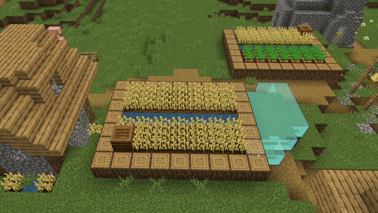

# Extrude Tool

Use Extrude to add or subtract layers of blocks around the face you click. It grows or carves volumes outward from that face, constrained by your Face Size and Layer Count settings.

- **Face Size**: Determines the number of blocks that will be extruded around the cursor. This value represents the radius size from the block face that you click (i.e., if you click the top face of a block, it will add or subtract blocks using the top face as the center of the radius). This value can range from 1 to 32.

- **Layer Count**: The number of layers that will be added or subtracted from the block that you click. This value can range from 1 to 16.

- **Contiguous Selection Type**: You can use this drop-down to set which types of blocks are added or subtracted.

#### Use Extrude

1. Select Extrude from the tool rail on the left of the Editor and add it to your action bar.
    > [!TIP]
    > Press **Ctrl+Shift+E** to switch to Extrude.

2. Set the **Face Size** and the **Layer Count**.

3. Click the block face you want to Extrude from to add or remove layers across the footprint..
    

## Keyboard shortcuts

For the full list, see [Editor Hotkeys](../BedrockEditor/EditorKeyboardInputs.md).

|Command |Shortcut |
|:-------|:-------|
|Activate Extrude Tool|**Ctrl+Shift+E**|