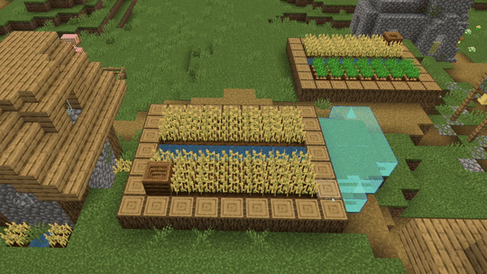

# Extrude Tool

Use Extrude to add or subtract layers of blocks around the face you click. It grows or carves volumes outward from that face, constrained by your Face Size and Layer Count settings.

## Quick Extrude Mode

Toggle between **Grow** and **Shrink** to control whether Extrude adds layers outward or removes layers inward from the clicked face.

## Settings

- **Face Size** (1–32): Determines the radius of blocks that will be extruded around the cursor, centered on the block face you click.

- **Layer Count** (1–16): The number of layers that will be added or subtracted from the block that you click.

- **Contiguous Selection Type**: Sets which types of blocks are included in the extrusion. Options:

    - **SameBlock**: Only blocks matching the clicked block type.
    - **BlockStates**: Blocks matching the type and block states.
    - **SolidBlock**: Any solid block.
    - **AllBlocks**: All blocks including air.
    - **Custom**: Select specific block types from a custom list.

- **Tolerance Level** (1–16): Controls how closely blocks must match the seed block to be included.

- **Has Adjacent Blocks**: When enabled, requires extruded blocks to have adjacent neighbors.

- **Has Trailing Blocks**: When enabled, requires extruded blocks to have trailing block connections.

- **Sample Layer Count** (1–16): Number of layers sampled to determine the extrusion pattern.

- **Search Radius** (1–100): How far from the clicked face to search for matching blocks.

#### Use Extrude

1. Select Extrude from the tool rail on the left of the Editor and add it to your action bar.
    > [!TIP]
    > Press **Ctrl+Shift+E** to switch to Extrude.

2. Set the **Face Size** and the **Layer Count**.

3. Click the block face you want to Extrude from to add or remove layers across the footprint..
    

## Keyboard shortcuts

For the full list, see [Editor Hotkeys](../BedrockEditor/EditorKeyboardInputs.md).

|Command |Shortcut |
|:-------|:-------|
|Activate Extrude Tool|**Ctrl+Shift+E**|