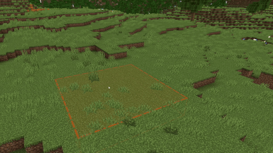

# Farm Tool

Use Farm to quickly generate a complete farm layout with crops, optional animals, fencing, and irrigation. Click the ground to place a farm centered on the clicked block.

## Overview

- Purpose: Procedurally generate a small farm area for prototyping or quick world dressing.
- Contents: Crops you select are planted within the plot; optional animals are spawned inside the fence.
- Where it lives: Tool rail on the left.

## Details

- **Crops**: Check the box for each crop you want to grow on your farm. Crops will be placed randomly within the farm area.

- **Animals**: Check the box for each type of animal that you want to include on your farm. Animals will be placed in random quantities.

- **Length**: The length of your farm.

- **Width**: The width of your farm.

- **Fence**: The type of fence surrounding your farm.

- **Irrigation**: Check this box to add irrigation channels between the crops on your farm.

#### Using the farm generator tool:

1. Open Farm by selecting it from the tool rail on the left side of the Editor.
    > [!Tip]
    > Pressing **Ctrl+P** also switches to Farm.

2. Choose the crops, animals, size, fence, and irrigation settings that you want for your farm.

3. Click a block on the ground to place a farm with that block at its center.
    > [!TIP]
    > For best results, place on relatively flat terrain. You can use Terrain or Flatten mode to prep the area first.

