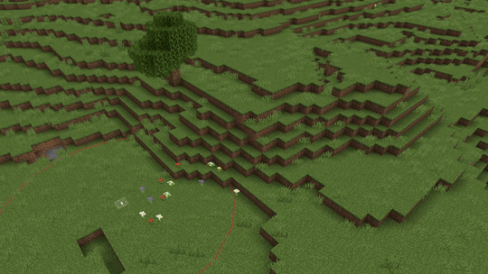

# Flatten Tool

Flatten is now part of the Terrain Tool! Use Terrain to Flatten, Smooth, or Roughen terrain in one place.

## Tool configuration

- **Height Threshold**: The number of blocks above the cursor that will be flattened when you click. This value ranges from 1 to 32.

- **Radius**: The number of blocks around the cursor that will be flattened when you click. This value ranges from 1 to 5.

- **Intensity**: Controls flatten strength per stroke. This value ranges from 1-100.

- **Smoothing**: Blends edges of the flattened area into nearby terrain. This value ranges from 1-100.

- **Floor Block Override**: When enabled, allows overriding specific “floor” blocks during flattening.

### Use Flatten to adjust the terrain:

1. Switch to Terrain by clicking the button in the tool rail on the left of the Editor.
    > [!Tip]
    > Pressing **Ctrl**+**T** also switches to Terrain.

2. Select **Terrain Mode** and choose **Smooth**. 

2. Select the **Radius** for the area you want to flatten, then adjust the **Height Threshold**.

3. Click and drag the cursor along the ground to flatten the terrain according to your preferences.

    

For more information on the terraforming tools in Editor, check out our article on the [Terrain Tool](../BedrockEditor/EditorTerrainTool.md).

## Keyboard shortcuts

For the full list of Editor shortcuts, see [Editor Hotkeys](../BedrockEditor/EditorKeyboardInputs.md).

> [!NOTE]
> The following commands only work while the Terrain tool is active.

|Command |Shortcut |
|:-------|:-------|
Cycle modes| **Ctrl**+**T**|
|Flatten Down| **Shift**+**D**|
|Flatten Up| **Shift**+**U**|
|Flatten Both| **Shift**+**F**|
