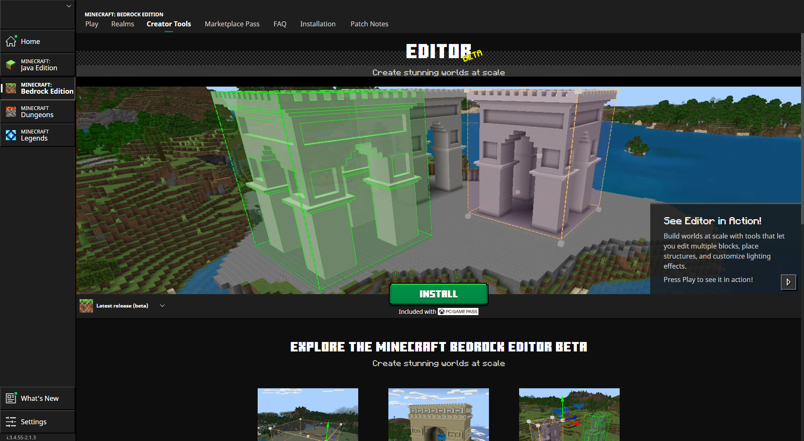
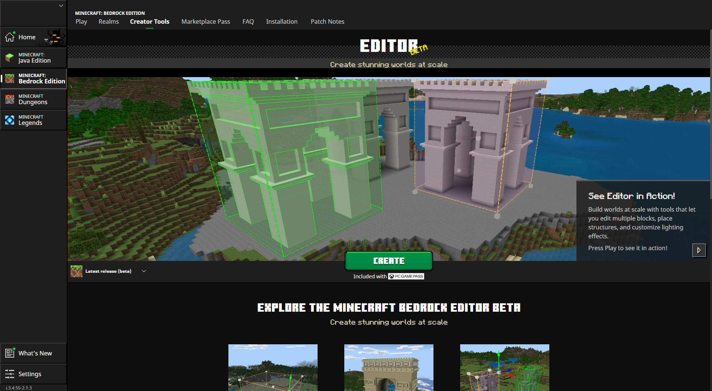

# How to get Minecraft Editor

Minecraft's Bedrock Editor is a multiblock editing experience that helps you easily craft high-quality worlds in Minecraft Bedrock. The Editor is available in Retail and Preview editions of Minecraft Bedrock. You can access the Editor either through the Minecraft Launcher or a shortcut you create on your computer desktop.

> [!NOTE]
> Images in this document may vary slightly from what you have on your screen.

First, we are going to install Minecraft Bedrock. 
Then, we will create the shortcut that launches Editor. 
After that, we will open Editor and make sure it works.

--------

In this tutorial, you will learn the following:

> [!div class="checklist"]
>
> - How to install Minecraft.
> - How to create the shortcut that launches Editor.
> - How to tell if everything is working correctly.

--------

## Requirements

To get started, you need the following:

- A Windows 10 (or later) computer
- Keyboard and mouse

> [!IMPORTANT]
> Editor is PC only and not available on mobile or console.

## Install Bedrock 

The Bedrock Editor is a separate mode of Bedrock. If you already have Bedrock, you already have the Editor. If not, install the latest Bedrock Retail and/or Preview. To learn more about what Preview is and where to get it, check out the [Preview FAQ on Minecraft.net](https://aka.ms/PreviewFAQ).

The easiest way to install either of these versions is from the Minecraft Launcher. You can get Minecraft Launcher from the Microsoft Store.

Once the Minecraft Launcher is installed, navigate to the Creator Tools tab. From here you can install Retail and Preview versions of Bedrock.

To switch the target version, select the version from the drop-down.

After you install Bedrock, a **Create** button appears under the Creator Tools tab in the Launcher.

To launch Editor, click Create. The Launcher opens Bedrock in Editor mode.

## Make a Shortcut

Alternatively, if you already have Bedrock installed and want to create a shortcut to make accessing Editor easier in the future, follow these steps.

1. Right-click on your desktop, select **New** from the dropdown, and choose to create a new **Shortcut**.  

2. For the location of the item, enter the following:

    `minecraft:?Editor=true`

    or

    `minecraft-preview://creator/?Editor=true`

    This is case-sensitive and needs to match exactly.

3. Click **Next** and give your shortcut a name like **Minecraft Editor**.

4. Click **Finish**. Your Editor shortcut has been created!

You should see the shortcut created on your desktop and it should automatically have the Minecraft icon if you set it up correctly. If the icon does not populate, don't worry.

5. Double-click the shortcut to launch the Editor.

You should see Editor launch and display the "Create New Project" screen.

Great job! You're ready to create a project!

> [!NOTE]
> If you uninstall Bedrock, but you plan on installing a newer version later, you can leave the Editor shortcut on your desktop and it should work with the new version.

## Troubleshooting

### I can't get into the Editor when I open Minecraft

Use the Launcher’s Create button or the desktop shortcut to open Editor. Opening Bedrock normally will not launch the Editor.

### I added the desktop shortcut, but it won't open the Editor. What's going on?  

Three things to check:  

- Is the desktop shortcut set up correctly? Remember it is case-sensitive and needs to match exactly. Ensure it says the following: **`minecraft:?Editor=true`**. 

- Did you install Bedrock? If not, you need to do that. 

- Do you have both Bedrock Preview and Bedrock (Retail) installed? You may have selected a checkbox that says "Always open" for Bedrock (Retail) even if you are trying to open a Preview version. To fix this, perform the following steps:

    1. Press **Windows + I** to open the Settings app.

    1. Select **Apps** and click **Default apps**.

    1. Scroll down to **Minecraft** and select it.

    1. Scroll down and find the **MINECRAFT** entry (it should also say Minecraft | URL:minecraft) and click it.

    1. In the pop-up, select **Minecraft** and click **OK**.

- If you would like to open Editor a different way, you can open a file explorer window and enter **`minecraft:?Editor=true`** into the path:

