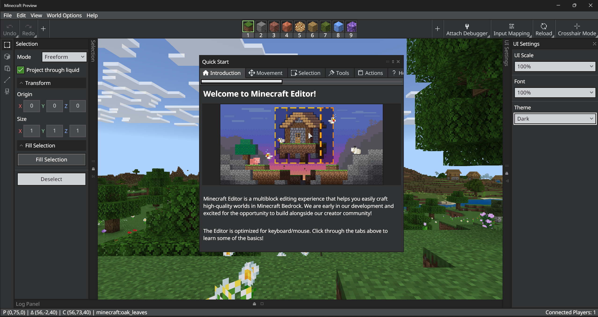

# Editor Overview

This overview is intended to introduce you to the parts of the Editor interface and the tools. For a more in-depth experience using the tools to accomplish basic tasks, take a look at the [Editor Tutorial](EditorTutorial.md). There's more information about Editor on the [Minecraft: Bedrock Editor GitHub site](https://github.com/Mojang/minecraft-editor)!

> [!IMPORTANT]
> The Editor is still in development we're working to add more capabilities.
> It will change significantly as we get feedback from creators like you.
> Also, the images of Editor in this document might vary a little from what you have on your screen.

--------

In this manual, you will learn the following:

> [!div class="checklist"]
>
> - What the difference is between a project and a world

--------

## Requirements

To get started, you need the following:

- A Windows 10 (or higher) computer with Minecraft Bedrock Editor
- Keyboard and mouse

> [!IMPORTANT]
> Editor is not available on mobile.

It's recommended that the following be completed before beginning this tutorial.

- [How to get Minecraft Bedrock Editor](EditorInstallation.md)

## Creating an Editor Project

After you launch the Editor from the shortcut, you get a screen that says "Create New Project."


While you're creating a project, you can configure the name, export settings, and the usual settings for a Minecraft world.

Export settings will apply when you export as a playable world from the Editor (.mcworld).


New projects load with a Welcome/Quick Start screen. If you close it and you want it open again, go to the Help menu and select Quick Start.

## First Things First: UI Settings

Editor looks like your usual Minecraft game with a user interface (UI) on top of it. Before we get started, let's make sure that UI looks okay for your monitor resolution and preferences.

Go to the **File** menu and select **UI Settings**.


>- UI Scale - Makes the menu bar and windows larger or smaller in relation to the project world.
>- Font - Changes the size of the text in the windows.
>- Theme - Changes the colors used in the UI.

After you make a selection from the UI Settings menu, your changes are reflected immediately.

Hint: If you accidentally adjust things to where you can't read the settings to fix it, press the `Alt F4` keys on your keyboard to close Editor. Then, launch Editor again and create a new project. (This is part of why we're doing this first.)

Editor works with [Minecraft Accessibility](https://www.minecraft.net/accessibility) features.

When you're happy with the UI Settings, you can click the X to close the UI Settings window.

## Editor UI Windows: Move, Minimize, Close

You can move Editor windows by clicking and dragging them by the title bar.

Click the double "up arrows" in the corner to collapse the windows upwards so you can tuck them out of the way if you don't want to close them.

If you do want to close the window, click the X in the corner. Some windows can be re-opened with a keyboard shortcut.

## Welcome/Quick Start



|Tab  |Content  |
|:-------|:---------|
| Introduction | Welcome to Minecraft Editor!<br>Minecraft Editor is a multiblock editing experience that helps you easily craft high-quality worlds in Minecraft Bedrock. We are early in our development and excited for the opportunity to build alongside our creator community!<br>Click through the tabs above to learn some of the basics! |
| Movement | Movement in Editor requires a keyboard and mouse. Trackpad or controller is not recommended.<br>There are two Editor modes: Tool and Crosshair. <br> You are starting in Tool for multiblock editing and using the available tools: <br>- Unlock movement in Tool by holding down the right mouse button.<br> - While holding down the right mouse button, move horizontally using `W A S D` and vertically using `Shift` / `Space`. <br><br>Want to experience single-block editing? Swap to Crosshair: <br>- Use Ctrl-Tab or the button in the top right.<br> - Movement in Crosshair is the same as non-Editor Minecraft.<br> - Swap back to Tool from Crosshair using Esc or Ctrl-Tab.|
|Selection|The Selection tool can be found on the left toolrail. There are several different selection modes: <br> - Freeform: Select a specific block or air block immediately nest to a solid block. <br> - Left-click anywhere in the world to select a single block.<br> - Adjacent: Select up to 2 air blocks adjacent to a solid block, but not the solid block itself. <br><br> Create single selection volumes:<br> - Left-click to select a single block. This is your X origin. - Hold Shift + left-click to create your Z. Then, click the corner cube gizmo or use the panel to resize the Y and/or Z. <br> - Move this single volume using the center cube gizmo. <br> <br> Create multiple selection volumes: <br> - After creating your first selection, hold Ctrl + left-click to create n+1 new and distinct selection volumes. <br> - Move all volumes at once using the center cube gizmo. <br><br> Deselect using Ctrl + D or the Deselect button in the Selection tool. |
|Tools|Tools are located in the left toolrail.<br> Brush:<br> - Left-click and drag to paint.<br> - Face Mode means new blocks will be additive to the top "face" vs. replacing blocks.<br> - Currently, the only brush shape is a cube, but we have plans to significantly expand the options available and increase precision with cursor painting.<br><br> Selection: Create selection volumes to Select, Cut (Ctrl + X), Copy (Ctrl+C), or Fill (Ctrl + F or within panel).<br><br>Paste Preview: View the 'Actions' tab for more specifics on how to use this. <br><br> Line:<br> - Your first left-click will create the starting point. The second left-click will establish the next point. <br> - Use Shift + left-click to make additional segments beyond the second point.<br> - Use Ctrl + left-click to create n+1 new line segments.<br> - Select the block you want your line to be filled with and choose "Fill Selection."<br> - Deselect by using Ctrl + D to remove line previews.|
|Actions|Actions exist both in the action bar and the menu bars, located at the top of the Editor.<br>Each action has corresponding keyboard shortcuts. Click around and explore what's available!<br>Top actions and shortcuts:<br> - Open the Selection pane (Ctrl + S)<br> - Undo (Ctrl + Z) or Redo (Ctrl + Y) - Fun Fact: Undo/Redo also work in Crosshair! <br> - Cut (Ctrl + X) or Copy (Ctrl + C)<br> - Deselect (Ctrl + D)<br> - Log Panel (Ctrl + H)<br> - Fill (Ctrl + F)<br> - Delete (Delete)<br><br> How to paste after you cut or copied a selection: <br> - Quick paste: Select a single block and then Ctrl + V.<br> - Preview your paste before committing: Ctrl + Shift + V and then left-click to precisely place and use the Paste Preview panel for more configuration options. |
|Help|Editor will be exclusively available in Bedrock Preview until the feature set and quality meets our standards to be made visible in the Launcher.<br>- Documentation<br>- Log issues and give feedback.<br>You may close this panel. To reopen at any point, select "Quick start" from the top "Help" menu.|

## Navigation

Before we dive into the Tool Mode UI, you might want to take a moment to familiarize yourself with how to look around and move around in the different modes.

- Unlock the camera: In Tool mode, hold down the right mouse button to look around. In Crosshair Mode, you do not need to hold down the right mouse button.  

- Moving around: In Tool Mode, hold the right mouse button down while you press `W`, `A`, `S`, `D`, `Space`, and `Shift` keys. You do not need to hold down the right mouse button to use the same keys to move around in Crosshair Mode.

- Look-to-teleport: In Tool Mode, point your cursor at a block in the distance, and hit `G` on your keyboard. You will be "Grapple teleported" there. This function does not work in Crosshair Mode.

## Editor

For an overview of the parts of Editor and what each thing does, start on the [Tool Mode page](EditorToolMode.md) (because Editor starts in Tool Mode.)


## Editor and Bedrock Dedicated Server

Editor is only enabled in the preview version of Win32 Bedrock Dedicated Server (BDS). There are two ways to launch it:

**Launch the .exe with the command line, like this:**

`bedrock_server.exe Editor=true`

This will only work if you're launching BDS from scratch with no existing world.

You should see the output say:

```
#####################################################
#                                                   #
#              CREATING EDITOR PROJECT              #
#                                                   #
#####################################################
```

**Create an Editor project from Minecraft**

1. Launch Editor from the usual desktop shortcut.
1. Create a new Editor Project.
1. Locate the Editor Project in the **com.mojang/minecraftWorlds** folder and copy it into the BDS worlds folder
1. Ensure that `server.properties` has the correct world name.
1. Execute **bedrock_server.exe**.

If correctly set up, this message will be displayed:

`[2023-10-24 07:21:43:977 INFO] Enabling Editor Services`

Editor Mode is controlled by a flag in the level data (not by the command line), so you need to launch the server either by having the server create a new Editor project, or by launching the server using an existing Editor project.

When the server is up and running, any client connections from Minecraft Bedrock Preview Edition will connect as editor sessions and present the editor interface.  Connections from Non-Preview editions of Minecraft will be refused.

## What's Next?

Now that you know more about the parts of Editor, let's use the tools to do some editing!

> [!div class="nextstepaction"]
> [Editor Tutorial](EditorTutorial.md)
