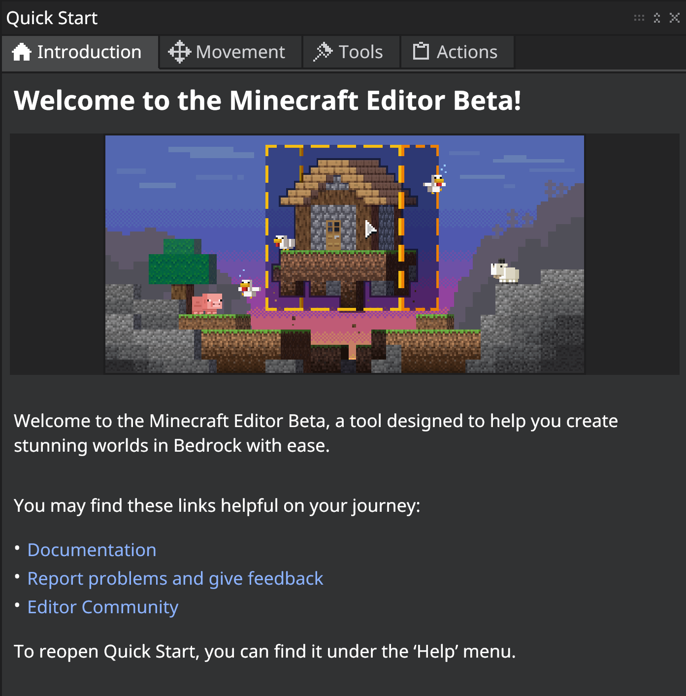

# Editor Overview

This overview is intended to introduce you to the parts of the Editor interface and the tools. The keyboard shortcuts, also known as keybindings, have been provided with each tool and in the table at the end of this document.

For a more in-depth experience using the tools to accomplish basic tasks, take a look at the [Editor Tutorial](EditorTutorial.md).

There's more information about Editor on the [Minecraft: Bedrock Editor GitHub site](https://github.com/Mojang/minecraft-editor)!

> [!NOTE]
> Images in this document may vary slightly from what you have on your screen.

In this manual, you will learn the following:

> [!div class="checklist"]
>
> - What the difference is between a project and a world
> - How to create a project
> - How to customize the user interface and project world settings
> - What all the parts of the UI are and where to find them
> - How to save a project
> - How to open an existing project
> - How to export a project as a world
> - How to open a world created from a project
> - Where Editor stores exported and saved files

## Requirements

To get started, you need the following:

- A Windows 10 (or higher) computer with Minecraft Bedrock Editor 
- Keyboard and mouse

> [!IMPORTANT]
> Editor is PC only, and not available on mobile or console.

It's recommended that the following be completed before beginning this tutorial.

- [How to get Minecraft Bedrock Editor](EditorInstallation.md)

## Creating an Editor project

After you launch Editor, you get a screen that says "Create New Project."


While you're creating a project, you can configure the name, export settings, and the usual settings for a Minecraft world.

Export settings will apply when you export as a playable world from the Editor (.mcworld).


New projects load with a Welcome/Quick Start screen. If you close it and you want it open again, go to the Help menu and select Quick Start.

## First Things First: UI Settings

Editor looks like your usual Minecraft game with a user interface (UI) on top of it. Before we get started, let's make sure that UI looks okay for your monitor resolution and preferences.

Go to the **File** menu and select **UI Settings**.


>- UI Scale - Makes the menu bar and windows larger or smaller in relation to the project world.
>- Font - Changes the size of the text in the windows.
>- Theme - Changes the colors used in the UI.

After you make a selection from the UI Settings menu, your changes are reflected immediately.

Hint: If you accidentally adjust things to where you can't read the settings to fix it, press the `Alt F4` keys on your keyboard to close Editor. Then, launch Editor again and create a new project. (This is part of why we're doing this first.)

Editor works with [Minecraft Accessibility](https://www.minecraft.net/accessibility) features.

When you're happy with the UI Settings, you can click the X to close the UI Settings window.

## Editor UI Windows: Move, Minimize, Close

You can move Editor windows by clicking and dragging them by the title bar.

Click the double "up arrows" in the corner to collapse the windows upwards so you can tuck them out of the way if you don't want to close them.

If you do want to close the window, click the X in the corner. Some windows can be re-opened with a keyboard shortcut.

## Welcome/Quick Start



|Tab  |Content  |
|:-------|:---------|
| Introduction | Welcome to Minecraft Editor, a tool designed to help you create stunning worlds in Bedrock with ease. <br> <br> You may find these links helpful on your journey: <br> <br> <ul> <li> [Documentation](https://aka.ms/BedrockEditorDocs) </li> <li> [Report problems and give feedback](https://aka.ms/BedrockEditorFeedback) </li> <li> [Editor Community](https://aka.ms/BedrockEditorCommunity) </li></ul> <br>  To reopen Quick Start, you can find it under the 'Help' menu.|
| Movement | To navigate in the Editor, you'll need a keyboard and mouse. Trackpads or controllers aren't recommended. <br> <br> To move around in Editor: <br> <br><ul> <li> Hold down the right mouse button to look around. </li><li> While holding the right mouse button, move horizontally with `WASD` and vertically with `SHIFT` and `SPACE`. </li></ul> |
|Tools|You can find tools on the left rail. Each tool allows you to edit your world in different ways. <br> <br>Click on the Information button ("i") at the top right corner of each tool to learn more about how it works.|
|Actions|Actions are shortcuts that live at the top of your screen. Hit the “+” button in the Action Bar to customize which are displayed.<br> <br>At the top center of your screen is the Block Hotbar. Click once to change the active block, click twice to open the Block Picker to customize the Hotbar.<br> <br> You can create a new Hotbar by clicking the Hotbar Menu button to the right.
|

## Movement

Before we dive into the Tool Mode UI, you might want to take a moment to familiarize yourself with how to look around and move around in the different modes.

- Unlock the camera: In Tool mode, hold down the right mouse button to look around. In Crosshair Mode, you do not need to hold down the right mouse button.  

- Moving around: In Tool Mode, hold the right mouse button down while you press `W`, `A`, `S`, `D`, `Space`, and `Shift` keys. You do not need to hold down the right mouse button to use the same keys to move around in Crosshair Mode.

- Fly Speed: In Tool Mode, click the **View** menu and select **View Settings** to open the View Settings panel. From here, you can set your fly speed from 1 to 10 so that you can navigate your project faster.

- Look-to-teleport: In Tool Mode, point your cursor at a block in the distance, and hit `G` on your keyboard. You will be "Grapple teleported" there. This function does not work in Crosshair Mode.

- Directional Compass: In the upper-right corner of the editor window, the directional compass will show you which cardinal direction you are facing. You can even click a direction to snap your view to face it.

## Editor and Bedrock Dedicated Server

Editor is enabled in the Windows version of Bedrock Dedicated Server.
There are two ways to launch it:

### Launch editor from the command line

Open a terminal window and run the following command:

`bedrock_server.exe Editor=true`

This will only work if you're launching Dedicated Server from scratch with no existing world.

You should see the output say:

```
#####################################################
#                                                   #
#              CREATING EDITOR PROJECT              #
#                                                   #
#####################################################
```

### Create an Editor project from Minecraft

1. Launch Editor from the usual desktop shortcut.
1. Create a new Editor Project.
1. Locate the Editor Project in the **com.mojang/minecraftWorlds** folder and copy it into the Dedicated Server worlds folder
1. Ensure that `server.properties` has the correct world name.
1. Execute **bedrock_server.exe**.

If correctly set up, you should see the output say

`[2023-10-24 07:21:43:977 INFO] Enabling Editor Services`

Editor Mode is controlled by a flag in the level data (not by the command line), so you need to launch the server either by having the server create a new Editor project, or by launching the server using an existing Editor project.

When the server is up and running, any client connections from Minecraft Bedrock Edition will connect as editor sessions and present the editor interface. Clients must match the server’s edition/version&mdash;mismatched clients will be refused.

## What's Next?

Now that you know more about the parts of Editor, let's use the tools to do some editing!

> [!div class="nextstepaction"]
> [Editor Tutorial](EditorTutorial.md)
