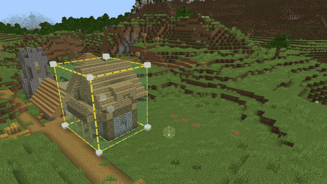
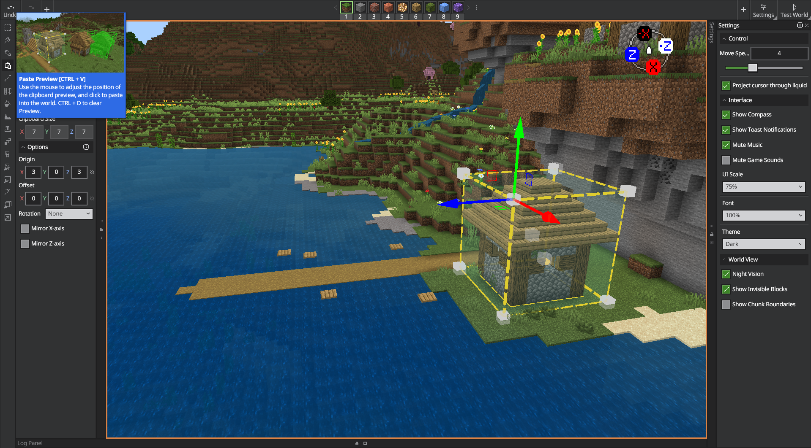
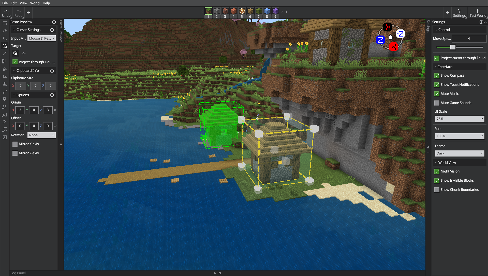
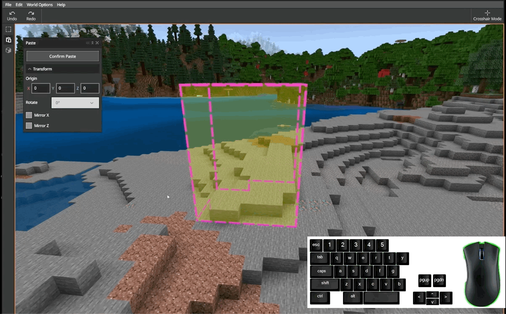
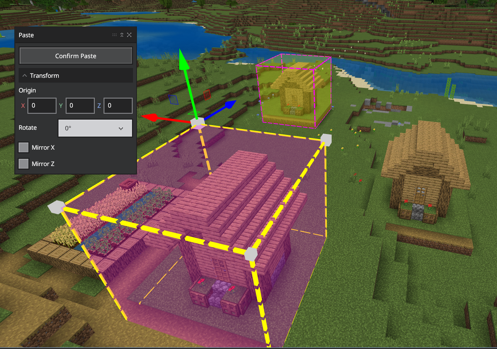

# Paste Preview

Paste Preview lets you position, rotate, mirror, and offset your clipboard contents before committing the paste. Open it after Copy/Cut to get an interactive preview with precise controls and keyboard nudges.

Use Paste Preview to place a copied or cut selection exactly where you want it. Click to place the preview, adjust origin/offset, rotate or mirror, then confirm to write blocks into the world.

## Get started

1. Select something interesting, like a village house, with any of the selection modes.
    

2. Copy or cut the selection (**Ctrl+C** or **Ctrl+X**).

3. Open Paste Preview (**Ctrl+Shift+V**).

4. Click the ground where you want the copied or cut blocks to be pasted. A preview appears with an outline of the clipboard item.
    

5. Nudge it into position with the keyboard (see shortcuts).
    

6. Click Confirm Paste to place the blocks.
    

> [!TIP]
> You can Transform your copied selection by editing the Origin coordinates, Rotating the selection, or mirroring the selection along the x or z axis.

### Placement control pane

- **Origin**: The placement anchor in world coordinates; rotations and mirror actions pivot around this point. Editing X/Y/Z moves the preview anchor.

- **Offset**: Defines an additional offset from the placement point to the clipboard item’s intern al origin.

- **Rotation**: Rotates the preview in 90° increments (0°, 90°, 180°, 270°).

- **Mirror X‑axis / Mirror Z‑axis**: Reflects the preview around the X or Z axes.

- **Clipboard Size**: Shows the dimensions of the current clipboard item.

## Keyboard shortcuts

These shortcuts work while the Paste Preview is active. For the full list of shortcuts, see [Editor Hotkeys](../BedrockEditor/EditorKeyboardInputs.md).

|Command|Shortcut|Alternate|
|:---|:---|:---|
|Open Paste Preview|**Ctrl** + **Shift** + **V**|-|
|Move Origin (anchor)|**Ctrl** + **Up/Down/Left/Right**|**Ctrl** + **Page Up/Page Down**|
|Nudge Offset (relative)|**Ctrl** + **Shift** + **Up/Down/Left/Right**|**Ctrl** + **Shift** + **Page Up/Page Down**|
|Rotate clockwise 90°|**R**|-|
|Rotate counter‑clockwise 90°|**Shift** + **R**|-|
|Mirror X‑axis|**X**|-|
|Mirror Z‑axis|**Z**|-|

## Tips
- Use origin for world‑space placement and offset for fine, relative alignment.

- If the clip seems to pivot oddly, check the origin rotation and mirror use it as the pivot.

- For large structures, pick a stable anchor (like a corner) before rotating.
