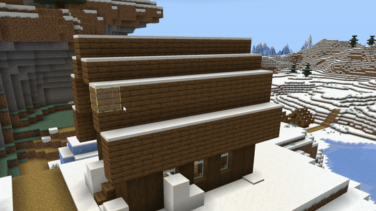
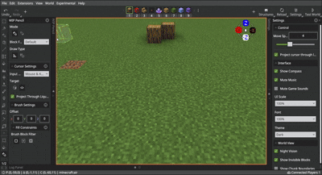

# Pencil Tool

The Pencil tool lets creators easily place and remove single blocks and takes player position into account to ensure the tool works well with blocks that have permutations. The Pencil tool lets creators place multi-blocks like beds, doors, and double-tall plants, and can even detect which half of a block the cursor is on to help to determine the orientation of blocks like slabs, stairs, and trapdoors.

This tool should greatly reduce the need for creators to need to go into Crosshair mode to build.  

## Mode

-	**Draw**

    Uses the Pencil to add individual blocks to the world.

-	**Erase**

    Uses the Pencil to remove individual blocks from the world.

## Block Facing

-	**By Camera**

    Changes the placed block's rotation based on the direction the camera (player) is facing.

-	**Default**

    Places blocks that have rotation or permutations at their default position.

## Cursor Settings

### Input Modes

- **Keyboard Only**

    Uses the directional keys to move the cursor around the world. The mouse and W, A, S, and D keys are still used to move and look around the world, but they're not involved in selecting a block.

- **Mouse & Keys**

    Selects blocks based on the location of the cursor.

- **Fixed Distance**

    Selects blocks, air, or a combination of both, based on your Selection Settings, at a fixed location at the center of the Editor screen.

    

    > [!Tip]
    > Fixed distance is the easiest mode to use if you want to select only air blocks. You can use the scroll wheel on the mouse to increase or decrease the distance between you and the selection cube.

### Target

- **Block**

    Selects the block you highlight with the cursor.

- **Face**

    Selects the air next to, above, or below solid blocks that you highlight with the cursor.

## Pencil Settings

### Offset 

Sets the Pencil's offset from the cursor's location.

### Fill Constraints

Block Filters determine what type of blocks are included/excluded from the Pencil action and how your selection is filled.

- **Disabled**

    Uses the type of block currently selected in the Block Picker to fill the entirety of your selection with.

- **Mask**

    Lets you specify a list of block types to exclude from the Pencil action, preventing them from changing even when included in your selection.

- **Replace**

    Lets you specify what type of blocks to replace and the type of block to replace them with.

