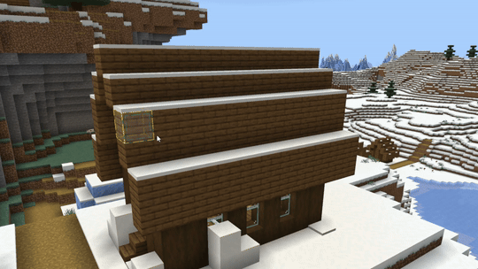
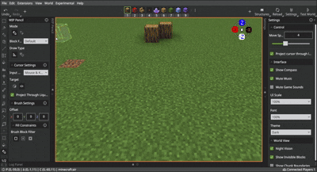

# Pencil Tool

The Pencil tool lets creators easily place and remove single blocks, greatly reducing the need to switch into Crosshair mode while building. It automatically accounts for player position to ensure the tool works well with blocks that have different permutations. 

Creators can place multi-blocks like beds, doors, and double-tall plants, and can even detect which half of a block the cursor is on to help to determine the orientation of blocks like slabs, stairs, and trapdoors.

> [!TIP]
> Use the *By Camera* facing option for stairs, doors, trapdoors, and slabs to make them match your viewing direction when placed.

## Mode

Use the Pencil to place or erase single blocks or objects with the proper orientation quickly. It supports two draw types (Block and Object), two edit modes (Draw and Erase), camera‑aware facing, and shares the standard cursor/target controls used for other Editor tools.

### Draw Type

- **Block**

    Places individual blocks from the Block Picker.

- **Object**

    Places multi-block objects such as doors, beds, plants, candles, and seeds/crops. Use the drop-down to select the object type.

### Edit Mode

-	**Draw**

    Uses the Pencil to add individual blocks or objects to the world.

-	**Erase**

    Uses the Pencil to remove individual blocks or objects from the world.

> [!TIP]
> Hold **Ctrl** while drawing to temporarily invert the erase mode (draw becomes erase, erase becomes draw).

## Block facing (orientation)

-	**By Camera**

    Changes the placed block's rotation based on the direction the camera (player) is facing.

-	**Manual**

    Places blocks that have rotation or permutations at their default position. When selected, a front face drop-down lets you specify the exact facing direction.

    

## Cursor/Target settings

### Input Modes

- **Keyboard Only**

    Uses the directional keys to move the cursor around the world. The mouse and W, A, S, and D keys are still used to move and look around the world, but they're not involved in selecting a block.

- **Mouse & Keys**

    Selects blocks based on the location of the cursor.

- **Fixed Distance**

    Selects blocks, air, or a combination of both, based on your Selection Settings, at a fixed location at the center of the Editor screen.
    
    > [!Tip]
    > Fixed distance is the easiest mode to use if you want to select only air blocks. You can use the scroll wheel on the mouse to increase or decrease the distance between you and the selection cube.

### Target

- **Block**

    Selects the block you highlight with the cursor.

- **Face**

    Selects the air next to, above, or below solid blocks that you highlight with the cursor.

### Keyboard shortcuts
|Name|Shortcut|
|:----|:----|
|Toggle Pencil|**Space Bar**|
|Toggle Draw Type (Block/Object)|**Shift+D**|
|Toggle Edit Mode (Draw/Erase)|**Shift+E**|
|Single-press paint|**Enter**|
|Temporarily invert Erase|**Ctrl** (hold)|
|Paint continuously|**Left‑click and hold** (release to stop)|

> [!NOTE]
> Cursor movement, targeting, and fixed‑distance toggles follow the standard Cursor Settings shortcuts documented in the Selection tool page.

## Pencil settings

### Offset 

Sets the Pencil's offset from the cursor's location.

### Fill constraints

Block Filters determine what type of blocks are included/excluded from the Pencil action and how your selection is filled.

- **Disabled**

    Uses the type of block currently selected in the Block Picker to fill the entirety of your selection with.

- **Mask**

    Lets you specify a list of block types to exclude from the Pencil action, preventing them from changing even when included in your selection.

- **Replace**

    Lets you specify what type of blocks to replace and the type of block to replace them with.

> [!TIP]
> Use Mask or Replace to avoid accidentally selecting certain blocks while drawing or erasing.
