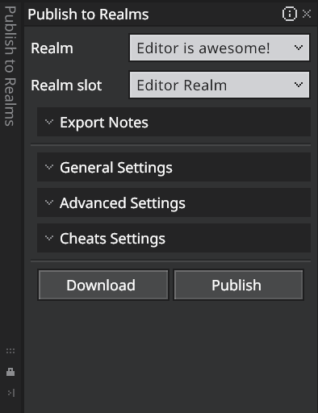

# Publish to Realms

Publish to Realms allows you to directly publish your Editor Project directly to Realms making testing on cross platforms with additional users even easier.

In this guide you'll learn the following:

> [!div class="checklist"]
>
> - How to publish a project to a Realm
> - What publishing to a Realm does
> - Requirements for publishing a project to a Realm
> - How to select a Realm slot
> - How to configure Realm options
> - How to publish/dowload a backup Realm

## Requirements

- You must be signed in with an active Realms subscription.    
    > [!TIP]
    > Learn how to [buy a Realm here](https://www.minecraft.net/en-us/realms/how-buy-realm).

- For Preview builds, you need a Preview Realm set up before entering Editor mode.

## Overview

The Publish to Realms Pane can be opened via the Action Bar or **File -> Publish to Realms**.

> [!NOTE]
> To use this feature you will need to be logged in with an active Realms subscription. Information on this can be found [here](https://www.minecraft.net/en-us/realms/how-buy-realm). When using a Preview build, you will need a Preview Realms setup before entering Editor Mode. 

### Realms pane elements

- **Selecting your Realm and slot**: If you have an active Realms subscription your Realm(s) appear in the drop down automatically. Once selected you can specify the world slot you want to publish your Realm to.

- **Publish options**: Similar to Export, publishing to Realms contains settings you can cusomize before publishing. 
    

- **Download**: The Download button saves the world in the current selected Realm slot to the minecraftWorlds folder. This is a great way to backup your world before publishing. 

- **Publish**: Publishes the current project to the selected Realms slot with the selected settings. It mirrors key Export settings; lets you download the current slot as a backup; and publishes in a single flow from the Editor.

## Publishing to your Realm

Publishing to Realms uploads your current project to a chosen Realm slot so you and others can play or test across platforms without manual export/import. 

1. Navigate to Realms from the Minecraft laucher home page. Your Realm(s) will automatically appear in the Realm dropdown if you have an active subscription.

2. Choose the Realm you want to work in, then select the world slot you want to publish to.

3. Click Download to save the current contents of the selected Realm slot to your local `minecraftWorlds` folder.
    > [!TIP]
    > Always use this step to create a backup before you publish.

4. Click Publish to upload the current project to the selected Realm slot using the chosen settings. The process may take time for large worlds or slow connections. Keep the Editor open until it completes.
    > [!NOTE] 
    > Your choices apply to the published world in the selected slot. Your publishing options for Realms are similar to those on the Export pane (game mode, difficulty, etc.).

## Tips

- Use a spare slot for testing to avoid interrupting an active Realm.

- If you’re using a Preview build, verify your Preview Realm is active before opening the Editor.