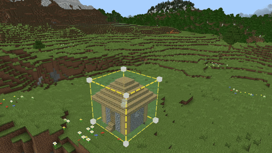

# Repeater Tool

The Repeater is used to repeat a selection of blocks to make pattern across a specific volume. You can use this tool to make repetitive block placement much more efficient. 

The Repeater makes one or more copies of your current selection at regular offsets. Use it to build rows, columns, layers, or full 3D grids of a structure.

## Spacing

Spacing refers to the size of the area between each repetition. If you leave the value for an axis at 0, the selection will not repeat along that axis.

- **Auto spacing**: Calculates spacing from your selection’s bounding box plus 1 block in each axis. This places copies edge‑to‑edge without overlap by default.

- **Manual control**: Edit X, Y, Z spacing values to change the offset on the corresponding axis.

- **Zero spacing**: Setting an axis to 0 prevents movement along that axis (useful for staying in a single line or plane).

> [!TIP]
> The maximum value for each axis is the size of your world,but very large spacing values and very high copy counts can impact performance while previewing.

## Line
Makes a one‑dimensional row of copies along the direction implied by non‑zero spacing values.

- **Repetitions**: Set how many copies to make (default is 5). Each copy is offset by multiples of the spacing.

- **Preview**: Shows a row of outlined instances; edit values to update live, then click Apply to write them to the world in one transaction (Undo with Ctrl+Z).

## Grid
Repeats in a 3D grid. Choose one of two repeat styles:

- **Uniform**
When selected, the repetitions value is applied to all enabled axes. 
    > [!NOTE]
    > Limits adjust automatically to keep the total number of previewed copies reasonable. With 3 axes enabled, the maximum uniform repetitions per axis is reduced (cube‑root of the internal limit); with 2 axes it’s reduced to a square‑root threshold. This prevents creating more than about 1000 preview widgets.

- **Separate**
When selected, repetition counts for the X, Y, and Z axes are set independently. The total number of copies generated scales with (X+1) × (Y+1) × (Z+1), minus the original position.
    > [!NOTE]
    > Controls clamp to prevent exceeding the same internal limit (~1000 widgets).

> [!NOTE]
> In both Uniform and Separate, if no axes are effectively active (e.g., all repeats are zero or all axes disabled), the preview will be empty and clicking **Apply** will do nothing.

## Use the Repeater to create patterns:

1. Open the Repeater by selecting it from the tool rail on the left side of the Editor.
    > [!TIP]
    > Pressing **Ctrl+R** also switches to the Repeater.

2. Select the group of blocks that you want to repeat.

3. Set the **Spacing** and **Mode** settings.

4. Verify the preview looks correct.

4. Click **Apply** to place all copies at once. The operation is performed as a single action so you can Undo.

## Keyboard shortcuts

These shortcuts are available while working in the Editor. The toggle is most useful when switching to Repeater frequently. For the full list of shortcuts, see [Editor Hotkeys](../BedrockEditor/EditorKeyboardInputs.md).

|Command |Shortcut |
|:---|:---|
|Toggle Repeater tool|**Ctrl** + **R**|

## Tips
- Use the Selection tool to tightly bound the structure—the default spacing uses that size to tile copies seamlessly.

- For flat arrays, use Grid → enable X and Z only. For vertical stacks, enable Y only. For full 3D lattices, enable all three.

- If you want a single row, Line mode is fastest. For rectangles/cuboids of copies, use Grid (Uniform for symmetric counts; Separate for different counts per axis).