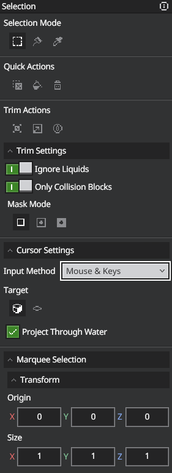
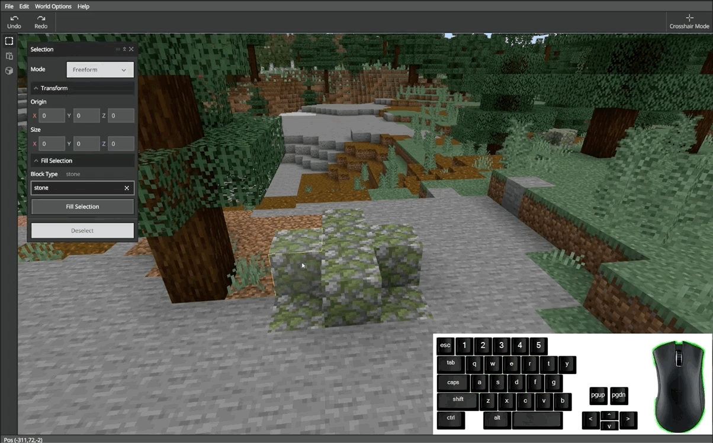
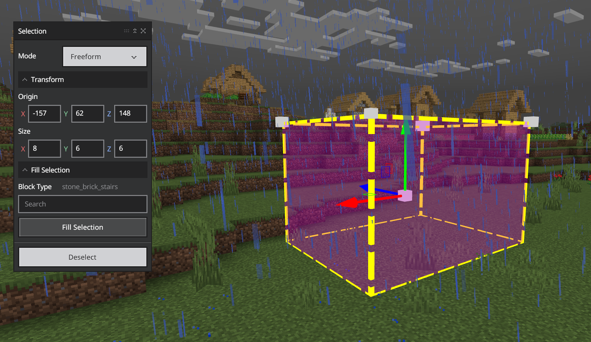
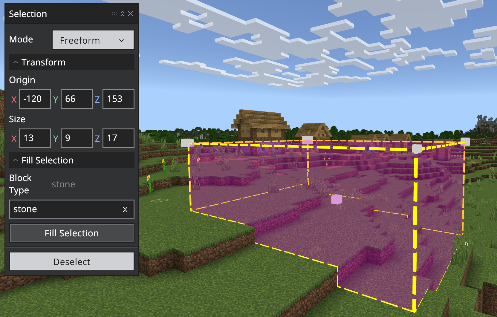
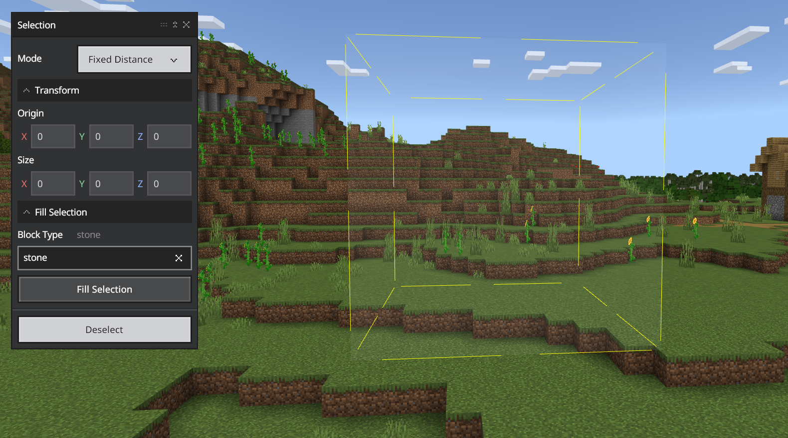
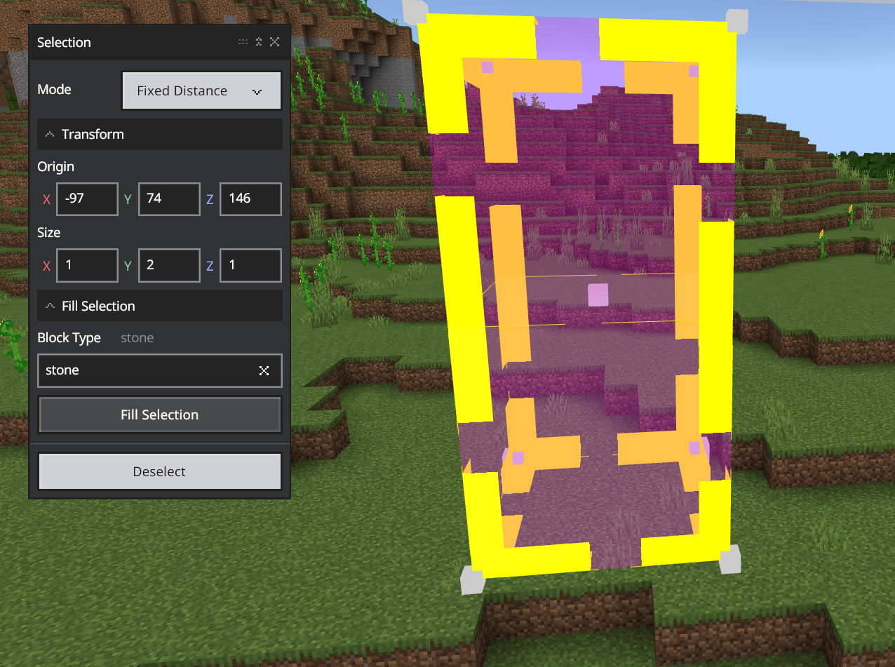
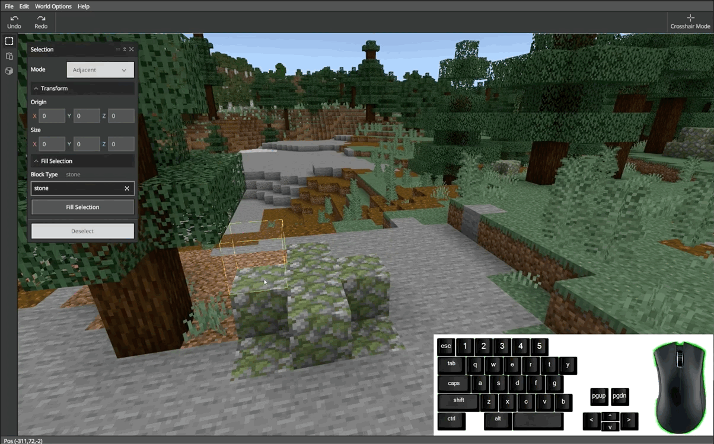
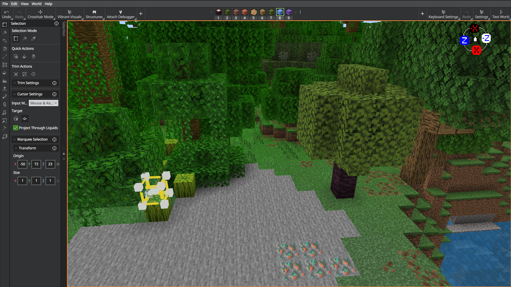

# Selection Tool

Use Selection to select any of the blocks in the world (including air). The Selection menu lets you change the Selection Mode, Transform the selection, Fill the selection with blocks, or Deselect your selection.

> [!Tip]
> Pressing **Ctrl+S** switches to Selection when you're using a different tool.

## Selection Modes

Editor supports three different Selection modes so you can pick the one that makes the most sense for your project's needs.

### Marquee Selection

Marquee creates a selection area when you choose the X, Y, and Z coordinates (in that order). Selections can include air, but you can't choose air as a coordinate.

There's more than one way to specify the coordinates in Marquee mode thanks to the Selection helper features.

#### Gizmos

When you make a selection and click on one of the white corners, a blue, red, and green arrow appears &mdash; that's the **Resize Gizmo**! You can click and drag the **Resize Gizmo** to adjust the size of your selection with your mouse.

You might have noticed another white box, hovering in the center of your selection &mdash; that's a **Move Gizmo**! You can click and drag the **Move Gizmo** around to move your selection with the mouse.

#### Practice using Marquee Selection:

1. Choose Marquee as the Selection Mode.

2. Click a block on the ground in front of you with your cursor to choose the block that will hold the X coordinate.

3. Hold **Shift** and click another block to chooses the Z coordinate. A square with X and Z as opposite corners will appear on the ground.

4. To add the Y coordinate, hold **Alt** and click somewhere above the square.

5. Deselect the selection (**Ctrl+D**) before moving on to the next practice.

    

### Freehand Brush Selection

Creates a selection with the same mechanic as the Brush Paint Tool to create a more seamless integration for creators that heavily rely on Brush Paint in their workflow.

#### Brush Settings

> [!Note]
> These settings are only visible in the Selection menu when Freehand Brush Mode is selected.

- **Brush**

    Choose a cursor with one of the six supported brush shapes.

    - Ellipsoid

    - Cuboid

    - Cylinder

    - Cone

    - Pyramid

    - Single Block

- **Offset**

    Specify the selection's offset from the cursor location.

**Shape Settings**

- Uniform

    *Combines the following three fields into a single one that defines the shape's radius.*

- Width 

    *Defines the selection's width (X-Axis), in blocks.*
    
- Height 

    *Defines the selection's height (Y Axis), in blocks.*

- Depth 

    *Defines the selection's depth (Z Axis), in blocks.*

**Fill Constraints (Block Filters)**

Block Filters determine what type of blocks are included/excluded from the Brush Paint action and how your selection is filled.

- Disabled

    *Uses the type of block currently selected in the Block Picker to fill the entirety of your selection with.*

- Mask

    *Lets you specify a list of block types to exclude from the Brush Paint action, preventing them from changing even when included in your selection.*

- Replace

    *Lets you specify what type of blocks to replace and the type of block to replace them with.*

### Magic Select Mode

Used to select entire structures from blocks that are connected to each other in the world. Magic Select can help you quickly adjust, copy, or paste structures to add richness your world.

> [!Note]
> Magic Select is best used to select isolated structures since it creats a selection out of all connected blocks beside and above the initial selected block. All connected structures will be grouped together (i.e. adjacent trees that are connected by touching leaf blocks).

## Quick Actions

These are some of the helper tools you'll use the most with Selection, so we put them together at the top to make them easy to find.

### Deselect

Deselects the current selection.

### Fill

Fills the selection with the block selected in the Block Picker.

#### Practice using Fill

1. Create a selection with any of the selection modes.

2. Use the Block Picker to choose the Block Type you want to fill your selection with.

    > [!Note]
    > The default Block Type is stone.

3. Click Fill to fill the current selection with your chosen Block Type.

4. Deselect the shape before moving on.

    > [!Note]
    > You can undo a Fill action by pressing **Ctrl+Z**.

### Delete

Deletes the blocks in the current selection, leaving only air behind.

## Trim Actions

### Trim Selection
???

### Remove Air
???

### Hollow Selection

Retains the outline of your selection while changing all interior blocks to air.

## Cursor Settings

### Input Modes

- **Keyboard Only**

    Uses the directional keys to move the cursor around the world. The mouse and W, A, S, and D keys are still used to move and look around the world, but they're not involved in selecting a block.

- **Mouse & Keys**

    Selects blocks based on the location of the cursor. You can click and drag the mouse to create an initial selection larger than one block, and you can use either Gizmos or the Keyboard to adjust your initial selection.

- **Fixed Distance**

    Selects blocks, air, or a combination of both, based on your Selection Settings, at a fixed location at the center of the Editor screen.
    
    

    You can use the scroll wheel on the mouse to increase or decrease the distance between you and the selection cube.
    
    > [!Tip]
    > Fixed distance is the easiest mode to use if you want to select only air blocks.

    #### Practice using Fixed Distance:

    1. Select Fixed Distance from the Input Mode drop-down menu. You should see a thinly-outlined cube shape in front of you.
    
        

    2. Hold down the right mouse button while you move the mouse look around the world. Notice how the pre-selection cube stays in the center of the screen?

    3. Next, roll the mouse's scroll wheel back and forth to zoom in and out.

    4. Next, hold Shift while your repeat step 3. See how the fixed distance pre-selection cube changes size and position?

    5. Click to make a selection where the pre-seletion cube is on the screen.

    6. Click the Deselect button (or **Ctrl+D**) before moving on to the next practice.

        

### Target

- **Block**

    Selects the block you highlight with the cursor.

- **Adjacent**

    Selects the air next to, above, or below solid blocks that you highlight with the cursor.

    

    #### Practice using Adjacent:

    

    1. Make sure the Selection Target is set to Adjacent.
        
        > [!Note]
        > When you move the mouse around, you will see a faint cube outline move around with the cursor.

    2. Click to choose the outlined cube as your selection.

    3. Deselect the Selection (**Ctrl+D**) before moving on to the next practice.

## Transform

In the Transform section, you can move and fine-tune your selection by entering Origin coordinates or changing the selection Size.

### Origin

Represents the world-coordinates for the center of your selection.

#### Practice transforming the selection's origin:

1. Create a selection with any of the selection modes.

2. Look in the lower left corner of the UI to see your cursor's coordinates. Compare the position coordinates with the X, Y, and Z coordinates in the Origin.

4. Increase the X coordinate and press enter. Notice how the selection moves.

5. Change the Y and Z coordinates to better understand how the selection is affected.

6. Deselect the selection (**Ctrl+D**) before moving on to the next practice.

### Size

Used to adjust the size of your selection based on the length of each axis.

#### Practice changing the selection's size:

1. Create a selection with any of the selection modes.

2. Increase or decrease each coordinate and notice how the size and shape of the selection is affected.