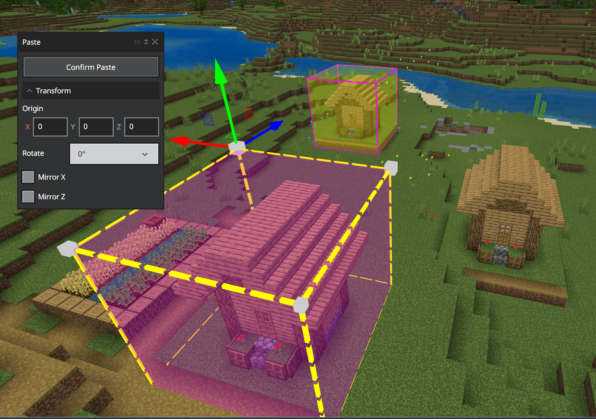

# Editor Selection Tool

`Ctrl S` opens the Selection tool window.

The selection tool is used to select any of the blocks in the world, including air.

The Selection window that you use to configure the selection tool has sections where you can change the selection mode, transform the selection, fill the selection with blocks, or deselect your selection.

### Freeform Selection Mode

**Freeform** mode creates a selection area when you choose the x, z, and y coordinates, in that order. It can include air in the selection, but you can only click on a non-air block to choose it as a coordinate.

There is more than one way to specify the coordinates in Freeform mode, and they will all be explained fully, along with the helper features called **gizmos**.

For now, let's learn one way to create a selection in Freeform mode.

Freeform mode practice:

1. Make sure "Freeform" is showing in the Mode drop-down menu of the Selection window.
1. Left-click a block on the ground in front of you with your cursor. This chooses the block that will hold the x coordinate.
1. Hold down the `Shift` key and click another block. This chooses the z coordinate. A square with x and z as opposite corners will be drawn on the ground.
1. To add the y coordinate, hold down the `Alt` key and click somewhere above the x, z selection square.
1. Click the Deselect button (or `Ctrl D`) before moving on to the next practice.

### Fixed Distance Selection Mode

**Fixed Distance** mode can select blocks, air, or a combination of both.

You can use the scroll wheel on the mouse to increase or decrease the distance between you and the selection cube.
Fixed distance is the easiest mode to use if you want to select only air blocks.
Like Freeform selection, you build the selection shape by selecting the x, z, and y coordinates (in that order).

Fixed Distance mode practice:

1. Make sure "Fixed Distance" is showing in the Mode drop-down menu of the Selection window. You should see a thinly-outlined cube shape in front of you.
1. Hold down the right mouse button and look around the world. Notice how the pre-selection cube moves around.
1. Next, roll the mouse's scroll wheel back and forth to see how the fixed distance pre-selection cube changes size and position.
1. Click the ground to set your x coordinate.
1. Hold the shift key and click the ground a little distance away to choose your z coordinate.
1. Alt-click above the x z square.
1. Click the Deselect button (or `Ctrl D`) before moving on to the next practice.

### Adjacent Selection Mode

**Adjacent** mode selects only the air next to, above, and below solid blocks.

Adjacent mode practice:

1. Make sure "Adjacent" is showing in the Mode drop-down menu of the Selection window.
1. If you move the mouse around, you will see the thin, pre-select cube move around on top of the ground.
1. Left-click to confirm your choice of where to create the selection.
1. Click the Deselect button (or `Ctrl D`) before moving on to the next practice.

### Transform

In the Transform section, you can fine-tune your selection by entering Origin coordinates or changing the Size.

Practice transforming the origin of the selection:

1. Create a selection with any of the selection modes.
1. Look in the lower left corner of the UI to see the Pos (position) coordinates. These are the coordinates of where you are standing.
1. Compare the position coordinates with the x, y, and z coordinates in the Origin section.
1. Increase the x coordinate and press enter. Notice how the selection moves.
1. Change the y and z coordinates and notice how the selection is affected.
1. Click the Deselect button (or `Ctrl D`) before moving on to the next practice.

### Size

Practice changing the size of the selection:

1. Create a selection with any of the selection modes.
1. Increase or decrease each coordinate and notice how the size of the selection is affected.
1. Click the Deselect button (or `Ctrl D`) before moving on to the next practice.

### Fill

1. Create a selection with any of the selection modes.
1. Notice the Block Type. The default is stone.
1. Click the Fill Selection button to fill the current selection with stone.
1. Deselect the shape and move to another area.
1. Make another selection.
1. Click the Search field and select a different block type.
1. Click the Fill Selection button to fill the current selection with the different block type.

### Gizmos

Create a selection and click on a corner of the selection box. You will see a little cube with arrows appear. That's a **Resize Gizmo**! You can click and drag these arrows to adjust the size of your selection box.

You might also see another box hovering in the center of the selection. That's a **Move Gizmo** and you can drag it around to move your selection.

### Paste Preview

`Ctrl Shift V` opens the Paste Preview window.

After you create a selection and copy it (`Ctrl C`) or cut it (`Ctrl X`), you can use the Paste Preview window to change how the selection will appear when you paste it.

1. Select something interesting, like a village house, with any of the selection modes.

1. Copy or cut the selection (`Ctrl C` or `Ctrl X`).
1. Open the Paste Preview window (`Ctrl Shift V`).
1. Click the ground where you want the copied or cut blocks to be pasted. The paste preview selection is displayed.

1. You can use the arrow keys and the page up/page down keys to move the paste preview box to exactly where you want it.

1. Click Confirm Paste.

You can Transform your copied selection by editing the Origin coordinates, Rotating the selection, or mirroring the selection along the x or z axis.

Click Confirm Paste after each transformation to place a selected object.

