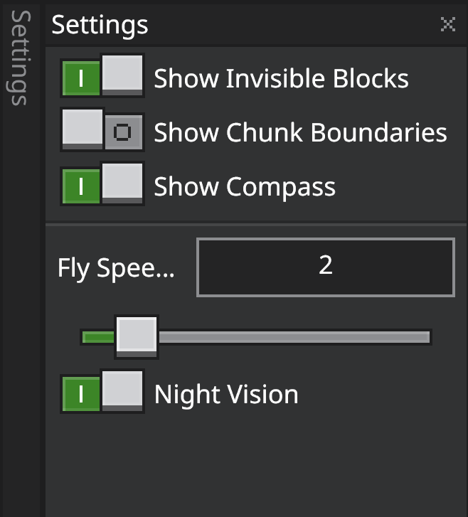

# Editor Settings

Use Settings to adjust Editor UI preferences, cursor behavior, and world visualization aids that make building and navigation easier. 

## Open Settings

There are two ways to open the settings menu:
1. From the menu, select File and navigate to Settings.
2. From the Action Bar, click the Settings icon.

The Settings Pane includes the following options:

### UI settings
You can change the color options for the following Editor interface elements:

- UI Scale
- Font
- Theme

### Cursor settings

- **Project Through Liquid**: Toggles whether the cursor selects through water/lava when targeting blocks.

### World visualization and navigation settings

- **Show Invisible Blocks** -  Displays certain blocks that don’t render by default so you can see and edit them more easily.
- **Show Chunk Boundries** - Shows the boundary lines between chunks (16×16 block areas).
- **Show Compass** - Toggles the directional compass at the top-right of the screen.
- **Fly Speed** - Changes the vertical and horizonal fly speed to navigate around your world faster.
- **Night Vision** - Turns on night vision to make editing underground and in dark places easier. 

