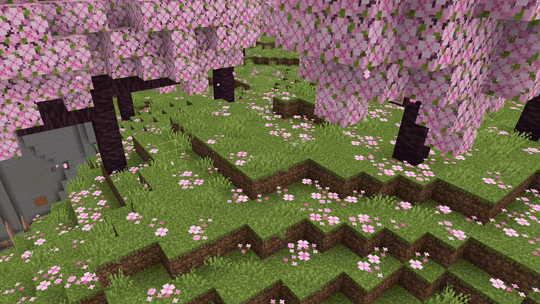

# Summon Tool

Place entities into your world quickly. Some entities have random visual or variant traits (for example, horses or sheep) — each placement can spawn a random variant. While entities are paused, you can adjust their facing direction using rotation controls.

## Using the summon tool

1. Select Summon by clicking the button in the toolbar on the left side of the Editor.
    > [!TIP]
    > Pressing **Ctrl+Shift+S** switches to Summon.

2. Select an Entity Type.

3. Click where you want to place the entity. If the entity is something with random variations like a horse or sheep, you'll get a random entity on each click.

4. With entities paused, you can use rotation controls to set which direction a selected entity is facing. Unpausing resumes normal behavior.

## Keyboard shortcuts

The following are the default key bindings for the Summon Tool.

| Name | Shortcut | Exclusive |
|:----|:----|:----|
| Summon Tool | Ctrl+Shift+S | - |
| Clear Selection | Ctrl+D | - |
| Delete Entity | Delete | On |
| Move Selected Back | Down Arrow | On |
| Move Selected Down | PgDn | On |
| Move Selected Forward | Up Arrow | On |
| Move Selected Left | Left Arrow | On |
| Move Selected Right | Right Arrow | On |
| Move Selected Up | PgUp | On |
