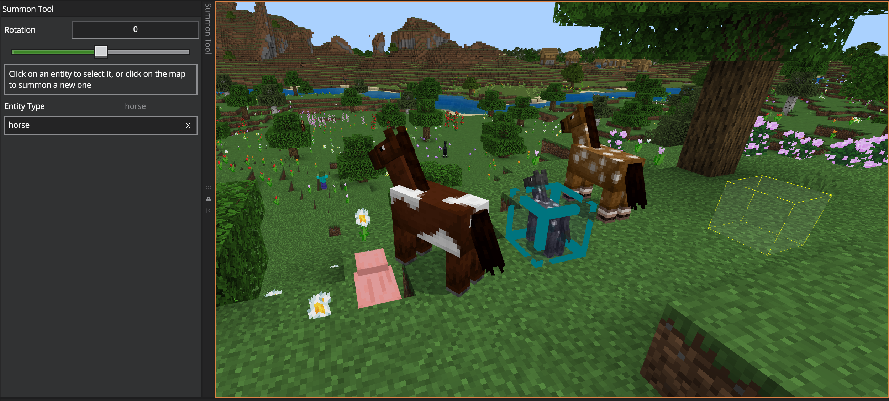

# Summon Tool

1. Select Summon by clicking the button in the toolbar on the left side of the Editor.
    > [!Tip]
    > Pressing **Ctrl+Shift+S** switches to Summon.

2. Select an Entity Type.

3. Click where you want to place the entity. If the entity is something with random variations like a horse or sheep, you'll get a random entity on each click.

4. With the entity selected, you can use Rotation to set which direction the entity is facing (until you un-pause entities).

