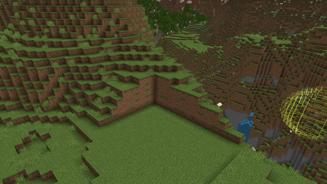

# Terrain Tool

Sculpt your world with three modes in one tool: Flatten, Smooth, and Roughen. Flatten levels terrain to a target plane, Smooth blends sheer or steep terrain into a gentler slope, while Roughen adds terrain variation, making terrain seem less uniform. 

Add Terrain to your Action Bar, open it, pick a mode, and click‑drag to paint over blocks. Terrain uses the Editor brush system, so you can choose shapes, adjust size, and set an offset from the cursor.

## Flatten settings

- **Mode**: Chooses how Flatten applies changes.

    - Both: Flatten up and down toward the target plane.

    - Down: Only lower terrain toward the plane.

    - Up: Only raise terrain toward the plane.

- **Intensity** (1–100): Controls flatten strength per stroke.
- **Smoothing** (0–100): Blends edges of the flattened area into nearby terrain.
- **Floor Block Override**: When enabled, allows overriding specific “floor” blocks during flattening.

## Smooth/Roughen strength
The number of blocks around the cursor that will be smoothed or roughened. This value can range from 0 to 9.

## Brush settings

You can use the Brush drop-down to select the shape you want to use for smoothing or roughening. Once you choose a brush, you can configure additional settings, such as the offset from the cursor as well as the radius of the cursor shape.

- **Brush shapes**: Ellipsoid, Cuboid, and Cylinder; Flatten defaults to a cylinder optimized for planar edits.

- **Brush offset**: Shifts where the brush applies, relative to the cursor.

- **Cursor**: Keyboard and mouse control, block targeting, visible outline.

### Use Terrain to flatten/smooth/roughen the terrain:

1. Open Terrain by clicking the button on the left side of the Editor.
    > [!TIP]
    > Pressing **Ctrl+T** also switches to Terrain.

2. Select **Terrain Mode** and choose **Smooth** or **Roughen**.
    > [!TIP]
    > Pressing **R** with Terrain selected toggles between **Smooth and Roughen**.

3. Choose the **Smooth/Roughen Strength** and the **Brush**. You can also set the offset and radius to adjust the specific area.

4. Click and drag the cursor along the ground to alter the terrain.

## Keyboard shortcuts

| Name | Shortcut |
|:-----|:---------|
|Terrain tool|**Ctrl**+**T**|
|Cycle mode|**Ctrl**+**T** (while Terrain is active)|
|Paint|Click and drag mouse|
|**When flatten is selected**:||
|Both|**Shift**+**F**|
|Down|**Shift**+**D**|
|Up|**Shift**+**U**|