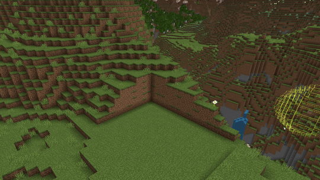
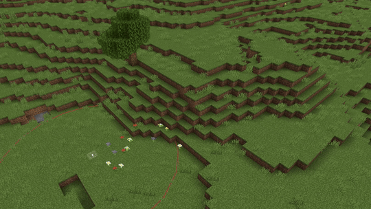

# Terrain Tool

Sculpt your world with four modes in one tool: Flatten, Elevation, Smooth, and Roughen. Flatten levels terrain to a target plane, Elevation raises or lowers terrain, Smooth blends sheer or steep terrain into a gentler slope, while Roughen adds terrain variation, making terrain seem less uniform. 

Add Terrain to your Action Bar, open it, pick a mode, and click‑drag to paint over blocks. Terrain uses the Editor brush system, so you can choose shapes, adjust size, and set an offset from the cursor.

## Flatten settings

Flatten levels terrain to a target plane. It defaults to a Cylinder brush shape optimized for planar edits.

- **Mode**: Chooses how Flatten applies changes.

    - Both: Flatten up and down toward the target plane.

    - Down: Only lower terrain toward the plane.

    - Up: Only raise terrain toward the plane.

- **Intensity** (1–100): Controls flatten strength per stroke.
- **Smoothing** (0–100): Blends edges of the flattened area into nearby terrain.
- **Floor Block Override**: When enabled, allows overriding specific “floor” blocks during flattening.

## Elevation settings

Elevation raises or lowers terrain around the cursor. It uses a disk-shaped brush with separate controls for the effect radius and falloff.

- **Elevation Mode**: Chooses the direction of the effect.

    - Raise: Pushes terrain upward.

    - Lower: Pushes terrain downward.

- **Intensity** (1–100): Controls the strength of the raise or lower effect per stroke.
- **Falloff** (1–20): How quickly the effect tapers at the edges. This value is clamped to the brush radius.
- **Sample Layers** (1–16): Number of vertical layers considered when sampling terrain height.
- **Brush Radius** (1–20): Radius of the disk-shaped brush.

## Smooth/Roughen strength
The number of blocks around the cursor that will be smoothed or roughened. This value can range from 0 to 9.

## Brush settings

You can use the Brush drop-down to select the shape you want to use for smoothing or roughening. Once you choose a brush, you can configure additional settings, such as the offset from the cursor as well as the radius of the cursor shape.

- **Brush shapes**: Ellipsoid, Cuboid, and Cylinder; Flatten defaults to a cylinder optimized for planar edits.

- **Brush offset**: Shifts where the brush applies, relative to the cursor.

- **Cursor**: Keyboard and mouse control, block targeting, visible outline.

### Use Terrain to flatten/smooth/roughen the terrain:

1. Open Terrain by clicking the button on the left side of the Editor.
    > [!TIP]
    > Pressing **Ctrl+T** also switches to Terrain.

2. Select **Terrain Mode** and choose the mode you want.
    > [!TIP]
    > Pressing **Ctrl+T** while Terrain is active cycles through all four modes: Flatten → Elevation → Smooth → Roughen.

3. Adjust the settings for your chosen mode. You can also set the brush offset and radius.

4. Click and drag the cursor along the ground to alter the terrain. You can also press **Enter** to apply the effect once at the cursor position.

## Keyboard shortcuts

| Name | Shortcut |
|:-----|:---------|
|Terrain tool|**Ctrl**+**T**|
|Cycle mode (Flatten → Elevation → Smooth → Roughen)|**Ctrl**+**T** (while Terrain is active)|
|Paint at cursor (one‑shot)|**Enter**|
|Paint continuously|Click and drag mouse|
|**When Flatten is selected**:||
|Both|**Shift**+**F**|
|Down|**Shift**+**D**|
|Up|**Shift**+**U**|
|**When Elevation is selected**:||
|Raise|**Shift**+**R**|
|Lower|**Shift**+**L**|