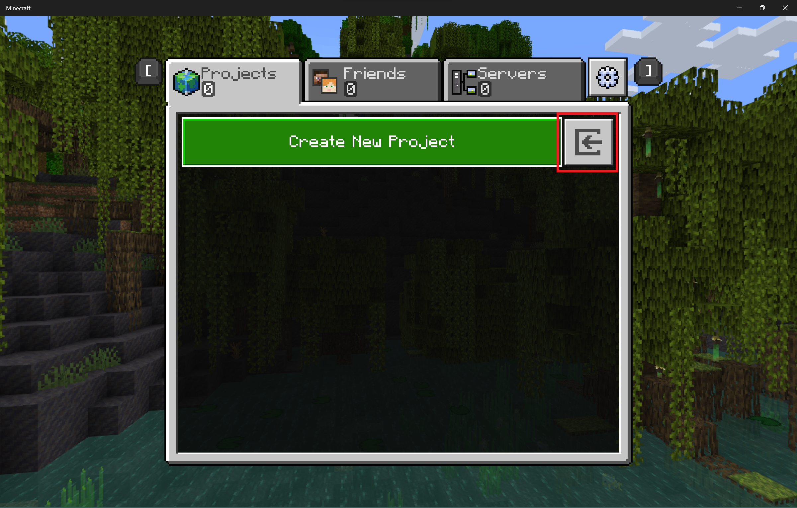

# Tool Mode and Crosshair Mode

The two modes within Editor are Tool Mode and Crosshair Mode.

**Tool Mode** has multi-block editing tools and the user interface. When you move the mouse without holding any mouse buttons, your cursor is freely available to use the user interface.

**Crosshair Mode** has more precise, single-block editing capabilities. It also uses the usual Minecraft keybindings you can see on the Settings > Controls > Keyboard & Mouse screen. Move the mouse to look around.

In a new project, before you touch anything, you are in Tool Mode.

If you're ever not sure which mode you are in, press **Esc**. If you're in Crosshair mode, you'll go back into Tool Mode - if you're in Tool Mode already, nothing will happen.

> [!PRACTICE]
> In the top right corner of the screen, select the "Crosshair Mode" button or press **Ctrl+Tab** to go into Crosshair Mode. Note the differences. To go back to Tool Mode, you can press **Ctrl+Tab** again or press **Esc**. You can also go from Tool Mode to Crosshair Mode by clicking the Crosshair Mode button in the upper right corner.

Think of the Tool Mode UI as a collection of containers. The menu bar contains menus. The action bar contains buttons that do simple functions like Undo and Redo. The toolrail contains more complicated tools that have their own configuration windows where you can change the settings.

> [!NOTE]
> The contents of these containers may change between versions of Editor.

**Menu bar**: Located at the top of the screen. Currently has File, Edit, World Options, and Help.

**Action bar**: Located below the menu bar. Currently has Undo, Redo, Attach Debugger, Input Mapping, Reload, and Crosshair Mode.

**Toolrail**: Located on the left side of the screen. Currently holds Selection, Brush, Paste Preview, Line, and Summon Tool. You can also select these tools using keyboard shortcuts, if they have one.

## Menu bar

### File

#### Export as:
When you're ready to share your project (or just see it in-game) select **File > Export as > Playable world** to create a .mcworld file. Save your new file to the **projectbackups** folder located inside **com.mojang**.

> [!NOTE]
> If you don't know how to find your com.mojang folder, there are instructions in the Bedrock [Getting Started](../GettingStarted.md) tutorial.

Editor has its own file type for projects: .mcproject. These files always open in Editor if it's installed on your computer. To **import** projects from the editor screen, select Create New Project, then click the button to the right of Create New Project.

Navigate to a .mcworld, .mctemplate, or .mcproject file.
After the file is imported, it is converted to an .mcproject file.

Visit [Minecraft File Types](../MinecraftFileExtensions.md) to learn more about Minecraft file types like .mcproject and .mcworld.

- **UI settings** - This is where you can adjust the UI Scale, Font, and Theme color settings of the Editor UI.

  

- **Cursor Settings** - This gives you the option to toggle Project through Liquid on or off.

- **Game menu** - Brings up the menu where you can Resume Editing, go into Minecraft settings, or Save & Quit.

### Edit

These are some of the main functions you'll use as you work in Tool Mode.

|Command  |Shortcut  |
|:-------|:---------|
| Undo | `Ctrl+Z` |
| Redo | `Ctrl+Y` |
| Quick Fill | Select an area and either `Ctrl+F` while in Selection mode or use Fill in the Selection panel |
| Deselect | `Ctrl+D` or use the Deselect button in the Selection panel |
| Delete | `Delete` |

Check out our other guide for a complete list of the [Bedrock Editor hotkeys](EditorKeyboardInputs.md).

### View

- **Log Panel** (`Ctrl+H`)

- **Navigation Logging** - Toggles this feature on or off.

- **Deferred Lighting Settings** - Opens the Settings Editor.

### World Options

- **Pause**

- **Change Dimension**

- **Test World** 

- **Time of Day Settings**

- **Navigation Panel**

- **Weather**

For more information about World Options, take a look at [Editor World Options](EditorWorldOptions.md).

### Help

- **Quick start**:  Select this to reopen the welcome menu.

- **Documentation**: A quick link to our Editor documentation.

- **Feedback**: Links to the public GitHub repository where you can share feedback directly with our team!
