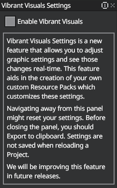
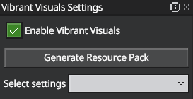
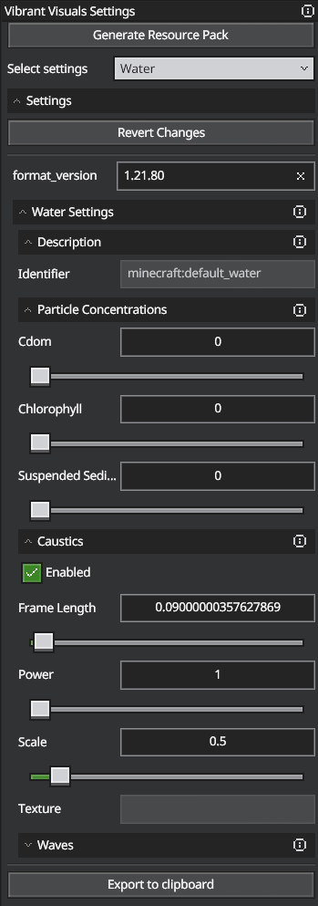
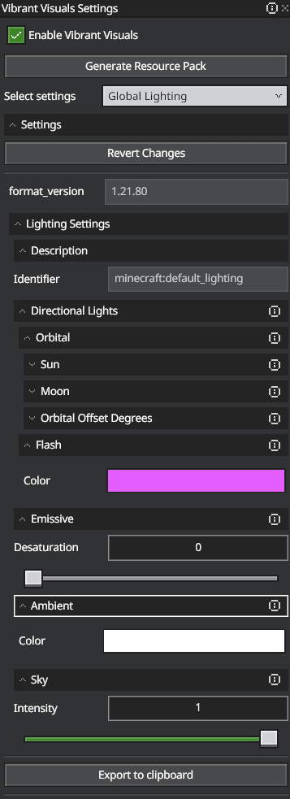
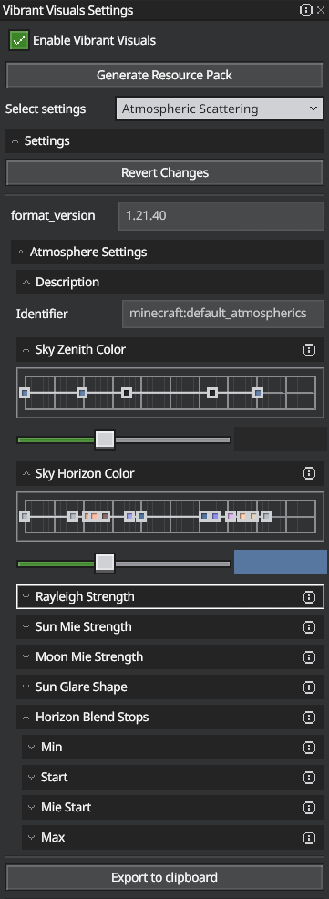
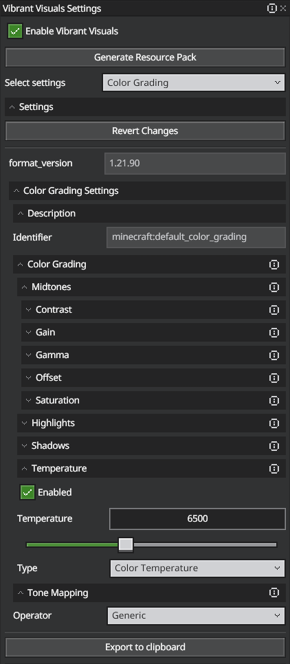
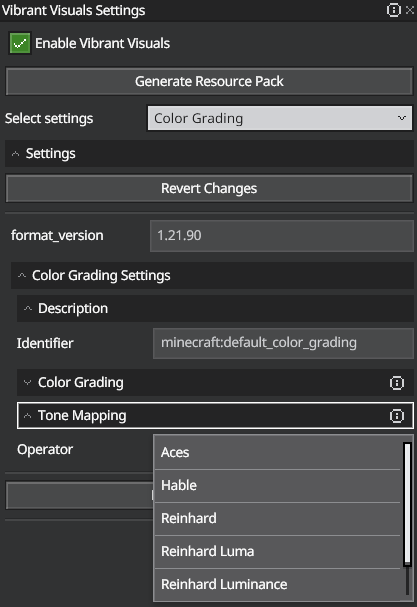
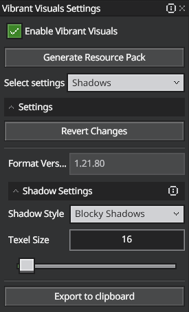

# Vibrant Visuals in Bedrock Editor

Vibrant Visuals (previously Advanced Rendering: Deferred Lighting) is a complete overhaul of the Minecraft graphics system, introduced with Editor v1.0. Use it to tune lighting, water, sky, color grading, tone mapping, shadows, and default PBR values for worlds you build in Editor.

Open Minecraft Editor and add Vibrant Visuals to the Action Bar to get started, then select the graphical element you want to start editing.

- **Generate Resource Pack**: A template on mctools.dev for a new resource pack with the Vibrant Visuals settings you've configured.

- **Export to Clipboard**: Copys the JSON of the current visual setting to your device's clipboard. You can use this to quickly modify parts of a resource pack without the need to generate a completely new one.

> [!Tip]
> You can reset the current visual settings to the Editor default by clicking **Revert Changes** near the top of the Vibrant Visuals menu at any time.

## Water settings

### Particle Concentration

-	**Chromophoric Dissolved Organic Matter (CDOM)**

    Represents the organic matter suspended in the water. Increasing this value increases the strength of the organic matter’s blue wavelength absorption, turning the water yellow to yellow-brown (CDOM values range from 1 – 15).

-	**Chlorophyll**

    Represents the amount of chlorophyll present in a body of water. Chlorophyll absorbs blue and red wavelengths, turning the water green according to the slider’s value (ranges from 1 – 10).

-	**Suspended Sediment**

    Represents the amount of sediment suspended in the water. Sediment absorbs blue and green light wavelengths, so adding more Suspended Sediment will turn the water red to red-brown (sediment values range from 1 – 300).

### Caustics
Enabling Caustics lets light rays project onto underwater surfaces.

-	**Frame length**

    Represents the time spent (in seconds) on a single frame of animation in the caustics sprite sheet texture.

    > [!Tip]
    > A larger frame length results in a slower animation.

-	**Power**

    Adjusts the brightness of the caustic effect (ranges from 1 - 6).

-	**Scale**

    Adjusts the caustics texture projection size.

    > [!Tip]
    > Larger scale values make the texture repeat/tile more frequently, making it appear smaller. Smaller scale values make the texture cover a larger area.

-	**Texture**

    Reveals the texture used for the caustics animation. 

### Waves
When enabled, bodies of water in your world generate waves, which you can edit by adjusting the following settings:

-	**Depth**

    Adjusts the amount the water’s surface is displaced by waves. Larger values make bigger waves (ranges from 0 - 3)

-	**Direction Increment**

    Represents the degree each heading changes between each octave.

-	**Frequency**

    Adjusts the number of waves that fit in a single block of water. Larger values pack the waves tighter together, resulting in more total waves per water block.

-	**Frequency Scaling**

    Adjusts the change in wave frequency between octaves. A value of 1 is neutral, while anything below it reduces wave frequency and anything above it increases wave frequency.

-	**Mix**

    Controls the amount of blending between adjacent octaves.

-	**Octaves**

    Controls how many wave layers are simulated. Larger values yield more complex wave structures.

-	**Pull**

    Adjusts the pull of larger waves is on smaller waves. A value of 0 is neutral; positive values pull smaller waves in a concave (cresting) while negative ones pull smaller waves convexly (pillowing).

-	**Sample Width**

    Controls the resolution of the fractal effect on your world’s waves. A higher value results in a lower resolution, causing waves to appear smoother and more uniform.

-	**Shape**

    Alters the core shape of your world’s waves. A value of 1 yields a true sine wave while values lower than 1 sharpen wave peaks and valleys.

-	**Speed**

    Determines both the movement speed of the first wave in a sequence and the starting point for Speed Scaling.

-	**Speed Scaling**

    Controls how much faster each subsequent wave moves. A value of 1 is neutral, while anything below it reduces wave speed and anything above it increases wave speed.

## Global Lighting

### Lighting Settings

#### Directional Lights
-	**Orbital**
    - Sun
        - Illuminance:
        
            Measures the brightness of the sun’s surface (in lux).

        - Color:
        
            The color your world’s Sun contributes to direct surface lighting.

            > [!Note]
            > Supports RGB Array and hex strings.

    - Moon
        - Illuminance:
        
            Measures the brightness of the moon’s surface (in lux)

        - Color:
        
            The color your world’s Moon contributes to direct surface lighting.

            > [!Note]
            > Supports RGB Array and hex strings.

    - Orbital Offset Degrees
        - Controls the angle the moon and sun are offset from their typical orbital paths, relative to the earth.
 
- **Flash**

    Use to adjust the color of the flash in the End

#### Emissive

Use the Desaturation slider to adjust the desaturation of emissive light sources in your world. By default, Desaturation is set to 0 (the lowest value).

#### Ambient

Controls how the surfaces of objects in your world are lit when no direct light source is present.

#### Sky

Use the Intensity slider to adjust the brilliance of your world’s sun. By default, your world’s Intensity is set to 1 (the highest value).

## Atmospheric Scattering

### Atmosphere Settings

#### Sky Zenith Color

Controls the color of the atmosphere’s zenith.

#### Sky Horizon Color

Controls the color of the atmosphere’s horizon.

#### Rayleigh Strength

Adjusts the strength of the atmosphere’s Rayleigh scattering.

> [!Tip]
> Rayleigh scattering refers to the way that particles that are significantly smaller/larger than a light ray’s wavelength scatter that light as it passes through them. For a more technical explanation, check out [this article on Rayleigh scattering](https://en.wikipedia.org/wiki/Rayleigh_scattering).

#### Sun Mie Strength

Adjusts the strength of the Sun’s Mie scattering.

> [!Tip]
> Mie scattering refers to the way that particles about the size of a light ray’s wavelength scatter light as it passes through them. For a more technical explanation, check out [this article on Mie scattering](https://en.wikipedia.org/wiki/Mie_scattering).

#### Moon Mie Strength

Adjusts the strength of your world’s Moon Mie scattering.

> [!Tip]
> Mie scattering refers to the way that particles about the size of a light ray’s wavelength scatter light as it passes through them. For a more technical explanation, check out [this article on Mie scattering](https://en.wikipedia.org/wiki/Mie_scattering).

#### Sun Glare Shape

Adjusts the shape of your world’s Mie scattering lobe.

#### Horizon Blend Stops

Adjusts how your world’s atmosphere layers are divided.

## Color Grading

Lets you adjust things like saturation, contrast, gain, and pixel offset to fine-tune the look of your world.

### Color Grading Settings

#### Color Grading

-	**Midtones**

    You can adjust the RGB values for each of the following fields to fine-tune the look and feel of your world:
    - Contrast
    - Gain
    - Gamma
    - Saturation
    - Offset

-	**Highlight**

    When enabled, the average luminance of the scene is multiplied by this factor to determine which pixels are considered highlights (ranges from 1 - 20). You can adjust the RGB values for each of the following fields to fine-tune the look and feel of your world:
    - Contrast
    - Gain
    - Gamma
    - Saturation
    - Offset

-	**Shadows**

    When enabled, the average luminance of the scene is multiplied by this factor to determine which pixels are considered shadows (ranges from 0 - 1). You can adjust the RGB values for each of the following fields to fine-tune the look and feel of your world:
    - Contrast
    - Gain
    - Gamma
    - Saturation
    - Offset

-	**Temperature**

    When enabled, this sets the temperature of your world in Kelvin (ranging from 1000 – 15000).

    - Temperature

        Adjusts the value of color temperature or the white balance according to the slider.

    - Type

        Determines whether the color temperature or the white balance is affected by the temperature slider.

#### Tone Mapping
Use the Operator to define how a color gets remapped from HDR-space to SDR-space for modern displays.

- #### Aces

- #### Hable

- #### Reinhard

- #### Rreinhard Luma

- #### Reinhard Luminance

- #### Generic

## PBR Fallbacks

### PBR Fallbacks Settings

You can configure the default MERS values for the following entities in your world when they're not specifically defined with a textureset:

- #### Blocks

- #### Actors

- #### Particles

- #### Items

> [!Tip]
> You can use either an RGBA array or a hex string to set values for Metallics, Emissives, Reflectives, and Subsurface Scattering (MERS).
## Shadows

### Shadow Settings

#### Shadow Style

Changes the way shadows render in your world.

-	**Blocky Shadows**

    Shadows render with hard edges that reflect the shape of the object casting them.

-	**Soft Shadows**

    Shadows render with softened edges that are inspired by shape of the object casting them.

#### Texel Size

Changes the size of texel-based shadows (ranges from 1 - 1024).

> [!Tip]
> A texel is basically a pixel, but for a texture pack instead of an image. For a more detailed explanation, check out [Mozilla’s article on Texels](https://developer.mozilla.org/en-US/docs/Glossary/Texel).

