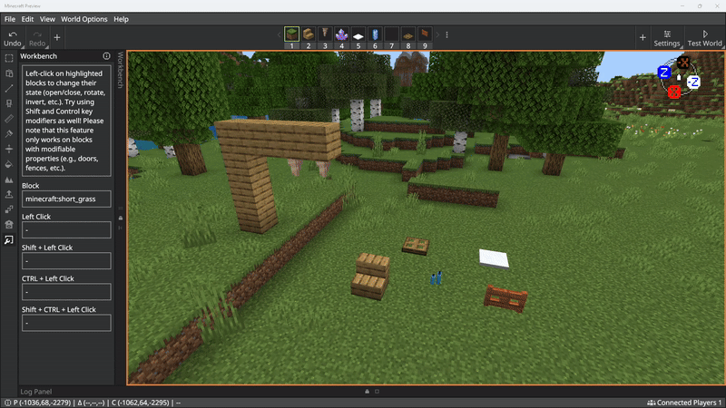

# Editor Workbench Tool

The Workbench tool lets you toggle the state of blocks with modifiable properties like doors, fences, snow, and candles. You can use the Workbench tool to conveniently change a block's properties without switching to Crosshair mode.

Use the following quick-actions with Workbench to change block states:

- **Left-click**
- **Shift+Left-click**
- **Ctrl+Left-click**
- **Shift+Ctrl+Left-click**

> [!Note]
> Each block has unique states. 

