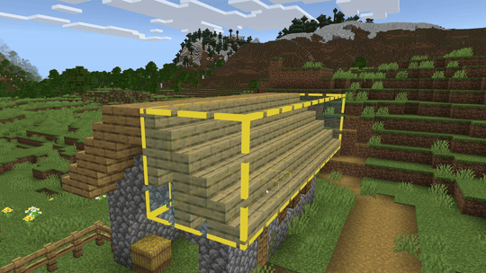

# Editor Workbench Tool

Workbench lets you change block states and properties directly in Tool Mode without switching to Crosshair. Use it to toggle or cycle states on interactive blocks like doors, trapdoors, stairs, slabs, candles, and snow layers.

## Using Workbench

1. Open Workbench from the tool rail (left toolbar) or add it to your Action Bar.
2. Hover over the block you want to modify and use one of the quick-action clicks above to toggle or cycle its state.
3. Repeat clicks or try modifier combinations to reach the desired state.

> [!NOTE]
> Each block exposes its own set of states and may support different click combinations.

### Quick Actions

Use the following quick-action modifier combinations to change block states.

> [!NOTE]
> The effect of each combination depends on the block type (ex. toggling between open and closed, rotating orientation, or cycling the layer or count).

- **Left-click**

    Cycles through common value-like states (i.e. vertical half/top slot, pillar axis (logs), height (snow layers), candles, turtle egg count, etc.).
- **Shift+Left-click**

    Cycles between open, upside-down, lit, and thickness-type states (i.e. upside_down_bit, open_bit (doors/trapdoors), lit, dripstone_thickness, etc.).
- **Ctrl+Left-click**

    Adjusts facing and direction (i.e. direction, weirdo_direction, facing_direction, minecraft:cardinal_direction, minecraft:block_face, etc.).
- **Shift+Ctrl+Left-click**

    Toggles upside_down_bit (alternate path for some blocks).

### Custom logic

- **Shift+Left-click** on logs/wood/stems strips them to their stripped variants.

- **Left-click** on Light Block cycles its light level (0&ndash;15).

- **Ctrl+Left-click** on ladders adjusts facing, skipping invalid mounting values.

## Keyboard shortcuts

You can perform the following Workbench actions from the Viewport anytime Workbench is active:

| Name | Shortcut | Description |
|:-----|:---------|:------------|
|Toggle Workbench|**Ctrl+W**|Activates the Workbench tool|
|Primary Action|**+** (numpad)|Same as **Left-click**|
|Secondary Action|**Shift** + **+** (numpad)|Same as **Shift+Left-click**|
|Tertiary Action|**Ctrl** + **+** (numpad)|Same as **Ctrl+Left-click**|
|Quaternary Action|**Ctrl** + **Shift** + **+** (numpad)|Same as **Ctrl+Shift+Left-click**|