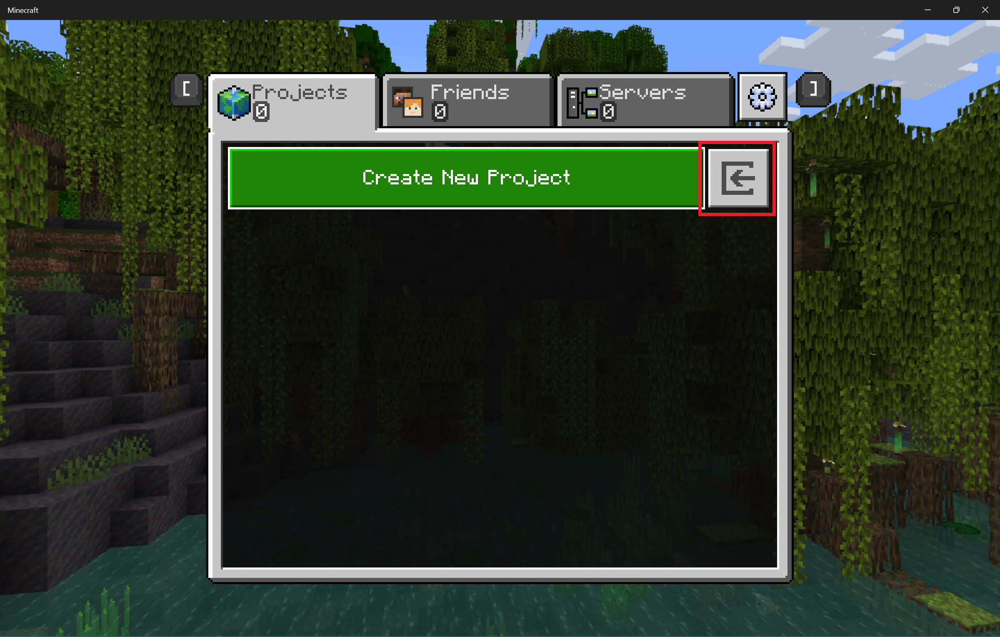

# Editor File Operations - Create, Import, Export

Here are the steps to create a project, make a quick edit, export the file, and then open that file in Minecraft and then again in Minecraft Editor.

1. Launch Minecraft Bedrock Editor.
1. Select "Create New Project."
1. Name the project something meaningful like "Editor Test Project" and open it up.
1. Select the brush tool (`Ctrl B`) and draw something by clicking on the ground a few times.
1. Go to the **File** menu and select **Export as ... Playable world**.
1. You will see some messages confirming that the export started and finished, and a temporary chat message will display the path to a folder in your **com.mojang** folder called **projectbackups**.
1. Close Editor by going to **File ... Pause screen** and then choose **Save & Quit** like you usually do.
1. Go to the **projectbackups** folder in your **com.mojang** folder. You should find a file with the name you gave it appended to the date, time, and a **.mcworld** extension.

If you need a reminder about how to find the **com.mojang** folder on your computer, there are some steps in the [Getting Started](../GettingStarted.md) article.

The **projectbackups** folder does not exist until the first time you export a project from Editor.

If you're curious about Minecraft file extensions, here is an article about them called [Minecraft File Extensions](../MinecraftFileExtensions.md) where you can learn more.

1. If Editor is closed, then when you double-click the **.mcworld** file Minecraft will launch like usual and import the .mcworld file. The world you created in Editor will be listed among any other Minecraft worlds you already have. However, if Editor is still running, then double-clicking the file will cause it to be imported into Editor instead.
1. To send your project file to someone else so they can work with it in Editor, go back to the **projectbackups** file in your com.mojang folder.
1. Copy and paste the file and change the file extension to **.mcproject**. When you send this file to someone else, they can double-click it to open it directly in Editor (if they have Editor installed.)

### Importing a file into Editor

1. Launch Editor and click the Play button.
1. Click the import icon next to the Create New Project button to open the Windows file explorer.

 

3. In the file explorer, choose the .mcworld, .mctemplate, or .mcproject you want to import.
4. When the file is imported, a success message is displayed.
5. The newly imported map will be available in the list.
6. Open the map. It will load into Editor with default settings, which can be modified within Editor.

### File structure information

As you probably already know, when you create a world in Minecraft, that world is stored in the **minecraftWorlds** folder in your **com.Mojang** folder.
When you create a project in Editor, that file is also a world, so it is also stored in the **minecraftWorlds** folder but it is invisible to non-Editor Minecraft unless you import it.
The Editor project file goes into the **projectbackups** folder only when you export it.
