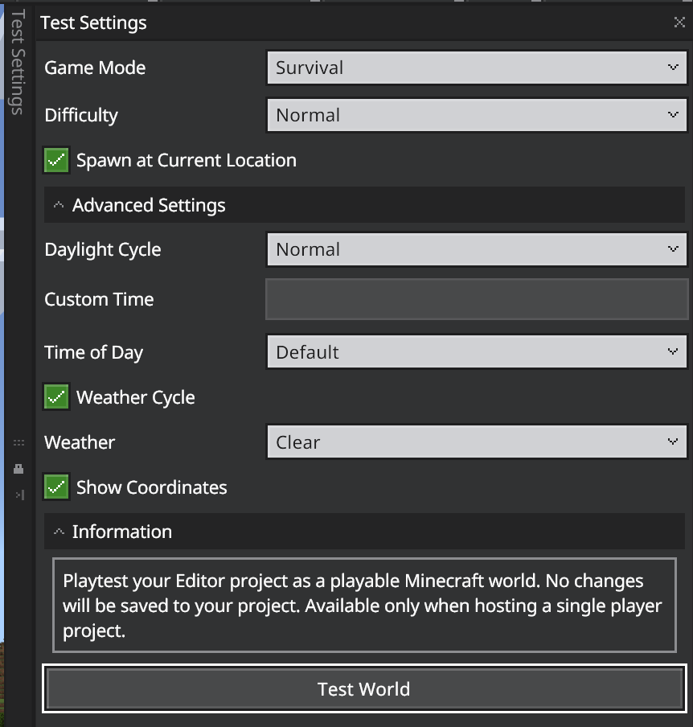

# Editor World Options

## World Options

### Pause

If you want to pause or unpause entities.

### Change dimension

You start in the Overworld by default. Go here to change to the Nether or the End.

### Test World

This opens the Test World panel, which allows you to enter your Editor project as a playable Minecraft world. You can choose the **Game Mode** and **Difficulty** settings and, in the **Advanced Settings**, you can set the **Daylight Settings**, **Time of Day**, **Weather** settings, and use the **Show Coordinates** setting if you want to display your current position while you are playing. While you are playing, you can press the **Esc** button and click **Return to Editor** to go back to end your test and resume editing your project. No changes will be saved to your project. Available only when hosting a single player world.

 

#### Game Mode

Choose Survival, Creative, or Adventure.

#### Difficulty

Choose Peaceful, Easy, Normal, or Hard.

#### Spawn at Current Location

If unchecked, the player spawns at the usual spawnpoint for that world.

#### Advanced Settings

**Daylight Cycle**

Normal, Always Day, or LockTime.

**Custom Time** 

This will be enabled if you choose Custom from the Time of Day option.

**Time of Day**

Choose Default, Day, Noon, Sunset, Night, Midnight, or Sunrise, or Custom.

**Weather Cycle**

Toggle on or off.

### Time of Day Settings

This option opens the **Time Settings** panel. In this panel, you can set the **Clock Type** (24hr, 12hr, or Minecraft Clock) and whether the **Daylight Cycle** will be locked in the current position, always daytime, or proceed as normal. You can also set the time of day to a number of **Presets** or use the slider to set a custom time.

### Navigation Panel

Go here to open the **Navigation Panel**. At the top is a toggle to show a birds-eye view mini-map which will teleport you to that coordinate on click. In the **Stored Locations** section, you can add markers to locations in your world and they will show up as colored flags within your mini-map.

### Weather

This option lets you instantly change the weather in your project to **Clear**, **Rain**, or **Thunder**.

## Practice: Test a world

1. After selecting the options you want, click the Test World button.

2. Your world loads much as it will in regular Minecraft. 

3. Whenever you're ready to continue editing, press **Esc**. From here, you can choose to Resume Testing or Return to Editor.
