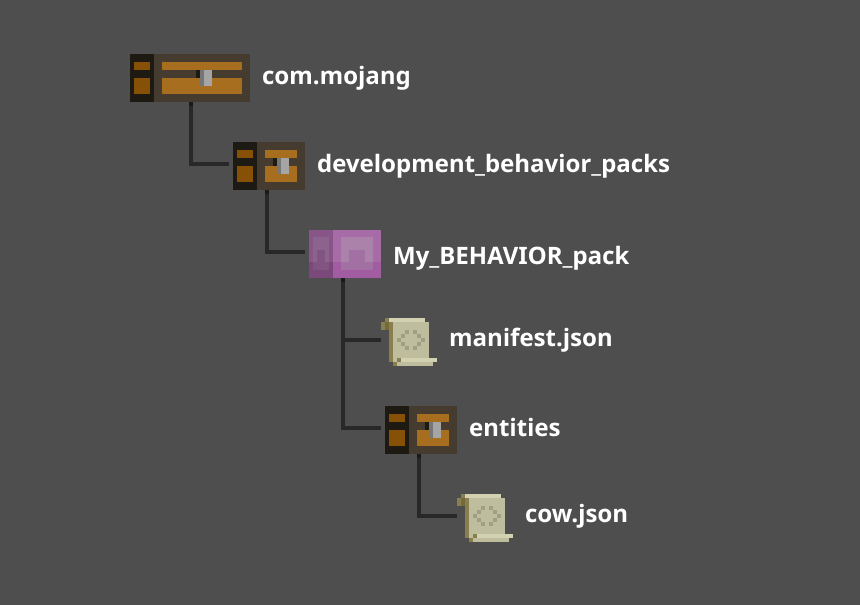
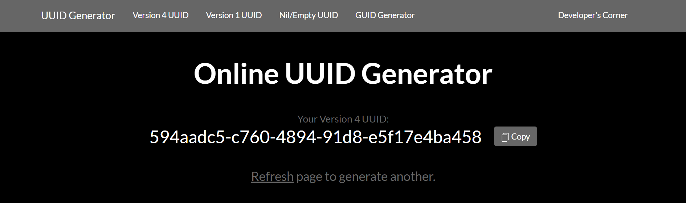

# Introduction to Behavior Packs

Before building your first Add-On for Minecraft: Bedrock Edition, you will need to create a pack to hold your custom content. There are two types of packs that a creator can make: resource packs and behavior packs. A **behavior pack** is a folder structure that contains files that drive entity behaviors, loot drops, spawn rules, items, recipes, and trade tables. This tutorial covers how behavior packs are created and how to add  behaviors to an in-game cow entity to make it aggressive.

:::image type="content" source="Media/BehaviorPack/Introduction-to-Behavior-Packs.jpg" alt-text="Image of a cow chasing Steve":::

In this tutorial, you will learn the following:

> [!div class="checklist"]
>
> - That it's possible to change an entity's behavior in Minecraft: Bedrock Edition.
> - How to link a Behavior Pack to a Resource Pack.

## Sample Behavior Pack

There is a [sample behavior pack](https://github.com/microsoft/minecraft-samples/tree/main/behavior_pack_sample) available at the Microsoft samples Github. it may be used to understand the structure of behavior packs and to check your work after the tutorial.

### Requirements

It’s recommended that the following be completed before beginning this tutorial.

- [Getting Started with Add-On Development](GettingStarted.md)
- [Introduction To Resource Packs](ResourcePack.md)

## Building the Behavior Pack

A behavior pack contains files that creators (like you!) use to add, remove, or alter gameplay behavior of entities within Minecraft. An entity's behavior file is what makes each entity do certain actions, like how a chicken follows a player who's holding seeds.

For Minecraft to find and use your behavior files, you have to set up the folders and files in a particular structure. This tutorial will guide you through creating this folder and file structure.



### Create a folder

In this section, you will create a folder called **My_BEHAVIOR_Pack**. Well, actually you don't have to call it that. In fact, you can name this folder anything you want, but the other folders have to be named exactly like this tutorial says so that Minecraft knows where to look.

1. Open your **com.mojang** folder.
1. Open the **development_behavior_packs** folder.
1. Inside the development_behavior_packs folder, create a new folder and name it **My_BEHAVIOR_Pack**.
1. Open the **My_BEHAVIOR_Pack** folder.
    :::image type="content" source="Media/BehaviorPack/my_behavior_pack.png" alt-text="Image of My_BEHAVIOR_Pack folder located in the com.mojang development_behavior_packs folder":::

### Create the manifest file

To load a behavior pack into Minecraft, you will need to create a manifest file. The behavior pack manifest file is similar to the one created for the resource pack, but it has two additional sections. 

- **modules**: Defines the pack so that Minecraft knows how to apply it to the world. Behavior packs use the **data** type.
- **dependencies** - Creates a link between behavior packs and resource packs to add custom textures and visuals to Minecraft.

> [!NOTE]
> To learn more about how a manifest.json file works, see the the Addons Reference [manifest.json](../Reference/Content/AddonsReference/Examples/AddonManifest.md) documentation.

1. Create a new document in your My_BEHAVIOR_Pack folder and name it **manifest.json**.
    1. You will need to change the file extension from .txt to .json. If your Explorer window does not show file extensions, you can enable File Name Extensions under the View tab.
    :::image type="content" source="Media/BehaviorPack/manifest_fileBP.png" alt-text="Image of the manifest.json file located within the My_BEHAVIOR_Pack folder":::
1. Double-click the **manifest.json** file to open it in a text editor.
1. Copy and paste the following code into your file.

```json
{
  "format_version": 2,
  "header": {
    "description": "My attack cow behavior pack Add-On!",
    "name": "My Behavior Pack",
    "uuid":"",
    "version": [1, 0, 0],
    "min_engine_version": [1, 16, 0]
  },
  "modules":
    [
      {
        "description": "My First Add-On!",
          "type": "data",
          "uuid": "",
          "version": [1, 0, 0]
      }
    ],
  "dependencies": [
    {
     "uuid":"UUID from the header section of manifest.json in My_RESOURCE_Pack",
      "version":[1,0,0]
    }
 ]
}
```

### Enter UUIDs

Similar to the resource pack manifest file, you will need to generate two different UUIDs for the header and module sections of your manifest file. You can get UUIDs from an online generator such as https://www.uuidgenerator.net/.



1. Copy and paste a UUID into the header section. The UUID will need to be pasted in the `"uuid"` field between the quotation ("") marks to be read correctly.
1. Refresh the webpage to generate a new UUID for use in the modules section.
1. Copy and paste the new UUID into the modules section in the `"uuid"` field between the quotation marks.

### Create the dependency

There is a third section in the behavior pack's manifest.json file called 'dependencies' that is used to create a link between a resource pack and a behavior pack. This link is created when the UUID located in the header section of the resource pack's manifest.json file is the same as the UUID in the dependencies section of the behavior pack's manifest.json file. You do not need to have a resource pack to use a behavior pack, and you do not need to have a behavior pack to use a resource pack. If you do have both, you can use this solution to link them together so that when you load a behavior pack into a world, it automatically loads and activates the linked resource pack.


1. Open the **manifest.json** file located in the **My_RESOURCE_Pack** folder in the **development_resource_packs** folder.
1. Copy the UUID from the **header** section of the resource pack **manifest.json** file.
1. Go to the **manifest.json** file located in the ***My_BEHAVIOR_Pack** folder in the **development_behavior_packs** folder.
1. Paste the UUID into the "uuid" field in the dependencies section. Make sure everything between the quotes matches exactly.
1. Save the behavior pack manifest.json file.


## Create the Entities Folder and Add a Cow

Every entity's behaviors are defined in its JSON file that lives inside the code that makes Minecraft work. You're going to create a new cow behavior file that Minecraft will use instead of its usual "vanilla" one.

1. In the **My_BEHAVIOR_Pack** folder, create a folder and name it **entities**.
1. Create a text file in the **entities** folder and name it **cow.json**.
1. Copy and paste the following code into your **cow.json** file. After you save the file, you're ready to go!
 
>[!Note]
> This is the entire edited cow.json file. It's big because cows do a lot!

```JSON
{
    "format_version": "1.16.0",
    "minecraft:entity": {
        "description": {
            "identifier": "minecraft:cow",
            "is_spawnable": true,
            "is_summonable": true,
            "is_experimental": false
        },
        "component_groups": {
            "minecraft:cow_baby": {
                "minecraft:is_baby": {},
                "minecraft:scale": {
                    "value": 0.5
                },
                "minecraft:ageable": {
                    "duration": 1200,
                    "feed_items": "wheat",
                    "grow_up": {
                        "event": "minecraft:ageable_grow_up",
                        "target": "self"
                    }
                },
                "minecraft:behavior.follow_parent": {
                    "priority": 6,
                    "speed_multiplier": 1.1
                }
            },
            "minecraft:cow_adult": {
                "minecraft:experience_reward": {
                    "on_bred": "Math.Random(1,7)",
                    "on_death": "query.last_hit_by_player ? Math.Random(1,3) : 0"
                },
                "minecraft:loot": {
                    "table": "loot_tables/entities/cow.json"
                },
                "minecraft:behavior.breed": {
                    "priority": 3,
                    "speed_multiplier": 1.0
                },
                "minecraft:breedable": {
                    "require_tame": false,
                    "breed_items": "wheat",
                    "breeds_with": {
                        "mate_type": "minecraft:cow",
                        "baby_type": "minecraft:cow",
                        "breed_event": {
                            "event": "minecraft:entity_born",
                            "target": "baby"
                        }
                    }
                },
                "minecraft:interact": {
                    "interactions": [
                        {
                            "on_interact": {
                                "filters": {
                                    "all_of": [
                                        {
                                            "test": "is_family",
                                            "subject": "other",
                                            "value": "player"
                                        },
                                        {
                                            "test": "has_equipment",
                                            "domain": "hand",
                                            "subject": "other",
                                            "value": "bucket:0"
                                        }
                                    ]
                                }
                            },
                            "use_item": true,
                            "transform_to_item": "bucket:1",
                            "play_sounds": "milk",
                            "interact_text": "action.interact.milk"
                        }
                    ]
                }
            }
        },
        "components": {
            "minecraft:is_hidden_when_invisible": {},
            "minecraft:type_family": {
                "family": [
                    "cow",
                    "mob"
                ]
            },
            "minecraft:breathable": {
                "total_supply": 15,
                "suffocate_time": 0
            },
            "minecraft:navigation.walk": {
                "can_path_over_water": true,
                "avoid_water": true,
                "avoid_damage_blocks": true
            },
            "minecraft:movement.basic": {},
            "minecraft:jump.static": {},
            "minecraft:can_climb": {},
            "minecraft:collision_box": {
                "width": 0.9,
                "height": 1.3
            },
            "minecraft:nameable": {},
            "minecraft:health": {
                "value": 10,
                "max": 10
            },
            "minecraft:hurt_on_condition": {
                "damage_conditions": [
                    {
                        "filters": {
                            "test": "in_lava",
                            "subject": "self",
                            "operator": "==",
                            "value": true
                        },
                        "cause": "lava",
                        "damage_per_tick": 4
                    }
                ]
            },
            "minecraft:movement": {
                "value": 0.25
            },
            "minecraft:despawn": {
                "despawn_from_distance": {}
            },
            "minecraft:behavior.float": {
                "priority": 0
            },
            "minecraft:behavior.panic": {
                "priority": 1,
                "speed_multiplier": 1.25
            },
            "minecraft:behavior.mount_pathing": {
                "priority": 2,
                "speed_multiplier": 1.5,
                "target_dist": 0.0,
                "track_target": true
            },
            "minecraft:behavior.breed": {
                "priority": 3,
                "speed_multiplier": 1.0
            },
            "minecraft:behavior.tempt": {
                "priority": 4,
                "speed_multiplier": 1.25,
                "items": [
                    "wheat"
                ]
            },
            "minecraft:behavior.follow_parent": {
                "priority": 5,
                "speed_multiplier": 1.1
            },
            "minecraft:behavior.random_stroll": {
                "priority": 6,
                "speed_multiplier": 0.8
            },
            "minecraft:behavior.look_at_player": {
                "priority": 7,
                "look_distance": 6.0,
                "probability": 0.02
            },
            "minecraft:behavior.random_look_around": {
                "priority": 9
            },
            "minecraft:leashable": {
                "soft_distance": 4.0,
                "hard_distance": 6.0,
                "max_distance": 10.0
            },
            "minecraft:balloonable": {},
            "minecraft:rideable": {
                "seat_count": 1,
                "family_types": [
                    "zombie"
                ],
                "seats": {
                    "position": [
                        0.0,
                        1.105,
                        0.0
                    ]
                }
            },
            "minecraft:physics": {},
            "minecraft:pushable": {
                "is_pushable": true,
                "is_pushable_by_piston": true
            },
            "minecraft:conditional_bandwidth_optimization": {},
            "minecraft:behavior.nearest_attackable_target": {
                "priority": 2,
                "must_see": true,
                "reselect_targets": true,
                "within_radius": 25.0,
                "entity_types": [
                    {
                        "filters": {
                            "test": "is_family",
                            "subject": "other",
                            "value": "player"
                        },
                        "max_dist": 32
                    }
                ]
            },
            "minecraft:behavior.melee_attack": {
                "priority": 3
            },
            "minecraft:attack": {
                "damage": 3
            }
        },
        "events": {
            "minecraft:entity_spawned": {
                "randomize": [
                    {
                        "weight": 95,
                        "trigger": "minecraft:spawn_adult"
                    },
                    {
                        "weight": 5,
                        "add": {
                            "component_groups": [
                                "minecraft:cow_baby"
                            ]
                        }
                    }
                ]
            },
            "minecraft:entity_born": {
                "add": {
                    "component_groups": [
                        "minecraft:cow_baby"
                    ]
                }
            },
            "minecraft:entity_transformed": {
                "remove": {},
                "add": {
                    "component_groups": [
                        "minecraft:cow_adult"
                    ]
                }
            },
            "minecraft:ageable_grow_up": {
                "remove": {
                    "component_groups": [
                        "minecraft:cow_baby"
                    ]
                },
                "add": {
                    "component_groups": [
                        "minecraft:cow_adult"
                    ]
                }
            },
            "minecraft:spawn_adult": {
                "add": {
                    "component_groups": [
                        "minecraft:cow_adult"
                    ]
                }
            }
        }
    }
}
```

### Testing the Pack

Now that the behavior pack has both a manifest file and a cow entity, it is time to launch Minecraft and test your new Add-On. As stated in the resource pack tutorial, **Pack Stacking** will work for behavior packs as well. This means that when content is loaded, vanilla content is loaded first, followed by any Add-Ons. Because all cows are controlled by the **cow.json** behavior file, all cows that spawn into your world will have the new behavior.

1. Launch Minecraft and select **Play**.
1. Select **Create New World**.
1. Under **Settings**, scroll down to the **Add-Ons** section.
1. Click on **Behavior Packs** to see all available packs.
1. Click the **MY PACKS** drop-down to open it.
1. Select **My BEHAVIOR Pack** and click **Activate** to add the behavior pack to the world.
1. Click **Create** to create your world.
1. Go find a cow.

## Troubleshooting

Behavior pack woes? Troubleshooting is a normal part of any development process. Here are some places to begin troubleshooting a behavior pack.

You can use the [sample behavior pack](https://github.com/microsoft/minecraft-samples/tree/main/behavior_pack_sample) on the Minecraft samples Github to check the structure of your behavior pack.

### Behavior Pack Does Not Appear in Minecraft

If your resource pack does not appear in the Add-Ons section, something is wrong with the `manifest.json` file. Let's start there.

- Are there two different UUIDs in the `manifest.json` header and modules section? See the **UUID** section for more information.
- Have you turned on file extensions and paths? `manifest.json` may not be just `manifest.json`. If your Explorer window does not show file extensions, you can enable **File Name Extensions** under the **View** tab.
- Double-check JSON curly braces and brackets. JSON linting tools can help.
- If there's an issue with an active behavior pack, there will be a red exclamation point under Behavior Packs in the Add-Ons section.
  - The behavior pack will have more information. It may alert a missing dependency, or run diagnostics on other issues.

### Behavior Pack Shows Up, Content Doesn't Work

- Check that the `entities` folder is in the right place, and spelled correctly. Then check all spellings of `cow`. 
- Make sure that the UUID in the `dependencies` section matches an existing resource pack (and that it's working too).
- Move your pack above others to ensure your behavior pack is loaded first. Pack stacking may cause your changes to not appear.

## What's Next?

Now that you have seen a behavior pack in action, you can learn more about how they work and what else you can do with them.

> [!div class="nextstepaction"]
> [Introduction to Add Entity](introductiontoaddentity.md)
> [Entity JSON Documentation](../Reference/Content/EntityReference/index.yml)

To see examples of unchanged resource and behavior files, check out the Minecraft [Vanilla resource pack](https://aka.ms/resourcepacktemplate) and [Vanilla behavior Pack](https://aka.ms/behaviorpacktemplate).
