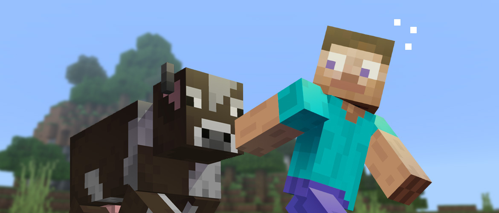
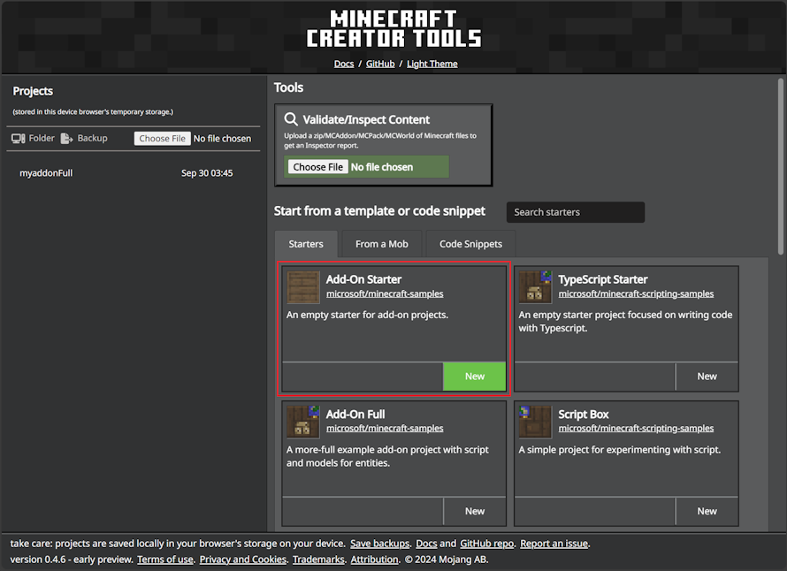
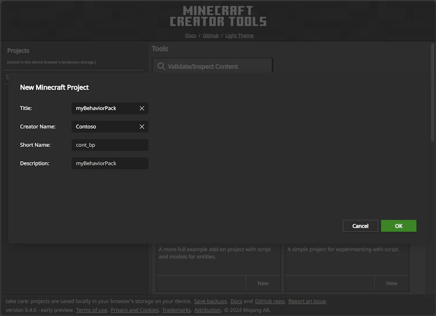
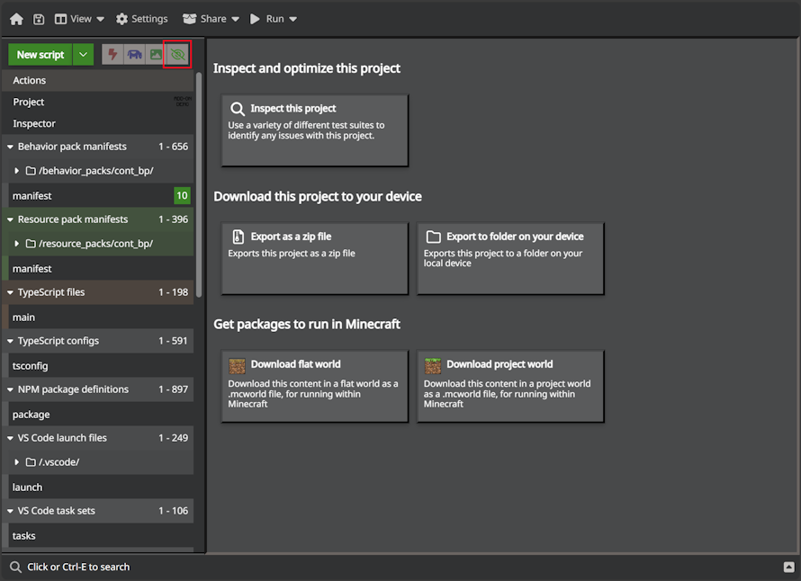
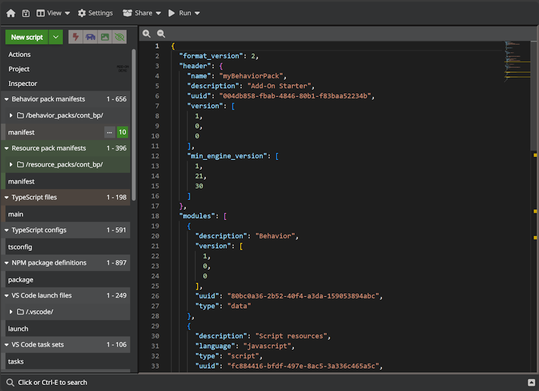
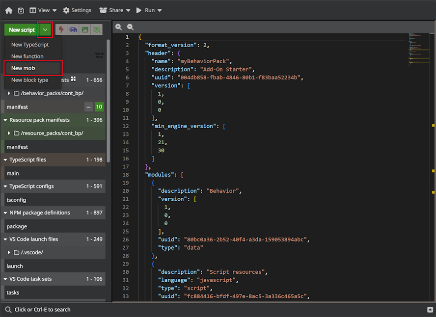
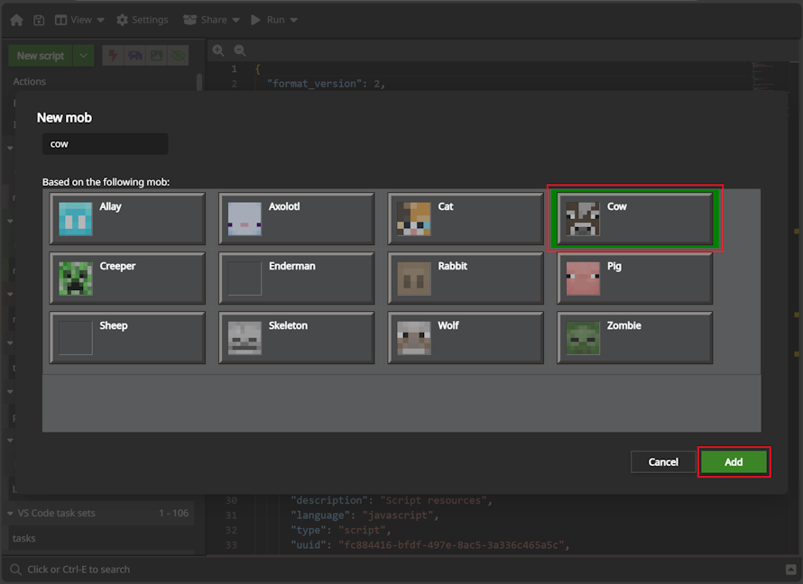
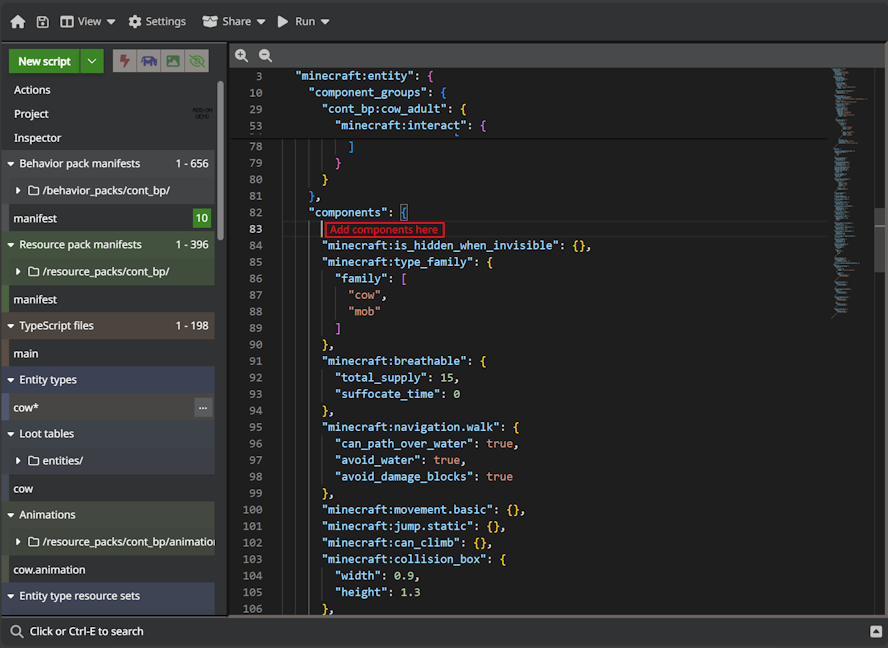
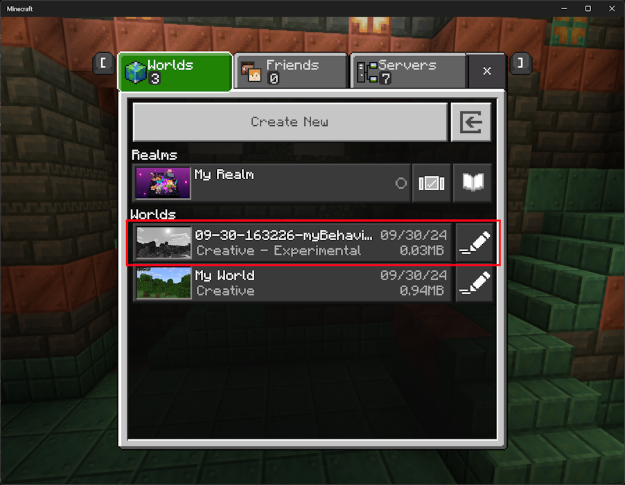

# Introduction to Behavior Packs

Before building your first Add-On for Minecraft: Bedrock Edition, you will need to create a pack to hold your custom content. There are two types of packs that a creator can make: resource packs and behavior packs. A **behavior pack** is a folder structure that contains files that drive entity behaviors, loot drops, spawn rules, items, recipes, and trade tables. This tutorial covers how behavior packs are created and how to add  behaviors to an in-game cow entity to make it aggressive.




## On the Minecraft Creator Channel

> [!VIDEO https://www.youtube.com/embed/TUFeM5P4IwM]

If you prefer to watch a video version of this tutorial, you can view it on the [Minecraft Creator Channel](https://aka.ms/mcv), [available here](https://www.youtube.com/watch?v=TUFeM5P4IwM).

## Tutorial Overview

In this tutorial, you will learn the following:

> [!div class="checklist"]
>
> - That it's possible to change an entity's behavior in Minecraft: Bedrock Edition.
> - How to link a Behavior Pack to a Resource Pack.

>[!Note]
> The current version of this tutorial uses mctools.dev to simplify the process of creating a behavior pack. If you'd prefer to see creating a behavior pack "from scratch", [see this article](./BehaviorPackFromScratch.md).


### Requirements

It's recommended that the following be completed before beginning this tutorial.

- [Getting Started with Add-On Development](GettingStarted.md)
- [Introduction To Resource Packs](ResourcePack.md)

## Building the Behavior Pack

A behavior pack contains files that creators use to add, remove, or alter gameplay behavior of entities within Minecraft. An entity's behavior file is what makes each entity do certain actions, like how a chicken follows a player who's holding seeds.

For Minecraft to find and use your behavior files, you have to set up the folders and files in a particular structure. This tutorial will guide you through creating this folder and file structure.


### Use mctools.dev to get started

In this section, we'll get started with a toolset called [Minecraft Creator Tools](./MCToolsOverview.md). This toolset is an open source project from Mojang that helps do all of the management work of creating a new project.

1. Start by visiting [mctools.dev](https://mctools.dev).

2. In the Add-On Starter section, click New.

   

3. In the Title field, give your project a name like **myBehaviorPack**.

1. Enter your name in the Creator Name field.

1. Notice that a Short Name is generated for your project, but you can change this.

1. You can also add a Description for your project.

1. Click OK.

   

### Add a Cow to your Project

MCTools will add all of the files your project needs. You can click the "Eye" button to show all related files.



If you right-click on a file and select `View as JSON`, you can see the contents of that file.

If you view the manifest file for the behavior pack, you will notice several elements.



The behavior pack manifest file is similar to the one created for the resource pack, but it has two additional sections. 

- **modules** - Defines the pack so that Minecraft knows how to apply it to the world. Behavior packs use the **data** type.
- **dependencies** - Creates a link between behavior packs and resource packs to add custom textures and visuals to Minecraft.

> [!NOTE]
> To learn more about how a manifest.json file works, see the Add-ons Reference [manifest.json](../Reference/Content/AddonsReference/Examples/AddonManifest.md) documentation.

## Add a Cow

1. To add a cow to your project, select the down arrow next to new script. Select the New Mob button.



2. Select the cow and click Add.



### Make the Cow an Angry Cow

3. Select the cow JSON file underneath Entity Types.
4. Within the Components section of the JSON, add the following elements which turns cows into aggressive killing machines:



```json
            "minecraft:behavior.nearest_attackable_target": {
                "priority": 2,
                "must_see": true,
                "reselect_targets": true,
                "within_radius": 25.0,
                "entity_types": [
                    {
                        "filters": {
                            "test": "is_family",
                            "subject": "other",
                            "value": "player"
                        },
                        "max_dist": 32
                    }
                ]
            },
            "minecraft:behavior.melee_attack": {
                "priority": 3
            },
            "minecraft:attack": {
                "damage": 3
            },
```

### Testing the Pack

Now that the behavior pack has a modified cow entity, it is time to launch Minecraft and test your new Add-On. 

1. Within MCTools.dev, select Run and then Flat World with Packs.

2. Within the Downloads section of your browser, click Open file to open the downloaded file. The file should now open and import into Minecraft.

1. Launch Minecraft and select **Play**.

1. Select the world that was just imported. The file should be named based on your project and the time at which it was saved.

   

1. Summon your cow using the summon command: `/summon cont_bp:cow` (your namespace might vary based on your creator name.)
1. Your cow might not attack you in creative mode, so select `/gamemode s` to turn the world into a survival world.

## Troubleshooting

Behavior pack woes? Troubleshooting is a normal part of any development process. Here are some places to begin troubleshooting a behavior pack.

You can use the [sample behavior pack](https://github.com/microsoft/minecraft-samples/tree/main/behavior_pack_sample) on the Minecraft samples Github to check the structure of your behavior pack.

## What's Next?

Now that you have seen a behavior pack in action, you can learn more about how they work and what else you can do with them.

> [!div class="nextstepaction"]
> [Creating New Entity Types](introductiontoaddentity.md)
> [Entity JSON Documentation](../Reference/Content/EntityReference/index.yml)

To see examples of unchanged resource and behavior files, check out the Minecraft [Vanilla resource pack](https://aka.ms/resourcepacktemplate) and [Vanilla behavior Pack](https://aka.ms/behaviorpacktemplate).
