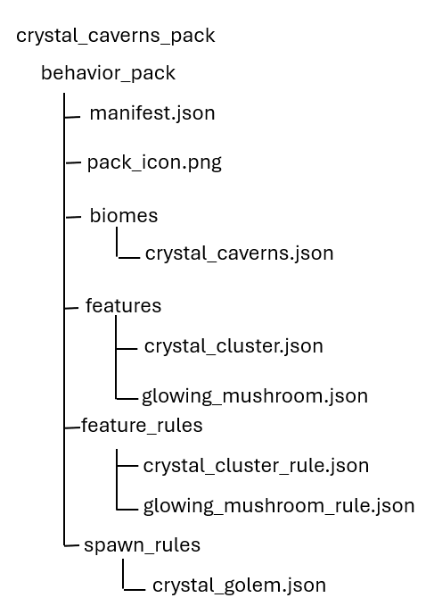
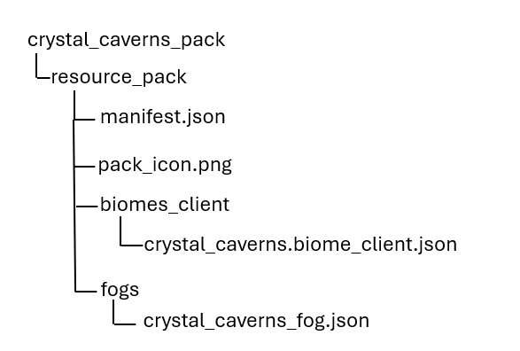

# Custom Biome Tutorial

This tutorial walks you through creating a custom biome from scratch—including surface generation, features, mobs, fog, and ambient effects. By the end, you'll have a unique "Crystal Caverns" biome that generates in your world.

## In this tutorial

You will learn:

> [!div class="checklist"]
>
> - How to structure biome definition files
> - How to configure surface materials and terrain
> - How to add custom features like ores and vegetation
> - How to set up biome-specific mob spawning
> - How to create atmosphere with fog and particles
> - How to register and test your biome

## Prerequisites

Before starting, you should:

- Complete the [Biome Overview](../Biomes/BiomeOverview.md)
- Understand behavior pack and resource pack structure
- Have a development environment set up for testing

> [!TIP]
> The completed resource and behavior packs for this biome are available in the [Crystal Caverns biome sample](https://github.com/microsoft/minecraft-samples/tree/main/crystal_caverns) on GitHub.

## Manifest files

### Behavior pack manifest

```json
{
  "format_version": 2,
  "header": {
    "name": "Crystal Caverns Biome",
    "description": "Adds the Crystal Caverns biome to your world",
    "uuid": "YOUR-UUID-HERE-1234-abcd-1234567890ab",
    "version": [1, 0, 0],
    "min_engine_version": [1, 21, 40]
  },
  "modules": [
    {
      "type": "data",
      "uuid": "YOUR-UUID-HERE-5678-efgh-1234567890ab",
      "version": [1, 0, 0]
    }
  ],
  "dependencies": [
    {
      "uuid": "YOUR-RP-UUID-HERE-ijkl-1234567890ab",
      "version": [1, 0, 0]
    }
  ]
}
```

### Resource pack manifest

```json
{ 
  "format_version": 2, 
  "header": { 
    "name": "Crystal Caverns Resources", 
    "description": "Resources for the Crystal Caverns biome", 
    "uuid": "YOUR-RP-UUID-HERE-ijkl-1234567890ab", 
    "version": [1, 0, 0], 
    "min_engine_version": [1, 21, 40] 
  }, 
  "modules": [ 
    { 
      "type": "resources", 
      "uuid": "YOUR-UUID-HERE-mnop-1234567890ab", 
      "version": [1, 0, 0] 
    } 
  ] 
}
```

> [!IMPORTANT]
> Generate unique UUIDs for each pack. You can use online UUID generators or your IDE.

## Configuring the behavior pack

Custom biomes require content in both a behavior pack and a resource pack. The behavior pack (server-side) contains the functional biome definition—everything that affects world generation and gameplay.

| Content | Purpose |
|---------|---------|
| **Biome definition** | Core biome properties (climate, surface, terrain shape) |
| **Features** | Structures and decorations that generate (ores, plants, crystals) |
| **Feature rules** | Where and how often features appear |
| **Spawn rules** | Which mobs spawn and under what conditions |

The definition JSON file in your behavior pack is the core file that houses the definitions for your biome's core properties. Most of the climate and terrain-based features of a biome are handled here, so you're well on your way to molding your worlds to your liking once you're familiar with this process. Start by creating the following folder structure:



### Biome JSON file

Create a file called **crystal_caverns.json** in the biomes folder of your new behavior pack and populate it with the following:  

```json
{ 
  "format_version": "1.21.40", 
  "minecraft:biome": { 
    "description": { 
      "identifier": "custom:crystal_caverns" 
    }, 
    "components": { 
      "minecraft:climate": { 
        "temperature": 0.5, 
        "downfall": 0.0, 
        "snow_accumulation": [0.0, 0.0], 
        "ash": 0.0, 
        "red_spores": 0.0, 
        "white_ash": 0.0 
      }, 
      "minecraft:overworld_height": { 
        "noise_type": "lowlands" 
      }, 
      "minecraft:surface_parameters": { 
        "sea_floor_depth": 7, 
        "sea_floor_material": "minecraft:gravel", 
        "foundation_material": "minecraft:stone", 
        "mid_material": "minecraft:stone", 
        "top_material": "minecraft:stone", 
        "sea_material": "minecraft:water" 
      }, 
      "minecraft:overworld_generation_rules": { 
        "hills_transformation": "custom:crystal_caverns", 
        "generate_for_climates": [ 
          ["cold", 1], 
          ["medium", 1] 
        ] 
      }, 
      "minecraft:tags": { 
        "tags": [ 
          "overworld", 
          "custom", 
          "crystal_caverns", 
          "no_legacy_worldgen" 
        ] 
      } 
    } 
  } 
} 
```

This file defines your custom biome and ties everything else in the behavior pack back to the identifier used at the beginning of the file so that it can be referenced in-world as needed. It’s generally a good idea to name the file whatever you choose for the identifier name to make it easier to find/summon when testing the pack.

### Component breakdown

As you probably noticed, most biome generation settings are handled within the components section in the file mentioned above. This table lists supported component types and provides a brief description about what they control.

| Component | Purpose |
|-----------|---------|
| `minecraft:climate` | Controls the temperature and precipitation settings for your biome |
| `minecraft:overworld_height` | Controls the terrain generation shape |
| `minecraft:surface_parameters` | Determines the type of blocks that compose the surface of a biome |
| `minecraft:overworld_generation_rules` | Controls how and where the biome generates in a world |
| `minecraft:tags` | Used to add tags to assist with filtering and identification |

Now, let's update `minecraft:surface_parameters` to make the surface more interesting with some custom materials.

```json
"minecraft:surface_parameters": {
  "sea_floor_depth": 7,
  "sea_floor_material": "minecraft:gravel",
  "foundation_material": "minecraft:deepslate",
  "mid_material": "minecraft:stone",
  "top_material": "minecraft:calcite",
  "sea_material": "minecraft:water"
}
```

We're using deepslate blocks as the foundation of our biome, with stone and calcite blocks layered above. We made the ocean floor 7 blocks deep and made of gravel&mdash;things already feel a lot more like a cave!

### Adding custom features

Now that our biome surface is to our liking, we should consider the features we want to use to give it more character. Features are structures and decorations that spawn in your biome where and when specified in the behavior pack.

1. Let’s begin by adding crystal clusters that occasionally spawn in place of the deepslate, stone, and calcite blocks that generate as part of the surface. Create a new file with the name of your custom asset’s identifier  (i.e. crystal_cluster.json) in the behavior pack’s features folder.
    
    ```json
    { 
      "format_version": "1.21.40", 
      "minecraft:ore_feature": { 
        "description": { 
          "identifier": "custom:crystal_cluster" 
        }, 
        "count": 8, 
        "replace_rules": [ 
          { 
            "places_block": "minecraft:amethyst_block", 
            "may_replace": ["minecraft:stone", "minecraft:deepslate", "minecraft:calcite"] 
          } 
        ] 
      } 
    } 
    ```

2. Next, create a different file called glowing_mushroom.json in the features folder and use the following code to add special mushrooms to the biome.
    
    ```json
    { 
      "format_version": "1.21.40", 
      "minecraft:scatter_feature": { 
        "description": { 
          "identifier": "custom:glowing_mushroom" 
        }, 
        "iterations": 5, 
        "scatter_chance": 25, 
        "x": { 
          "distribution": "uniform", 
          "extent": [0, 15] 
        }, 
        "z": { 
          "distribution": "uniform", 
          "extent": [0, 15] 
        }, 
        "y": "query.heightmap(variable.worldx, variable.worldz)", 
        "places_feature": "custom:single_glowing_mushroom" 
      } 
    }  
    ```

    The code above sets scatter conditions for our special glowing mushroom to create patches of the features around the biome, but we still need to define the glowing mushroom itself.  

3. Create another file in the features folder called single_glowing_mushroom.json with the code below to define the special mushroom feature we used in the previous step.
    
    ```json
    { 
      "format_version": "1.21.40", 
      "minecraft:single_block_feature": { 
        "description": { 
          "identifier": "custom:single_glowing_mushroom" 
        }, 
        "places_block": "minecraft:brown_mushroom", 
        "enforce_survivability_rules": true, 
        "enforce_placement_rules": true, 
        "may_replace": ["minecraft:air"] 
      } 
    }
    ```

### Feature rules

Now that our biome has some custom features to help distinguish it, we should set some feature rules to make sure they appear and behave as expected. Feature rules determine where and when features generate, so let's use one to define how our features spawn in our biome.

1. Create a JSON file in the behavior pack's feature_rules folder called crystal_cluster_rule and save it with the following code.
    
    ```json
    {
      "format_version": "1.21.40",
      "minecraft:feature_rules": {
        "description": {
          "identifier": "custom:crystal_cluster_rule",
          "places_feature": "custom:crystal_cluster"
        },
        "conditions": {
          "placement_pass": "underground_pass",
          "minecraft:biome_filter": {
            "test": "has_biome_tag",
            "operator": "==",
            "value": "crystal_caverns"
          }
        },
        "distribution": {
          "iterations": 10,
          "x": {
            "distribution": "uniform",
            "extent": [0, 15]
          },
          "y": {
            "distribution": "uniform",
            "extent": [0, 60]
          },
          "z": {
            "distribution": "uniform",
            "extent": [0, 15]
          }
        }
      }
    }
    ```

    And just like that, we’ve set rules for how and when our crystal cluster feature spawns in the Crystal Caverns.

2. Now we need to adjust the mushrooms we used in the last section to make them special in the way we intended. Create a new file in `feature_rules` called `glowing_mushroom_rule.json` and save it with the following code.
    
    ```json
    {
      "format_version": "1.21.40",
      "minecraft:feature_rules": {
        "description": {
          "identifier": "custom:glowing_mushroom_rule",
          "places_feature": "custom:glowing_mushroom"
        },
        "conditions": {
          "placement_pass": "surface_pass",
          "minecraft:biome_filter": {
            "test": "has_biome_tag",
            "operator": "==",
            "value": "crystal_caverns"
          }
        },
        "distribution": {
          "iterations": 3,
          "x": {
            "distribution": "uniform",
            "extent": [0, 15]
          },
          "y": "query.heightmap(variable.worldx, variable.worldz)",
          "z": {
            "distribution": "uniform",
            "extent": [0, 15]
          }
        }
      }
    }
    ```

    Now the mushrooms in Crystal Caverns cluster together like they only could there!

### Biome-specific spawning

Use biome-specific spawn rules to create custom rules for entities that only apply in your biome. First, you'll need to choose an entity (either a custom or a vanilla one).

> [!NOTE]
> We use a spawn rule for a crystal golem that we modified from the vanilla iron golem entity, so this rule won't work for you unless you have a similarly named entity in the pack as well.

1. Create a new file in the spawn_rules folder called `crystal_golem.json` and specify when and where in the Crystal Caverns the golem should appear.

    ```json
        { 
      "format_version": "1.21.40", 
      "minecraft:spawn_rules": { 
        "description": { 
          "identifier": "custom:crystal_golem", 
          "population_control": "monster" 
        }, 
        "conditions": [ 
          { 
            "minecraft:spawns_on_surface": {}, 
            "minecraft:spawns_on_block_filter": { 
              "blocks": ["minecraft:calcite", "minecraft:stone"] 
            }, 
            "minecraft:brightness_filter": { 
              "min": 0, 
              "max": 7, 
              "adjust_for_weather": false 
            }, 
            "minecraft:difficulty_filter": { 
              "min": "normal", 
              "max": "hard" 
            }, 
            "minecraft:biome_filter": { 
              "test": "has_biome_tag", 
              "operator": "==", 
              "value": "crystal_caverns" 
            }, 
            "minecraft:weight": { 
              "default": 50 
            }, 
            "minecraft:herd": { 
              "min_size": 1, 
              "max_size": 2 
            }, 
            "minecraft:density_limit": { 
              "surface": 3 
            } 
          } 
        ] 
      } 
    }
    ```

    For vanilla mobs, you can customize their spawn rules by simply overriding their default spawn rules. For example, to make bats more common in your biome, override the bat spawn rule so that it has a higher weight.

## Configuring the resource pack

Custom biomes require content in both a behavior pack and a resource pack. The resource pack (client side) contains the visual and audio elements of your custom biome.

| Component | Purpose |
|-----------|---------|
| Fog settings | Atmosphere, visibility, and volumetric effects |
| Client biome | Water color, ambient sounds, music |
|Particles | Custom particle effects (if any) |

> [!NOTE]
> The biome identifier between your behavior pack biome definition and any resource pack client biome files must match. Minecraft uses this identifier to link the server-side gameplay with client-side visuals. Start by creating the following folder structure.



### Biome fogs

Fog gives your biome a unique atmosphere, so it's only right to let you customize that too! This is a **resource pack** component that controls the visual atmosphere.

1. Create a new file in the fogs folder of your Crystal Caverns resource pack called crystal_caverns_fog.json, then save it with the following code.

    ```json
    {
      "format_version": "1.21.40",
      "minecraft:fog_settings": {
        "description": {
          "identifier": "custom:crystal_caverns_fog"
        },
        "distance": {
          "air": {
            "fog_start": 0.2,
            "fog_end": 1.0,
            "fog_color": "#3a1f5c",
            "render_distance_type": "render"
          },
          "water": {
            "fog_start": 0.0,
            "fog_end": 0.5,
            "fog_color": "#4a2882",
            "render_distance_type": "render"
          }
        },
        "volumetric": {
          "density": {
            "water": {
              "max_density": 0.8,
              "max_density_height": 0,
              "zero_density_height": 64
            },
            "air": {
              "max_density": 0.15,
              "max_density_height": 32,
              "zero_density_height": 70
            }
          },
          "media_coefficients": {
            "water": {
              "scattering": [0.02, 0.02, 0.08],
              "absorption": [0.35, 0.35, 0.35]
            },
            "air": {
              "scattering": [0.05, 0.02, 0.08],
              "absorption": [0.0, 0.0, 0.0]
            }
          }
        }
      }
    }
    ```

2. Update your biome definition to reference the custom fog.

    ```json
    {
      "format_version": "1.21.40",
      "minecraft:biome": {
        "description": {
          "identifier": "custom:crystal_caverns"
        },
        "components": {
          "minecraft:climate": {
            "temperature": 0.5,
            "downfall": 0.0,
            "snow_accumulation": [0.0, 0.0],
            "ash": 0.0,
            "red_spores": 0.0,
            "white_ash": 0.0
          },
          "minecraft:overworld_height": {
            "noise_type": "lowlands"
          },
          "minecraft:surface_parameters": {
            "sea_floor_depth": 7,
            "sea_floor_material": "minecraft:gravel",
            "foundation_material": "minecraft:deepslate",
            "mid_material": "minecraft:stone",
            "top_material": "minecraft:calcite",
            "sea_material": "minecraft:water"
          },
          "minecraft:overworld_generation_rules": {
            "hills_transformation": "custom:crystal_caverns",
            "generate_for_climates": [
              ["cold", 1],
              ["medium", 1]
            ]
          },
          "minecraft:fog_appearance": {
            "fog_identifier": "custom:crystal_caverns_fog"
          },
          "minecraft:tags": {
            "tags": [
              "overworld",
              "custom",
              "crystal_caverns",
              "no_legacy_worldgen"
            ]
          }
        }
      }
    }
    ```

3. For control of water appearance, the ambient sounds, and the music that plays in your biome, create a new file in the resource pack's biomes_client folder called `crystal_caverns.biome_client.json` and save it with the following code.
    
    ```json
    {
      "format_version": "1.21.40",
      "minecraft:client_biome": {
        "description": {
          "identifier": "custom:crystal_caverns"
        },
        "components": {
          "minecraft:water_appearance": {
            "surface_color": "#4a2882",
            "surface_transparency": 0.8
          },
          "minecraft:ambient_sounds": {
            "ambient_loop": "ambient.cave"
          },
          "minecraft:music": {
            "volume": 0.5,
            "music": "music.game.creative"
          }
        }
      }
    }
    ```

## Testing the biome

1. Start by creating a new world and enabling cheats and both add-on packs for your custom biome.

    > [!NOTE]
    > You may need to enable Custom Biomes in Experiments for your biome to render correctly. If the biome still doesn’t render, ensure that both packs are properly structured in their respective development folders.

2. In the new world, use the locate command to find your custom biome:

    `/locate biome custom:crystal_caverns`
  
    Or, you can use spectator mode to fly around and find it manually:

    `/gamemode spectator`
  
3. Finally, check that your biome has:
    - Correct surface blocks (calcite on top)
    - Crystal clusters that group correctly underground
    - Proper fog coloring
    - Custom mob(s) that spawn correctly (if referenced entity exists)

## Common customizations

- ### Adjusting biome rarity

    Change the weight in `generate_for_climates`:
    
    ```json
    "minecraft:overworld_generation_rules": {
      "generate_for_climates": [
        ["cold", 5],
        ["medium", 3]
      ]
    }
    ```
    > [!NOTE]
    > Higher weight values make the feature more common.

- ### Changing terrain shape

    Use different `noise_type` values:
    
    | Noise Type | Result |
    |------------|--------|
    | `default` | Standard varied terrain |
    | `lowlands` | Flat, low terrain |
    | `highlands` | Tall, hilly terrain |
    | `mountains` | Extreme height variation |
    | `river` | River-like channels |
    
- ### Adding weather effects
    
    Update the climate component:
    
    ```json
    "minecraft:climate": {
      "temperature": 0.2,
      "downfall": 0.8,
      "snow_accumulation": [0.5, 1.0],
      "ash": 0.0,
      "red_spores": 0.0,
      "white_ash": 0.0
    }
    ```

    > [!NOTE]
    > - Low temperatures combined with high downfall leads to a snowy biome.
    > - High temperatures combined with high downfall leads to a rainy biome.
    > - Use `ash`, `red_spores`, and `white_ash` for Nether-style particles.

## Troubleshooting

| Issue | Cause | Solution |
|-------|-------|----------|
| Biome doesn't generate | Missing experimental toggle | Enable Custom Biomes experiment |
| Biome doesn't generate | Invalid climate settings | Check `generate_for_climates` values |
| Wrong surface blocks | Incorrect `surface_parameters` | Verify block identifiers |
| Features not appearing | Feature rule not linked | Check `biome_filter` tag matches |
| Fog not showing | Fog identifier mismatch | Verify `fog_identifier` matches fog file |
| Pack not loading | Invalid JSON | Validate JSON syntax |
| Pack not loading | UUID issues | Ensure unique UUIDs and correct dependencies |

## Next steps

Now that you've created a custom biome, try:

> [!div class="nextstepaction"]
> [Adding Custom Features](../FeaturesTutorial_1.md)

> [!div class="nextstepaction"]
> [Creating Custom Entities](../IntroductionToAddEntity.md)

> [!div class="nextstepaction"]
> [Partial Biome Replacements](../Biomes/CustomPartialBiomeReplacement.md)

## See also

- [Biome Overview](../Biomes/BiomeOverview.md)
- [Feature Reference](../../Reference/Content/FeaturesReference/Examples/FeaturesIntroduction.md)
- [Fog Reference](../FogInResourcePacks.md)
- [Client Biomes Overview](../../Reference/Content/ClientBiomesReference/Examples/ClientBiomesOverview.md)
