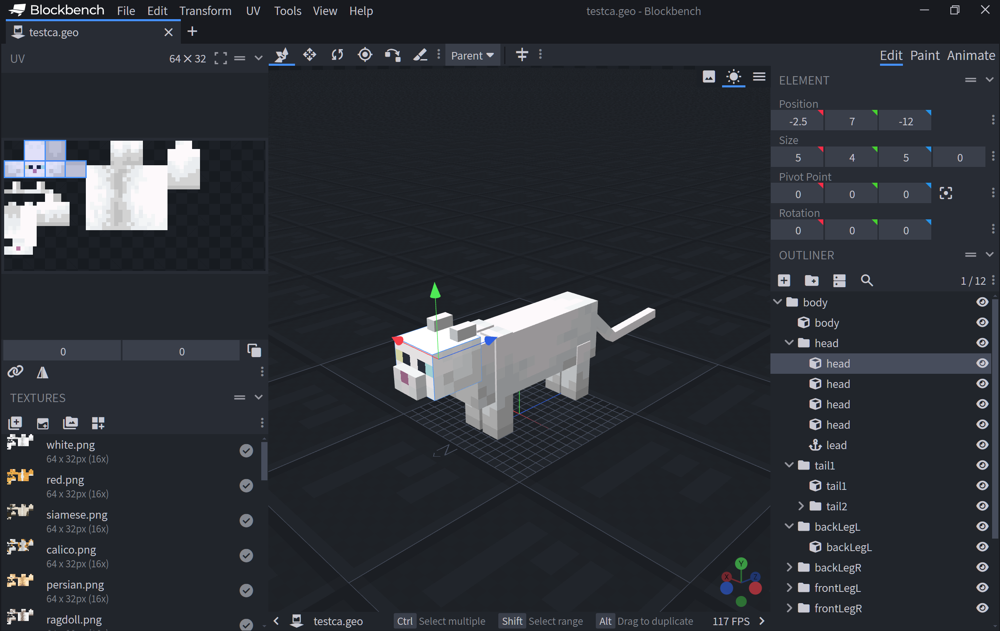
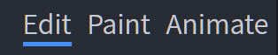
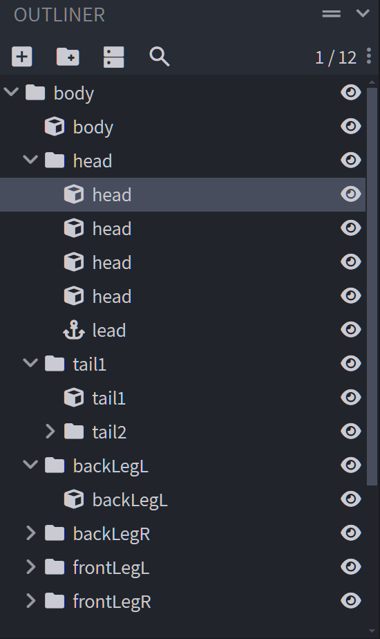
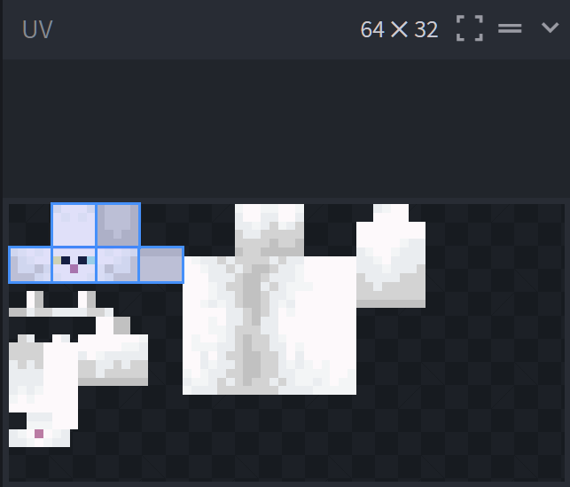

# Getting Started with Blockbench

Minecraft is built out of blocks, entities, and items. But behind every object you see, a _model_ provides the visual shape, and a set of _textures_ on the model give it color and features. For entities and items, a set of _animations_ provide movement and gestures.

As you create new builds in Minecraft, you're going to want to provide your own textures, models, and animations. One of the best tools to create these with is _Blockbench_, a free and open source low-poly model editor created by Jannis Petersen. You can get started with Blockbench by visiting <https://blockbench.net>.

>[!IMPORTANT]
>Blockbench is provided by external, third-party contributors and is not a Mojang/Microsoft offering.

## Blockbench fundamentals

Blockbench is available both as a web application&mdash;you can use it in a web browser&mdash;as well as a downloadable desktop application for Windows, Linux, or macOS. The web app and desktop app provide equivalent editing functionality, but the desktop app makes it easier to work with files on your device. On Windows, you can directly save your work in the Minecraft folder to make it easier to test out your creations.

Whether you use the desktop or the web app, Blockbench has a plug-in system that makes it easy to add additional functionality to tailor it to your workflow. In particular, a set of wizard plugins makes starting a new Minecraft project easier:

* [Minecraft Entity Wizard](./MinecraftEntityWizard.md) provides a jumpstart for creating a new entity/mob based on an example from vanilla Minecraft
* [Minecraft Item Wizard](./MinecraftItemWizard.md) provides starters for creating a new Minecraft item
* [Minecraft Block Wizard](./MinecraftItemWizard.md) provides a base for creating a new block

Each of these articles contains more information on creating an entity, item, or block respectively.

## Blockbench concepts

As you begin to edit in Blockbench, familiarize yourself with the different aspects of the screen.

### Edit, paint, and animate modes

In the upper right hand corner of the screen, you'll see Edit/Paint/Animate tabs. This lets you select the editing mode of Blockbench. In edit mode, you can add, update, and remove the various cubes that make up the shape of the model. In paint mode, you can edit the colors of the various pixels of the textures of your model. In animate mode, you can adjust the animation of various sections.

> [!NOTE]
> If you are editing a block, you may not see an animate tab, since blocks don't support animations.

As a general rule, you'll probably want to try to edit your models in these three phases: edit your cubes, then paint them, then animate them. In other words, don't paint or animate your model until you are pretty happy with the overall cube structure of your model. Significantly shifting the shape of your cubes can cause the need to rework some of your painting.

### Outliner and cube structure

In the lower right hand corner of the Blockbench application, you will see the Outliner, which lists all of the cubes in the model. Cubes are grouped into a broader tree-style hierarchy. These named groupings of cubes (referred to in Minecraft as a "bone") can sometimes have a special meaning and syntax: for example, the group/bone named "head" is automatically rotated on some mobs to provide "look at" behavior. These groups/bones are also the foundation for animation (you animate a group/bone, not an individual cube). For these reasons, it's a good practice to organize and name your bones and cubes as you work.

### UV texture mapping

In the upper left hand corner of the Blockbench window, you'll see the UV section. UVs refer to a texture image that provides the color information for a pixel on the model. If you visualize your model as a wrapped gift in a box, think of the UV as the wrapping paper, just flattened out. In edit mode, you can adjust the location of where an individual cube is pulling its colors. In the example above, you can see the head cube is selected and it is pulling the six faces from the upper left of the UV texture. In the Paint mode, you can use brushes, fills, and shapes to change the colors of the model&mdash;either directly on the model itself, or within the UV window.

## Next steps: more videos and docs

One of the best ways to understand Blockbench is just to dive in! We'd recommend using the Minecraft Entity Wizard to start with a model based on an existing Minecraft mob. If you'd like to see a tutorial on using Blockbench with the Minecraft Entity Wizard, you can watch it on the [Minecraft Creator Channel](https://aka.ms/mcv).

> [!div class="nextstepaction"]
> [Tutorial Video](https://www.youtube.com/watch?v=OdZlKpLOkj4)

Want to learn more about building with Blockbench? The Blockbench Wiki has step by step guides and reference documentation for modeling, texturing, and animating any custom creation you can imagine.

> [!div class="nextstepaction"]
> [Blockbench Wiki](https://www.blockbench.net/wiki/)

The Blockbench Quick Start guide can help lead you to the specific document that you're looking for and is a great way to discover relevant external guides and videos.

> [!div class="nextstepaction"]
> [Blockbench Quick Start](https://www.blockbench.net/quickstart)
