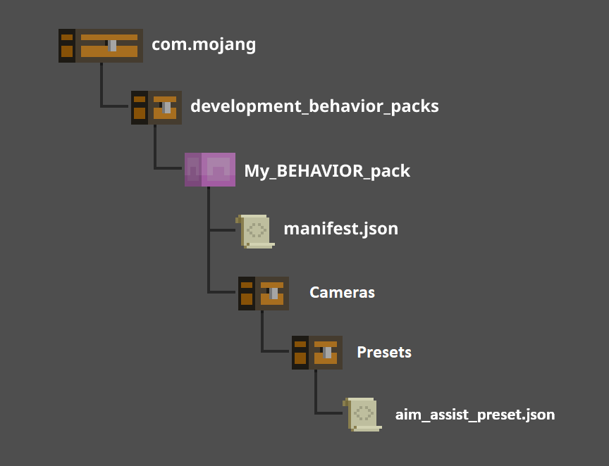

# Aim Assist Presets

Aim assist presets are pre-defined configurations for the aim assist feature in Minecraft. Presets are handy because they allow you to set aim assist parameters in specific situations without having to use the `/aimassist` command repeatedly. Presets also go beyond the capabilities of the `/aimassist` command in a number of cool ways, such as allowing you to exclude certain entities or blocks from targeting rules or choosing which items can target liquids!

Aim Assist presets are part of the behavior pack and preset files should be placed in the same folder as your camera presets in your behavior pack:



## Aim Assist Preset Settings

Aim assist preset settings determine how potential targets are evaluated by the aim assist feature. You can define what aim assist category to use and when to use them, as well as what blocks or entities can be targeted by a specific preset. To begin, create a json file called `aim_assist_preset.json`. It should look something like this:

```json
"minecarft:aim_assist_preset": {
    "identifier": "test:test_preset",
    "item_settings": {},
    "default_item_settings": "default",
    "hand_settings": "default",
    "exclusion_list": {},
    "liquid_targeting_list": {}
}
```

Let's take a look at these settings.

- **identifier**: The unique name for this aim assist preset. You can use this id in the `/aimassist` command or in your [camera preset file](CameraCommandIntroduction.md).
- **item_settings**: The items that should use special preset categories when held and the category that they should use.
- **default_item_settings**: The settings used by any other item not specified in `item_settings`.
- **hand_settings**: The settings used when not holding any items.
- **exclusion_list**: The list of blocks or entities that should never be targeted when using this aim assist preset.
- **liquid_targeting_list**: The list of items that can target liquids when held.

## Aim Assist Categories

Aim assist categories are where you define the priority for each type of block or entity when using the aim assist feature. To create an aim assist category, create a `categories.json` file and place it in the same directory as your `aim_assist_preset.json` file. This file will contain all of your aim assist categories. Each category is a predefined group of settings and only one category can be active at any time. The active category is determined by what item the player is holding at any given time.

Let's try creating an aim assist category that helps us target logs over other block types when we're holding an axe. Your `categories.json` file should look like this:

```json
"minecraft:aim_assist_categories": {
    "categories": [
        {
            "name": "default",
            "priorities": {}
        }
        {
            "name": "test:axe_priorities",
            "entity_default": 1,
            "block_dafault": 1,
            "priorities": {
                "blocks": {
                    "minecraft:oak_log": 6,
                    "minecraft:birch_log": 6,
                    "minecraft:acacia_log": 6,
                }
            }
        }
    ]
}
```

Let's take a closer look at our `test:axe_priorities` category in this file to help understand the parts of an aim assist category.

- **name**: The unique identifier for the aim assist category.
- **entity_default**: The default priority to be used for entities by this aim assist category. This should *usually* be 1.
- **block_default**: The default priority to be used for blocks by this aim assist category. This should *usually* be 1.
- **priorities**: The list blocks and entities that should override the default priorities when this category evaluates targets.
    - **entities**: The list of entities that should override the `entity_default` priority when this category evaluates targets.
    - **blocks**: The list of blocks that should override the `block_default` priority when this category evaluates targets.

>[!Important]
> The number used for priority values works by modifying the targeting criteria by the specified value. For example, in this aim assist category, we've given **oak logs** a priority of 6. This setting will make the aim assist feature treat oak logs as if they are 6 times closer to the player (or the center of the targeting cone, in angle aim assist mode) than any other block. This does not mean that oak logs will *always* be targeted over other blocks, it simply means that they will be treated as if they are much closer than they actually are and blocks that are closer than even the modified distance of an oak log could still be targeted.
> You should fine tune the priority numbers in your categories to get them feeling right.

## Aim Assist in Camera Presets

When you use [camera presets](CameraCommandIntroduction.md), you can use the `aim_assist` field in your `camera.json` file:

```json
"minecraft:camera_preset": {
    "identifier": "test:third_person",
    "inherit_from": "minecraft:follow_orbit",
    "aim_assist": {
        "preset": "test:axe_priorities",
        "target_mode": "distance",
        "angle": [30, 30],
        "distance": 10
    }
}
```

The aim assist settings defined in this preset will override any settings set by the aim assist command when this camera preset is active. Other aim assist commands or presets will only be active when the camera preset does not have a defined `aim_assist` object.