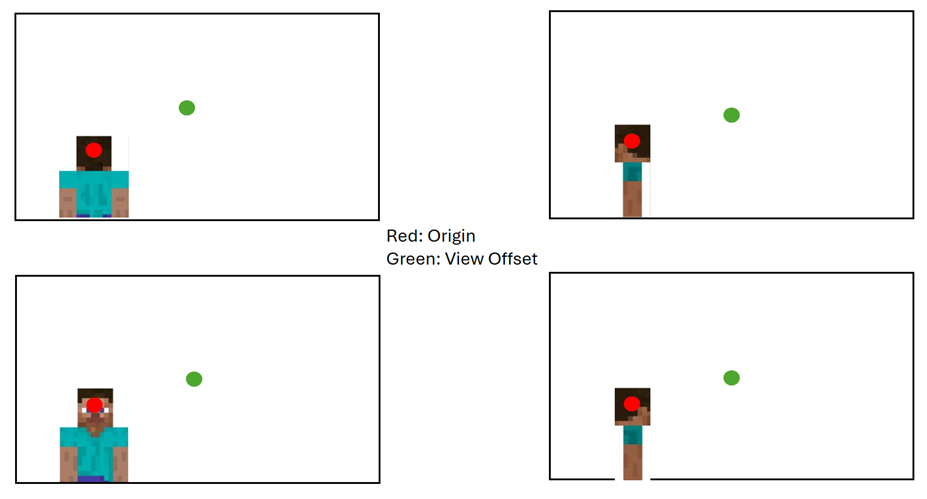
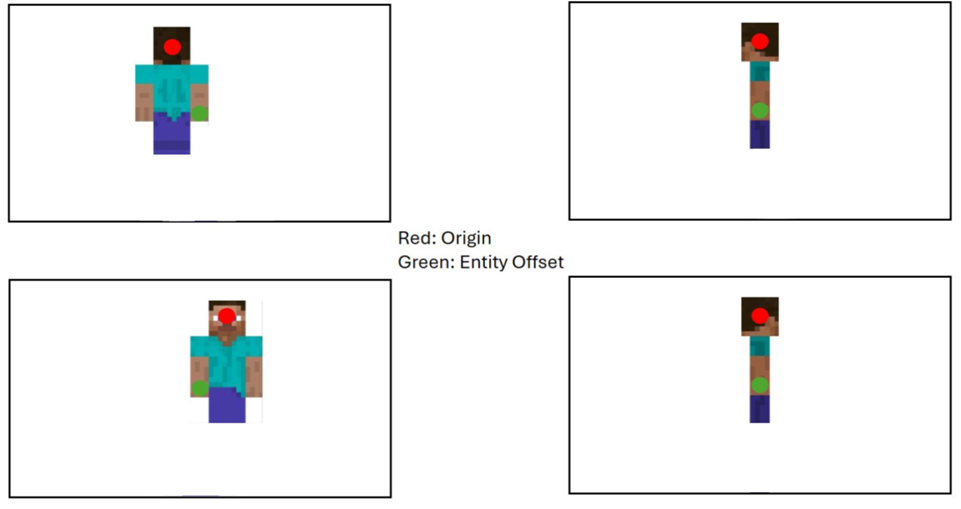

# Third Person Camera Preset

In this overview, you will learn about the **third_person** camera presets.

> [!IMPORTANT]
> This feature is experimental. To use the presets explained here, the following experimental toggle must be turned on:
> **Creator Cameras: New Third Person Presets**

The third_person camera presets were designed to provide a detached camera that can be set at a customizable range from the player, and attached to the player or other non-player entities, with the option of camera-relative player controls de-coupled from player facing direction. 

You can find more information about the camera system in the [Camera System Introduction](CameraCommandIntroduction.md) and in the [Free Camera Preset](CameraPresetFree.md) tutorial, using commands and script.

The third_person presets can be applied using commands, JSON, and script APIs.

The two third_person presets are:

-	Minecraft:follow_orbit
-	Minecraft:third_person_boom

## Parameters and definitions of the third person camera 

- **Radius**: Sets the camera distance from the player, measured in blocks. 
- **Rotation**: Sets the degree to which the camera can rotate around the player.
  - **Yaw**: Sets the rotation of the camera 360 degrees around the target parallel to the earth. The yaw value can be up to 180 to point directly to the right, and up to -180 to point directly to the left. 
  - **Pitch**: Sets the angle up or down, perpendicular to the earth. Pitch is limited to a range of 90 (facing straight down) to -90 (facing straight up). This limitation is to prevent rolling the camera upside down. 
- **Starting rotation**: Sets the initial rotation around the player. 
- **Offset**: Sets the reference point that the camera is anchored to, relative to the player. Entity offset anchors to the player position, while view offset anchors to a point on the screen.

### Follow Orbit

The follow orbit preset lets you 'attach' the camera to a player, apply an offset, and set a variable radius (distance from player) and rotation. The pitch will be customizable within bounds and the yaw will allow a range of 360 degrees. This preset maintains the parameters you set as it rotates around the player. See below for a JSON sample. 

**Command**

`/camera @s set minecraft:follow_orbit`


## Third Person Boom (or Fixed Boom) 

The boom preset is more specialized with fewer parameters to set up. As with the follow orbit, it also let's you 'attach' the camera to a player, apply an offset and set the radius (distance), pitch and yaw, but this preset does not rotate around the player. See below for a JSON sample.  

**Command**

`/camera @s set Minecraft:fixed_boom`

## Radius, Rotation

Both presets allow you to set the radius to be a customized distance from the player, but only the **follow_orbit** preset allows you to set the rotation. 

The default radius and rotation are determined by the resource pack but can be defined in the behavior pack. Radius and rotation for follow orbit and fixed boom, how the camera rotates around the player, have a default radius of 10 but can be overwritten for both presets in the behavior pack. 

Setting the rotation will set a default starting rotation for:  

1. The follow orbit camera's first spawn  
1. The angles at which the camera will follow the player for the fixed boom camera

Because you can set the rotation of the camera in the follow orbit preset, the starting rotation will be overwritten immediately when the mouse is moved. 

### Radius

The radius, distance from player, is customizable within a minimum radius of 0.1 and a maximum radius of 100, allowing you to set the camera any distance from the player. 

### Rotation Limits

The rotation, or the arc around the player, is not limited, allowing you to set the camera to rotate 360 degrees around the player. When rotating, the camera facing-direction will face the player by default.

### View Offset

The view offset allows you to anchor the camera to a point in the focal view that is not the player. This offset will force the player to be shifted to the side of the offset and stay to the side even as the player moves.  



View offset – anchored to a pivot point on the screen. Player is shifted to stay on the side of the offset.

### Entity Offset

The entity offset allows you to set the camera to anchor to a pivot point on the player (0, 0, 0 is the center of the player). This is helpful when determining the precise rotation of the camera around the player. While you can set the view offset with either preset, the entity offset is only usable with the follow_orbit preset as that is the only preset that allows you to rotate around the player. 

The maximum entity offset is equal to the maximum radius of 100.



Entity offset – additional option that anchors to a pivot point on the player.

## Setting the Radius and Offset 

You can set the _starting_ radius for either camera, as well as a _variable_ radius. Here are a few examples. 

**Command**

`/camera @s set minecraft:follow_orbit view_offset viewX viewY`

**Script**

```javascript
player.camera.setCamera('minecraft:follow_orbit', { viewOffset: { x: 3, y: 3 } });
```

**JSON**

The following code sample shows the follow_orbit camera with a view offset, radius, and rotation. 

```json
{ 
 "format_version": "1.21.0",  
 "minecraft:camera_preset": {  
   "identifier": "test:follow_orbit_test",  
   "inherit_from": "minecraft:follow_orbit",  
   "view_offset":  [2.0, 2.0],  
  "radius": 12  
  } 
} 
```
 
```json
{ 
  "format_version": "1.21.0", 
  "minecraft:camera_preset": { 
    "identifier": "example:follow_orbit", 
    "view_offset":  [0.0, 0.0], 
    "entity_offset":  [0.0, 5.0, 0.0], 
    "radius": 5.0 
  } 
} 
```

```json
{ 
  "format_version": "1.19.50", 
  "minecraft:camera_preset": { 
    "identifier": "minecraft:follow_orbit", 
    "starting_rot_x": 10,
    "starting_rot_y": 10
  } 
} 
```
