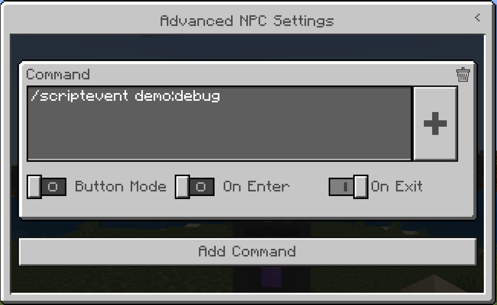

# Free Camera Script API Tutorial

In this tutorial you will learn how to set up a basic free camera script API. You can find more information at [Camera Command Introduction](CameraCommandIntroduction.md).

## Free Camera Functionality

The free camera preset can be used to accomplish many gameplay scenarios by setting the camera at a distance away from players and entities to show more of the environment. One use could even be setting up cutscenes and using easing methods to have the camera do a flyover a scene.

In this tutorial we will focus on how the free camera preset can be set up in TypeScript to be executed in the game at the exact parameters and settings you choose.

In this tutorial, you will learn how to:

> [!div class="checklist"]
>
> - Set the position of the camera
> - Set the position and facing direction
> - Set the easing method
> - Add easing, position, and facing direction together for a flyover
> - Disable player input during a flyover
> - Apply a fade
> - Clear camera during a fade
> - Teleport during a fade
> - Activate a camera based on a player’s distance from a location
> - Set up an NPC to activate a camera

To practice these features and see what they look like in the game, let’s try out a cutscene scenario. Say you want to make a cutscene where the camera transitions from the player’s view to show a flyover of the landscape and then turn to face the player. Let’s try it!

**Step 1: Set up your Script API workspace**

To get started, you will need to make some adjustments to your workspace so you can work with Script APIs. 

Follow the [Build a Gameplay Experience with TypeScript](../ScriptingGettingStarted.md) tutorial from the beginning through **Chapter 3** and then stop. Keep the behavior pack you create handy.

After you have completed the tutorial, continue to Step 2.

**Step 2: Create your own JSON Preset**

If you're using one of the vanilla camera types or built-in examples, you can skip this step. Using the built-in examples requires activation of the Camera experimental toggle.

To add your own camera preset, follow the instructions below.

1. In VSCode, right click the  behavior pack and add a new folder at file path **behavior_packs\starterbp** called **cameras**.

2. Add a new folder under **behavior_packs\starterbp\cameras** called **presets**.

3. Add a new file under the presets folder called **example_free.json**.

4. Inside of that file, add the following code example:

```json
{
  "format_version": "1.19.50",
  "minecraft:camera_preset": {
    "identifier": "demo:example_free",
    "inherit_from": "minecraft:free",
    "pos_y": 90,
    "rot_x": 10,
    "rot_y": 40
  }
}
```

**Step 3: Set up your Script API workspace**

Remove all the existing script code in **main.ts** and replace it with this:

```TypeScript
enum CameraTypes {
  Vanilla = 0,
  NPCGreeter = 1,
  TownCutScene = 2,
  TownStaticCamera = 3,
  TonCenterStaticCamera = 4,
}
```

We are creating an enum to easily reference the different types of cameras that we’ll have active in our gameplay session. This assigns reference numbers to the individual camera types. Setting them equal to numeric values allows us to iterate through them if we use the camera types in an array.

1. Add the following code example below the enum:

```TypeScript
interface CameraState {
  p: Player;
  previous: CameraTypes;
  current: CameraTypes;
}
```

A TypeScript interfaces is an object that holds multiple variables at once. The `CameraState` interface will hold on to the Camera State of any player, allowing this camera system to work nicely in multiplayer.

The `CameraState` interface includes a reference to a specific player, as well as the previous camera type that they had and the current camera type. This will allow you to go back to a previous camera type without needing to put tags on a player.

2. Add the following code below the interface:

```TypeScript
let playerCameraStates: CameraState[] = []; let curTick = 0; const ticksPerSecond = 20;

// Gameplay Data
const townCenterLocation = { x: -1003, y: 65, z: -1355 };
const townCenterRadius = 8;
const townRadius = 35;
const defaultCameraType = CameraTypes.Vanilla;
```

- **playerCameraStates** - Tracks the current state of the player camera; if null, no players have entered the game

- **curTick** - Keeps track of the current tick of the game

- **ticksPerSecond** - Tracks the number of ticks that happen in the game per second

- **townCenterLocation** - Tracks location of the town center; can be used to determine proximity to town

- **townCenterRadius** - Tracks the area around the town center and is a subset of the townRadius variable

- **townRadius** - Tracks the area around the town

- **defaultCameraType** - Represents the default Vanilla camera


**Step 4: Create initial event subscriptions and functions**

1. After the previous code snippet add this code:

```TypeScript
function PlayerSpawnCameraSetup(currentPlayer: Player) {}

world.afterEvents.playerSpawn.subscribe((event) => {
const player = event.player;
PlayerSpawnCameraSetup(player);}
);
```
To setup a camera for the player, we need to know when they’ve joined the game. But we actually want to be able to reset the camera state when they’ve died as well, so we can capture both of those scenarios by subscribing to the playerSpawn after event.

2. To setup the camera per player we will replace the empty `PlayerSpawnCameraSetup` with this snippet:

```TypeScript
function PlayerSpawnCameraSetup(currentPlayer: Player) {
  // Set the default camera state
  let setDefaultCameraState: CameraState = {
  p: currentPlayer,
  current: CameraTypes.Vanilla,
  previous: CameraTypes.Vanilla,
  counter: 0,
  };

// Check to see if this player previously had their creator camera setup
let foundplayer = false;
if (PlayerCameraStates != null && PlayerCameraStates.length > 0) {
  for (let pcs of PlayerCameraStates) {
    if (pcs.p == currentPlayer) {

      // Existing player found, reset their state to default
      foundplayer = true;
      currentPlayer.camera.clear();
      pcs.current = setDefaultCameraState.current;
      pcs.previous = setDefaultCameraState.previous;
      pcs.counter = 0;
  break;

    }}
} else {
  if (!foundplayer) {

// if no player was found, add & setup the default camera state
   PlayerCameraStates.push(setDefaultCameraState);
}}}
```
For this function we are passing the player in, this both allows us to check if they are already initialized in our camera state system, but has the added benefit of allowing us to do this at a per player level meaning this setup will work in multiplayer.

We check the existing `PlayerCameraStates` array for the player, if they are stored in the array we will reset their state back to the default camera state defined earlier in this function. If they are new player who is not captured in the camera states, we’ll add them to the array with the default settings.

3. Add the following function below the **PlayerSpawnCameraSetup** function:

```TypeScript
function ApplyPlayerCamera(ct: CameraTypes, currentPlayer: Player) {
  let currentPCS = GetPlayerCameraState(currentPlayer);
  let revert = false;

    switch (ct) {
      case CameraTypes.NPCGreeter:
        // Check if we are already talking to the NPC Greeter

        if (currentPCS.current != CameraTypes.NPCGreeter) {
          currentPCS.p.camera.setCamera("example:example_free", {
            location: { x: -1054.87, y: 71.27, z: -1343.5 },
            rotation: { x: 35, y: 230 },
          });
        } else {
          // We've finished talking to the greeter
          revert = true;
        }
        break;
      case CameraTypes.TownCutscene:

        if (currentPCS.current != CameraTypes.TownCutscene) {
          //camera @a fade time 1 1 1 color 0 0 0
          currentPCS.p.camera.fade({ fadeTime: { fadeInTime: 1, holdTime: 1, fadeOutTime: 1 } });
          const transitionTime = 5;
          currentPCS.counter = transitionTime * TicksPerSecond;

          system.runTimeout(() => {
            if (currentPCS != null) {
              CameraCutScene(currentPCS, transitionTime);
            }
          }, 1 * TicksPerSecond);
        }
        break;
      case CameraTypes.TownCenterStaticCamera:

        if (currentPCS.current != CameraTypes.TownCenterStaticCamera) {
          currentPCS.p.camera.setCamera("example:example_free", {
            location: { x: -1009.03, y: 69.9, z: -1345.82 },
            rotation: { x: 35, y: 210 },
          });
        }
        break;
      case CameraTypes.TownStaticCamera:

        if (currentPCS.current != CameraTypes.TownStaticCamera) {
          currentPCS.p.camera.setCamera("example:example_free", {
            location: { x: -1042, y: 81.78, z: -1323.33 },
            rotation: { x: 30, y: 220 },
          });
        }
        break;
      case CameraTypes.Vanilla:
        currentPCS.p.camera.clear();
        break;
    }

    // There are some instances where we are switching back the camera, do that for all here
    if (revert) {
      RevertCurrentCamera(currentPCS);
    } else {
      currentPCS.previous = currentPCS.current.valueOf();
      currentPCS.current = ct;
    }
}
```

The `ApplyPlayerCamera` function sets the player’s camera to a specific camera type. This function takes the parameters for the cameraType enum that we created and a player, allowing it to be run for any player uniquely.

The switch state inside of the function sets up different configurations for the player depending on the camera being selected. In this logic we also set the previous state of the camera, allowing for reverting the camera state to it’s previous form when needed. Like when looking at the NPC Greeter in a close up camera and then reverting back to whatever camera the player was using last when the dialogue is completed.

4. Add the following function below `playerSpawn` subscriber:

```TypeScript
system.afterEvents.scriptEventReceive.subscribe((event) => {
  // Player that interacted with an NPC
  let player = event.initiator as Player;

  // Apply Camera depending on NPC
  switch (event.id) {
    case "demo:greet":
      ApplyPlayerCamera(CameraTypes.NPCGreeter, player);
      break;
    case "demo:cutscene":
      ApplyPlayerCamera(CameraTypes.TownCutscene, player);
      break;
    case "demo:debug":
      player.sendMessage(`[DEBUG] Resetting ${player.name}`);
      PlayerSpawnCameraSetup (player);
      player.camera.clear();
      break;
  }
});
```

There are two ways that we are going to apply the camera to a player. One of them is from receiving an event from a player interacting with an NPC. The NPC will fire a `/scriptevent` that uses the specific camera name with a namespace.



After the event is fired, the `scriptEventRecieve` after event will capture the player who initiated the interaction and apply the appropriate camera based on the camera type.

Step 5: Creating camera code to affect players

Below the code currently in **main.ts**, add the following snippet.

```TypeScript
function gameTick() {
  try {
    curTick++;

    // Check to see if there are PlayerCameraStates setup (ie. are there players in the game yet?)
    if (PlayerCameraStates != null && PlayerCameraStates.length > 0) {
      for (let pcs of PlayerCameraStates) {
        // If in a Cutscene, don't update any proximity cameras
        if(pcs.current == CameraTypes.TownCutscene) {
          // Check to see if Cutscene countdown is complete
          if (pcs.counter <= 0) {
            // Fade the camera out & revert camera type to previous camera
            pcs.p.camera.fade({ fadeTime: { fadeInTime: 1, holdTime: 1, fadeOutTime: 1 } });
            system.runTimeout(() => {
              RevertCurrentCamera(pcs);
            }, 1 * TicksPerSecond);
          } else {
            // Continue to countdown until cutscene is complete
            pcs.counter--;
          }
        }
        else {
          // The only other camera to check in a ticking scenario are proximity cameras
         
          // Checking player to camera distance every other tick for better performance
          if (curTick % 2) {

            // Are we in proximity of the town?
            if (Utilities.distance(pcs.p.location, TownCenterLocation) <= TownRadius) {
              // We are in the town, but which static camera should be active?
              if (Utilities.distance(pcs.p.location, TownCenterLocation) <= TownCenterRadius) {
                // If we aren't already in Town Center camera, switch to it
                if (pcs.current != CameraTypes.TownCenterStaticCamera) {
                  ApplyPlayerCamera(CameraTypes.TownCenterStaticCamera, pcs.p);
                }
              } else {
                // If we aren't already in the Town camera, switch to it
                if (pcs.current != CameraTypes.TownStaticCamera) {
                  ApplyPlayerCamera(CameraTypes.TownStaticCamera, pcs.p);
                }
              }
            } else {
              // We are no longer inside the camera proximity, so reset the camera to the Vanilla Camera
              if (pcs.current == CameraTypes.TownStaticCamera) {
                ApplyPlayerCamera(defaultCameraType, pcs.p);
              }
            }
          }
       }
      }
    }
  } catch (e) {
    // Throw an error if there is a problem in the looping code
      console.warn("Tick error: " + e);
  }
  // Allow the gameTick function to keep re-running every tick
  system.run(gameTick);
}
// Runs the main gameTick function for the first time
system.run(gameTick);
```

Using **system.run** we will start a function that is called every tick. To improve performance inside of that gameTick function we won’t do our logic every tick, but instead every other tick. This is represented by the `%2` in the `if(curtick % 2)` statement, if the number is bigger the check will happen less often, but doing this check becomes less taxing. The player has 3 camera types that are either updated constantly or need to have an action taken during the time of the camera transitioning. 

For the cutscene camera, we need to countdown until it’s complete, to be able to to reset the camera to a different state.

