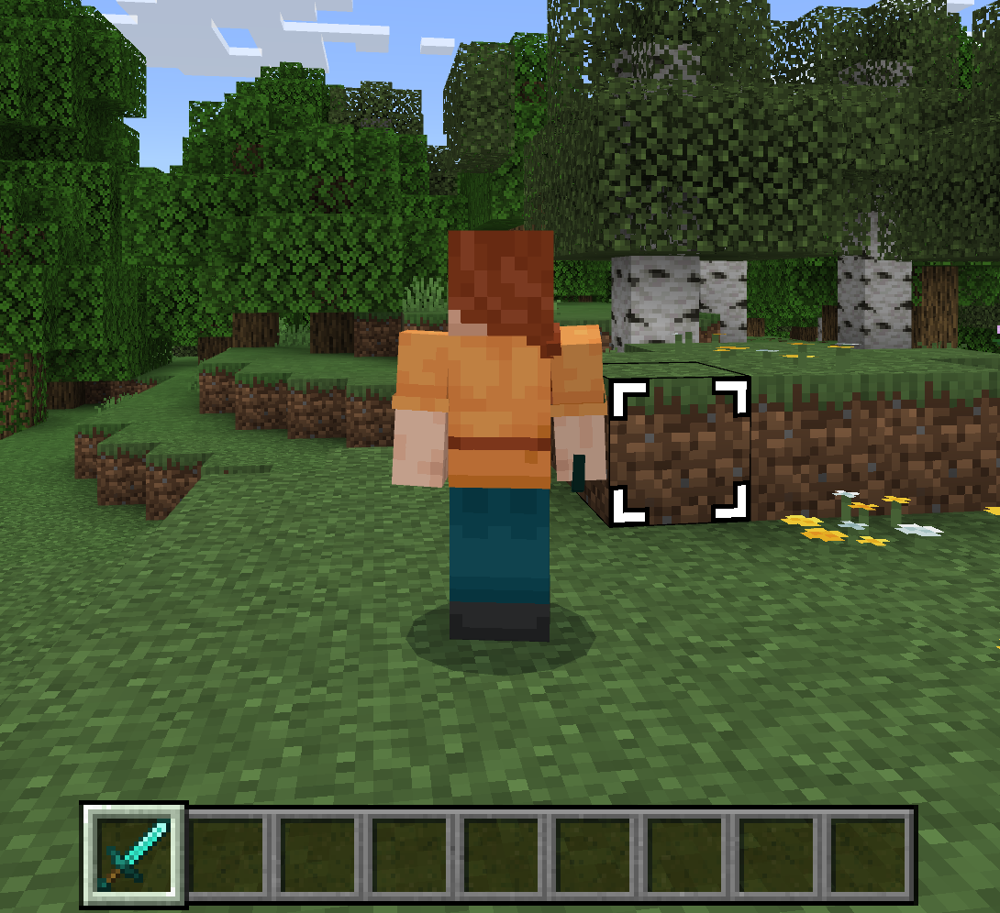
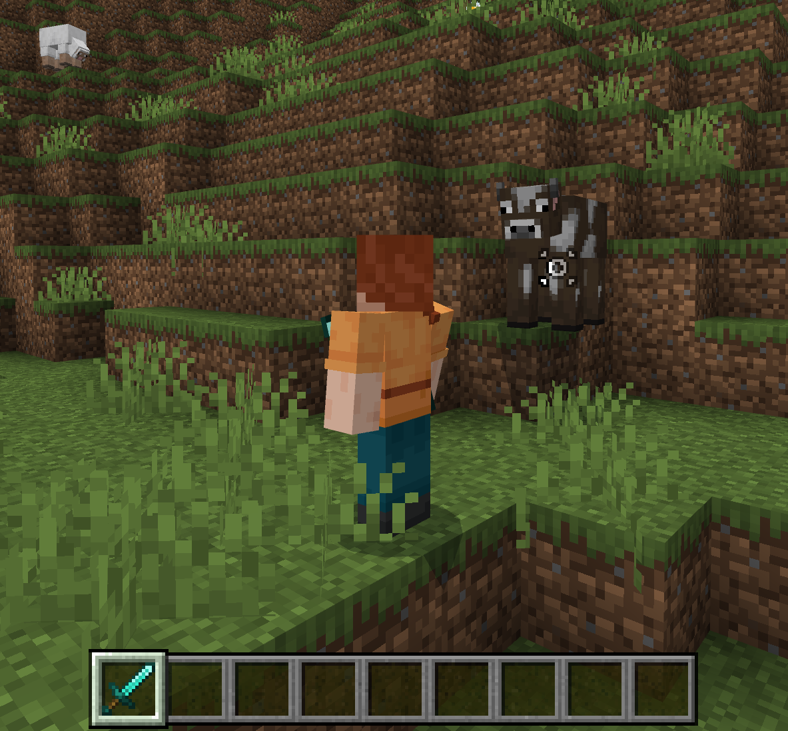

# Introduction to Aim Assist

The aim assist feature helps you target blocks and entities while using third-person camera modes by displaying a targeting reticle over the target. Aim assist will select targets within a defined distance and view angle that you can control using the [`/aimassist` command](../../Commands/commands/aimassist.md). Remember that aim assist will select targets based on the direction that *the player character* is facing, not the direction that the camera is facing. This can sometimes be confusing, since third-person camera modes allow you to look in a different direction than your player character.

## The /aimassist command

You have a lot of control over what entities and blocks are targeted by aim assist. To adjust these settings, use the `/aimassist` command and set the following parameters to your liking:

| Name | Default Value | Description |
|------|---------------|-------------|
| **Max Distance** | | The distance (in blocks) from the player where entities and blocks will be considered for targeting by aim assist. This creates a cone-shaped area in front of the player that can be adjusted using the **X angle** and **Y angle** parameters. Entities and blocks outside this cone will not be targeted. Range is from 1 to 16. |
| **Players** | *none* | The ids of the players who will benefit from the aim assist settings. |
| **Preset id** | *none* | An optional parameter that allows you to specify an aim assist preset to use. Presets can provide more details for how targets should be selected, such as changing what targets are prioritized when holding certain items or excluding specific blocks or entities entirely. For more information on aim assist presets, see [Aim Assist Presets](AimAssistPresets.md). |
| **Target mode**| *none* | An optional parameter that defines how how targets are evaluated by the aim assist feature. Uses either `distance` or `angle`.   - **distance**: Blocks and entities that are closest to the player will be evaluated first.   - **angle**: Blocks and entities that are closest to the center of the targeting cone will be evaluated first. |
| **X angle** | | The horizontal angle for the aim assist targeting cone in a range from 10 to 90 degrees. |
| **Y angle** | | The vertical angle for the aim assist targeting cone in a range from 10 to 90 degrees. |

## Customizing The Targeting Reticle

You can also customize the appearance of the aim assist targeting reticle. Here is an example of the default reticles for blocks and entities:

If you want to replace the targeting reticle with a different shape or color, you can create or update a resource pack to include custom textures.

1. Create a `resourcepack/textures/ui` folder. 

1. Add your textures with the names `aimassist_block_highlight` and `aimassist_entity_highlight` to replace the appropriate targeting reticle.

## Next Steps

You can adjust aim assist settings even further using behavior packs and aim assist presets. Aim assist presets are pre-defined configurations that go further than the `/aimassist` command and can create granular rules for evaluating targets, such as excluding entities or blocks entirely or creating aim assist rules for specific items. For example, you can have a custom Holy Sword item that can only target undead enemies! For an in-depth tutorial about aim assist presets, see [Aim Assist Presets](AimAssistPresets.md).
