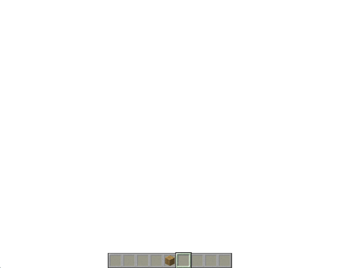

# Free Camera Preset: Command Basics

In this tutorial you will learn how the **free camera** preset command works.

You can find more information about the camera command in the [Camera Command Introduction](CameraCommandIntroduction.md).

## Free Camera Functionality

The free camera preset can be used to accomplish many gameplay scenarios by setting the camera at a distance away from players and entities to show more of the environment. You can even set up cutscenes and use easing methods to have the camera flyover a scene.

The free camera preset can be set up in JSON to be executed in the game at the exact parameters and settings you choose. In this tutorial we'll focus on how the commands work in the game first.

In this tutorial you will learn how to:

>- Set the camera's position and facing direction
>- Set the easing method
>- Combine easing, position, and facing direction for a flyover camera effect
>- Disable player movement, as needed
>- Apply a fade effect with a custom time and color
>- Teleport during a fade

To practice these features and see how they work in the game, let's try out a cutscene scenario. Say you want to make a cutscene where the camera transitions from the player's view to show a flyover of the landscape and then turn to face the player. Let's try it!

## Step 1: Frame your Cutscene

First, find the location for your scene. Think about the position you want to show and the direction you want the viewer to face. 

To get the coordinates you'll use to set the position of the camera, go into a world in creative mode (with coordinates toggled on), find a location you like, and make a note of those coordinates. 

### Position

The camera command supports adjusting the position relative to the world or to the player in these three ways:

**1. World coordinates**

The world map is on a grid, with every location in space plotted to a spot on the x, y, and z axis. 

You will use these coordinates to place the camera at that location on the grid.

>- x (west and east, or longitude)
>- y (above or below the player)
>- z (north and south, or latitude)

The command will look something like this, but with your own values for x, y, and z.

`/camera @s set minecraft:free pos -65 70 17`

**2. Distance from the player, in a cardinal direction**

The world itself has a true North, South, East, and West.

Using `~ ~ ~` lets you set the distance away from the target determined by cardinal direction.

This command will set the camera to be 5 blocks North from the player using the z coordinate:

`/camera @s set minecraft:free pos ~ ~ ~5`

To set the camera to be 5 blocks South, use a negative z coordinate like this:

`/camera @s set minecraft:free pos ~ ~ ~-5`

**3. Distance from the player, in the direction the player is facing**

To set the camera to be 5 blocks in front of the player:

`/camera @s set minecraft:free pos ^ ^ ^5`

Action: Find coordinates and set the location of the free camera to those coordinates. 

Steps: 
>- Go into creative mode and grab coordinates. 
>- Return your player to the starting area. 
>- Use a command like this to position the camera at the coordinates:

`/camera @s set minecraft:free pos -51 80 22`

In this example, the camera is in the right location. Now, we need to set the facing direction or rotation.

## Step 2: Set the Camera's Facing Direction

To angle the camera so it points in the direction you want, there are a few options:

>- Face the nearest player @p
>- Face yourself @s
>- Face entities @e
>- Set the rotation

### Face yourself

This is the same command from the previous step, with the addition of `facing @s` so the camera faces you:

`/camera @s set minecraft:free pos -51 80 22 facing @s`

### Set the camera rotation

It's important to note that rotation values are X and Y but those are not the same as x and y coordinate/cardinal values. 

**Y = yaw**

The rotation of the camera 360 degrees around the target parallel to the earth. The yaw value can be up to 180 to point directly to the right, and up to -180 to point directly to the left. 

**X = pitch**

The angle up or down, perpendicular to the earth. Pitch is limited to a range of 90 facing straight down to -90 facing straight up. This limitation is to prevent rolling the camera upside down.

A couple of notes about position:

>- When adjusting the camera position, the camera is not limited to whole numbers. Try setting the camera at 5.75 or 1.95 to fine tune the positioning of the camera to your needs.

>- When setting the camera relative to the player's position, you many notice an offset that may place the camera not relative to 0 but relative to some offset from the player.

In this example, the camera is in position and facing the player, but the movement of the camera was not smooth - it was immediate. To fix this, let's add a transition to make the movement more cinematic. 

## Step 3: Set up a Camera Transition

The camera is set up to capture the scene, but without an easing transition, the movement is abrupt. This step adds an easing method to transition from the player to the camera position in a smooth way.

Transitions need 2 variables: time and an ease method, also known as an "easing."

>- Time -This is the amount of time the camera will take to move into position. This allows you to set the camera to move slowly or quickly. You enter the time in seconds as a number.

>- Ease method - There are 32 different easings to choose from. You can find a list on the [Easing Functions](https://easings.net/) Website. Play around to find your favorite!

This example shows how to add an easing transition to the position and facing direction.

`/camera @s set minecraft:free ease 8 linear pos -51 80 22 facing @s`

Enter the command with your coordinates, time, and an ease to demonstrate the difference between the transition with and without easing.

Then, you can try the command again to demonstrate how it looks when the camera is going fast or slow.

After that, try changing the position coordinates to demonstrate how the distance changes the speed or how the easing transition behaves.

## Step 4: Use Fades

In this step, we return the player to their last camera perspective while using a fade.

Fade time is used to configure the lengths of the phases of the fade, and fade color is used to specify what single, solid color you want the scene to fade to.

### Fade time

To set the time, you need to include how many seconds for each phase of the fade: fade-in, hold, and fade-out.

Fade-in will dim the scene and fade in the color, hold will keep the color on the screen, then fade-out will dissolve the fade color and restore the scene.

This example shows the effect of setting all three values to 5 seconds:

`/camera @a fade time 5 5 5`

This example will set the fade-in to 3 seconds, the hold to 2 seconds, and the fade-out to 3 seconds:

`/camera @a fade time 3 2 3`

The target is set to `@a`, so that the fade will be seen by all players. You can also set it so that only the player sees the fade.

### Fade color

In addition to the length of the fade, you can set the color of the fade by adjusting the amounts of red, blue, and green that will be mixed to create your fade color. The amounts go from 0 to 255 for each of the three colors.

`/camera @a fade color 0 0 0` would make a classic fade to black.

`/camera @a fade color 255 255 255` makes the screen fade to white.

To make a red fade, set red to 255, green to 0, and blue to 0 like this:

`/camera @a fade color 255 0 0`

## Step 5: Prevent the Player from Moving

During a fade, the player can't see anything but they can still move. That can be dangerous! If you don't want the player to move during a fade, you can disable player movement. 

Do this by using another command before the camera command.

**Inputpermission movement disabled** disables the player from moving their feet and body.

`/inputpermission set @s movement disabled`

To allow them to move again, do the same command but add **enabled** instead of **disabled**.

`/inputpermission set @s movement enabled`

**Inputpermission camera disabled** disables player head movement.

`/inputpermission set @s camera disabled`

To allow them to move their head again, do the same command but use **enabled** instead of **disabled**.

`/inputpermission set @s camera enabled`

When the cutscene is over, enable input permissions to allow the player to move again.

## Step 6: Using Fades and Teleports Together

When teleporting a player to a location, it's nice to have a transition that makes that smoother.

Here is the example of the first part - configuring a 10-second fade...

This is the result showing that when the player's screen fades in, they have been teleported to an entirely new location.

