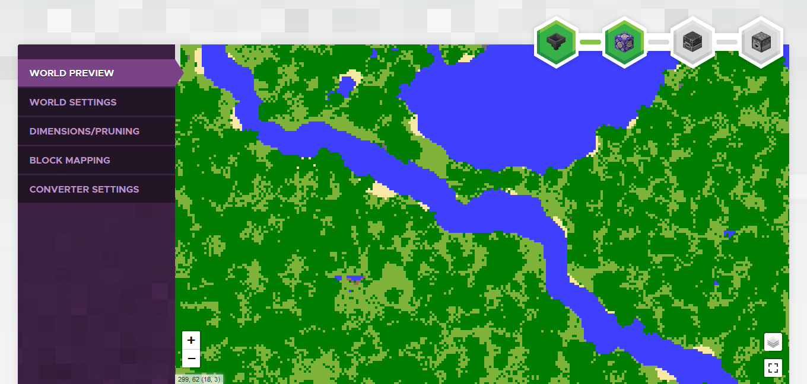
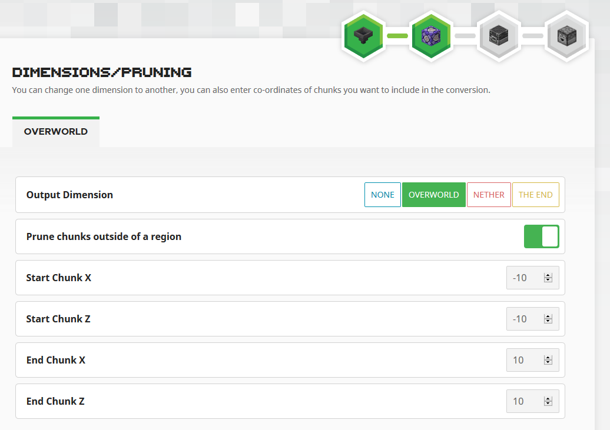
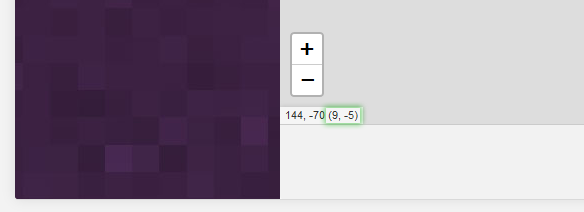
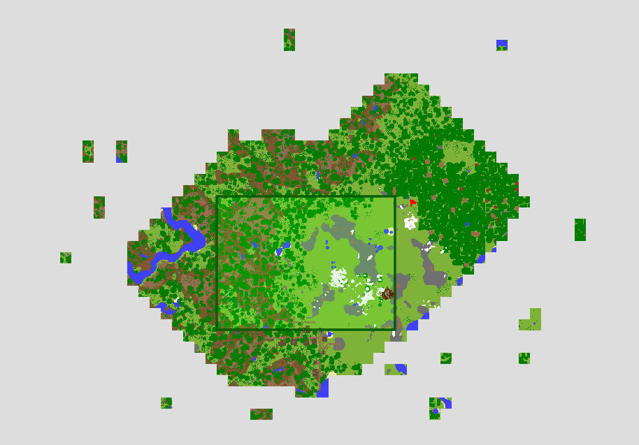

# Chunker - Advanced Mode

Sometimes you need to perform more complex actions when converting your world. This article will explain some of the advanced functionality within Chunker.

Before converting, you can enter Advanced Mode to tweak conversion settings and perform more complex actions on your world. To use the Advanced Mode tools, click the tabs on the left side of the Chunker interface.

## World Preview

World preview gives you a top-down view of the world you are about to convert. You can switch between different dimensions using the layers icon in the bottom right of the map. The map will also show you your pruning selection when using the prune chunks option.

The icons in the top-right detail how far along the conversion process you are. The icons represent the stages of conversion as follows:

- The hopper represents the upload process
- The repeating command block represents the settings phase
- The furnace represents the conversion process
- The dispenser indicates that the conversion has finished and your world is ready to download

## World Settings

The World Settings tab provides an intuitive interface to edit the settings for your exported world. By default, Chunker will load the settings from the uploaded world and remap them to the platform equivalent where required.

Settings are grouped by their purpose. Use the tabs at the top of the Chunker interface to switch between settings groups. A full list of available world settings and their descriptions can be found [here](ChunkerWorldSettings.md).

> [!IMPORTANT]
> Chunker allows you to edit settings and values that can cause unintended behavior, world corruption, or unstable gameplay if incorrectly set. Use caution when changing values.

## Dimensions/Pruning

Chunker allows you to both remap and prune dimensions to a specific region of chunks.

### Dimension Remapping

Remapping allows you to move data to a different dimension or drop the data altogether. To remap a dimension:

1. Select the tab of the dimension you want to modify.
2. Select output dimension or none.
3. Convert the world once you’ve finished with your conversion settings

Selecting **none** will exclude this dimension from the output world, wiping all data. For example, this can be used to clear The Nether to regenerate chunks with the new 1.16 nether biomes. A tutorial for clearing the Nether can be found [here](ChunkerTheNether.md).

An example of the Overworld being remapped to The Nether. Spooky!

### Chunk Pruning

Sometimes worlds will have excess data that you want to remove during the conversion process. This is particularly helpful in making survival spawns or other worlds you want to utilize seamless world generation.

Check out the [survival spawn creation](SurvivalSpawnCreation.md) article for an in-depth tutorial into using Chunker to make survival spawns.

To prune a chunk, follow these instructions:

1. Enable Prune chunks outside of a region.  

2. Enter the region coordinates of the chunks you want to keep. Any chunks outside of these coordinates will be excluded from the output world.  

3. After you have input the coordinates, the world preview screen will visually show the region you have selected.  

Convert the world once you’ve finished with your conversion settings.

> [!NOTE]
> Chunker expects chunk coordinates. The easiest way to locate chunk coordinates is by using the Chunker world preview. Chunk coordinates are in the bottom left of the preview in brackets.

## Converter Settings

Converter settings allow you to enable/disable features of Chunker. It’s recommended to leave these as the default values.

|Setting|Description|
|:---|:---|
|Identifier Validation|**Experimental.** Whether Chunker should ensure all block identifiers are valid Minecraft blocks. Do not enable this if you are using custom blocks.|
|Calculate Block Connections|Whether Chunker should emulate block connections. Disabling this may result in blocks, such as fences, not connecting to surrounding blocks.|
|Convert Items|Whether Chunker should convert the items in the world. If disabled, items in chests, block inventories, and item frames will not be converted.|
|Convert Structure Loot Tables|Whether Chunker should attempt to remap loot tables.|
|In-Game Map Conversion|Whether Chunker should convert the held maps to the new world.|
|Enable Compact (Bedrock Edition only)|Whether Chunker should run LevelDB compact after the conversion. This will reduce file-size but may cause the conversion to take longer.|

## What's Next?

The [Chunker - World Settings](ChunkerWorldSettings.md) article covers a wide variety of world settings. If you have a Nether dimension that you want to reset in order to have up-to-date generation features, Chunker can be used to do that with Advanced Mode.

> [!div class="nextstepaction"]
> [Chunker - World Settings](ChunkerWorldSettings.md)
> [Chunker - How to Clear The Nether](ChunkerTheNether.md)